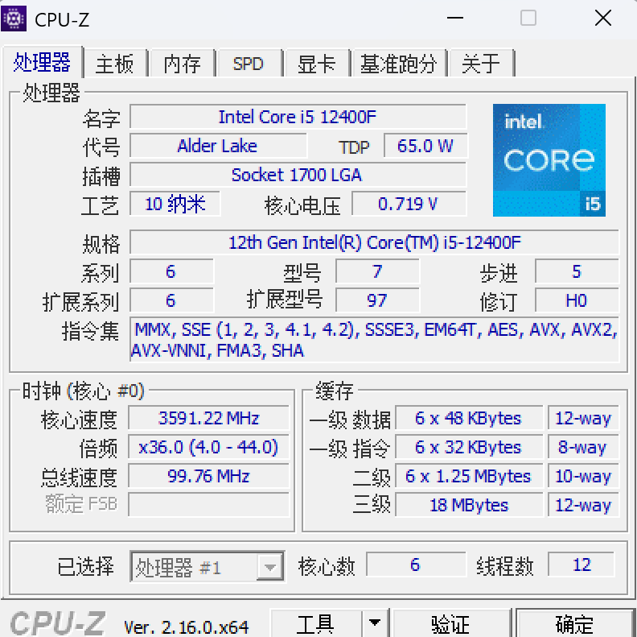
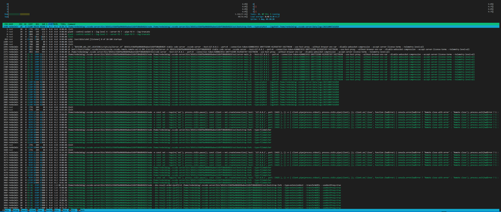
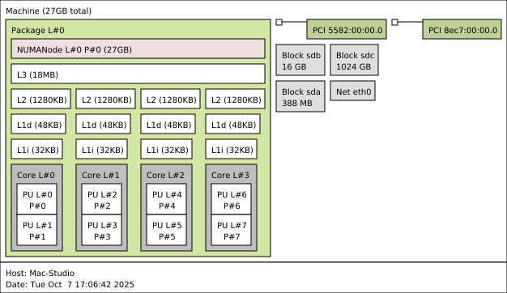
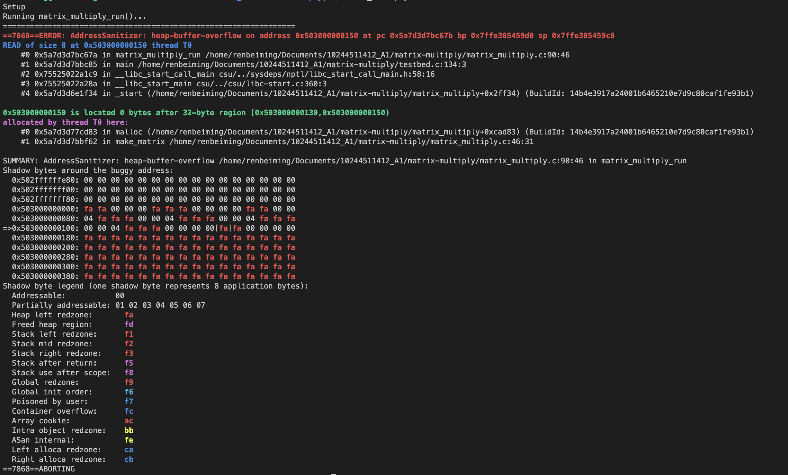

# 《软件系统优化》上机作业 A1

**姓名：** 任北鸣
**学号：** 10244511412

---

## 1. 环境搭建和工具安装

仅列出版本号：
1. 操作系统
- Linux Kernal: `5.15.167.4-microsoft-standard-WSL2`
- Ubuntu 发行版本: `22.04.1 LTS`
2. C 语言编译器
- `gcc  11.4.0`
- `clang version 16.0.6`
3. 其他编程语言
- `Python 3.13.5`
- `Java 17.0.16`
4. 性能剖析工具
- `valgrind-3.18.1`
- `perf version 5.15.189`
5. 并行编程拓展
- `OpenCilk 2.0`

## 2. 常用工具命令操作练习

### 2.1 `uname -a`

**输出结果**

```
Linux Mac-Studio 5.15.167.4-microsoft-standard-WSL2 #1 SMP Tue Nov 5 00:21:55 UTC 2024 x86_64 x86_64 x86_64 GNU/Linux
```

#### 2.1.a 分析输出结果包含了哪些信息

使用 `man uname` 可以查询到以下信息：

- `NAME` : print system information
- `-a, --all` : print all information, in the following order, except omit -p and -i if unkown

那么这个 "following order" 具体是什么顺序呢，我们需要继续阅读 `man` 手册 

```
       -a, --all
              print all information, in the following order, except omit -p and -i if unknown:

       -s, --kernel-name
              print the kernel name

       -n, --nodename
              print the network node hostname

       -r, --kernel-release
              print the kernel release

       -v, --kernel-version
              print the kernel version

       -m, --machine
              print the machine hardware name

       -p, --processor
              print the processor type (non-portable)

       -i, --hardware-platform
              print the hardware platform (non-portable)

       -o, --operating-system
              print the operating system
```

结合英文全称我们可以看到，`uname -a` 会按照**内核名称**(kernal-name), **节点名**(nodename)，**内核发布号**(kernal-release)，**内核版本**(kernal-version)，**硬件架构**(machine)，**处理器类型**(processor)，**硬件平台**(hardware-platform)，**操作系统名称**(operating-system) 的顺序来打印这些信息。需要注意的是，如何处理器类型和硬件平台信息未知的话则会忽略。

这与我们得到的输出顺序也是一一对应的：
- `kernel-name: Linux` —— 表示当前系统内核类型为 Linux；
- `nodename: Mac-Studio` —— 网络节点名称（此处的 Mac-Studio 系笔者自定义，实为 windows 平台下的 wsl2 系统）；
- `kernel-release: 5.15.167.4-microsoft-standard-WSL2` —— 表示当前 Linux 内核的发行版本，其中包含 “microsoft-standard-WSL2”，说明该内核是专为 WSL2（Windows Subsystem for Linux 2）编译的；
- `kernel-version: #1 SMP Tue Nov 5 00:21:55 UTC 2024` —— 说明该内核是多处理器（SMP）版本，于 2024 年 11 月 5 日编译；
- `machine: x86_64` —— 表示硬件架构为 64 位的 x86（即 AMD64）结构；
- `processor: x86_64` —— 表示处理器类型，同样是 64 位；
- `hardware-platform: x86_64` —— 指硬件平台，与前两项一致；
- `operating-system: GNU/Linux` —— 表示当前操作系统是基于 GNU 工具链的 Linux 系统。

#### 2.1.b `Linux` 内核版本与指令集架构是什么

从上面的分析中可以看出：
- 内核版本：`5.15.167.4-microsoft-standard-WSL2`
- 指令集架构：`x86_64`

***remark***:
- 我感觉 `uname -r` 和 `uname -v` 两个信息似乎从名字上有些容易混淆，查询了资料后发现 `kernal release` 指的是内核的发行号，主要描述版本代号与编译目标环境；而 `kernal version` 是内核的详细版本信息，主要描述编译时间与构建信息。
- 我发现 `uname -m`， `uname -p` 和 `uname -i` 在本机上的输出是一样的，那么它们有什么更深层的区别呢？我查询资料后发现：`machine` 表示系统编译与运行所基于的 CPU 架构类型（如 x86_64、aarch64），`processor` 指的是 具体的处理器实现或内核系列（如 Intel Xeon、ARMv8 Cortex-A72），而 `hardware-platform` 则代表 更高层次的硬件平台或厂商定义的系统类别（如 sun4u、ppc64le、hp9000）。在通用的 x86_64 平台上三者往往一致，但在异构或特定厂商体系（如 ARM、SPARC、POWER 架构）下会分别反映不同层级的硬件特征。

### 2.2 `cat /etc/os-release`

**输出结果**

```
PRETTY_NAME="Ubuntu 22.04.1 LTS"
NAME="Ubuntu"
VERSION_ID="22.04"
VERSION="22.04.1 LTS (Jammy Jellyfish)"
VERSION_CODENAME=jammy
ID=ubuntu
ID_LIKE=debian
HOME_URL="https://www.ubuntu.com/"
SUPPORT_URL="https://help.ubuntu.com/"
BUG_REPORT_URL="https://bugs.launchpad.net/ubuntu/"
PRIVACY_POLICY_URL="https://www.ubuntu.com/legal/terms-and-policies/privacy-policy"
UBUNTU_CODENAME=jammy
```

#### 2.2.a 分析输出包含了哪些信息

首先了解一下 `cat` 指令。通过查询 `man cat` 可以捕捉到以下关键信息：
- **NAME**：`cat - concatenate files and print on the standard output`  
- **DESCRIPTION**：`Concatenate FILE(s) to standard output`

也就是说，`cat` 指令可以接受一个或多个文件作为输入，并将其内容输出到标准输出。因此，这条命令的作用是打印 `/etc/os-release` 文件的内容。

虽然 `os-release` 并不是一个可执行指令，但我查询资料后得知它同样有相应的文档说明。通过执行 `man 5 os-release` 可以查看其手册页，该文件属于配置文件类手册（类别 5，对应 “configuration files”）。根据文档说明，`/etc/os-release` 是一个**系统标识文件**，用于描述当前操作系统的发行版信息。它通常位于 `/etc/` 目录下，由系统厂商定义，不建议用户修改。

由于该手册内容较长，这里不再贴出全文。结合实验输出，可对每个字段进行解释如下：

- **PRETTY_NAME**：`"Ubuntu 22.04.1 LTS"` —— 用户可读的系统完整名称，包含版本号与长期支持（LTS）标识；
- **NAME**：`"Ubuntu"` —— 系统发行版名称；
- **VERSION_ID**：`"22.04"` —— 系统的版本编号；
- **VERSION**：`"22.04.1 LTS (Jammy Jellyfish)"` —— 系统详细版本信息，包含开发代号 “Jammy Jellyfish”；
- **VERSION_CODENAME**：`jammy` —— Ubuntu 的内部代号，用于版本区分；
- **ID**：`ubuntu` —— 系统发行版标识符（常用于脚本识别系统类型）；
- **ID_LIKE**：`debian` —— 表示该系统与 Debian 系列兼容，说明 Ubuntu 的底层继承关系；
- **HOME_URL**：`https://www.ubuntu.com/` —— 官方主页；
- **SUPPORT_URL**：`https://help.ubuntu.com/` —— 技术支持页面；
- **BUG_REPORT_URL**：`https://bugs.launchpad.net/ubuntu/` —— 官方 Bug 反馈与问题追踪平台；
- **PRIVACY_POLICY_URL**：`https://www.ubuntu.com/legal/terms-and-policies/privacy-policy` —— 隐私政策与法律条款；
- **UBUNTU_CODENAME**：`jammy` —— 与 `VERSION_CODENAME` 一致，用于保持兼容性。

***remark***:  
- `/etc/os-release` 是 Linux 系统中的标准化发行版标识文件，不同发行版（如 Debian、Fedora、Arch）都会包含类似字段，但具体值有所差异；  
- 该文件为系统和应用程序提供统一的系统识别接口，对软件包管理器、容器镜像管理以及自动化部署（如安装脚本、CI/CD 流程）具有重要意义。

### 2.3 `sysctl -a`

运行后发现输出很长，因此使用管道与 `head` 命令来截断，我们只输出前 $10$ 行，**输出结果**如下：

```
abi.vsyscall32 = 1
debug.exception-trace = 1
debug.kprobes-optimization = 1
dev.raid.speed_limit_max = 200000
dev.raid.speed_limit_min = 1000
dev.scsi.logging_level = 0
dev.tty.ldisc_autoload = 0
fs.aio-max-nr = 65536
fs.aio-nr = 0
fs.binfmt_misc.llvm-14-runtime/binfmt = enabled
...
```

#### 2.3.a 该命令的功能是什么？`-a` 选项的含义是什么？

通过查询 `man sysctl` 可获得以下关键信息：
- **NAME**：`sysctl - configure kernel parameters at runtime`  
  - 用于在系统运行时**查看或配置内核参数**
- **DESCRIPTION**：`sysctl is used to modify kernel parameters at runtime. The parameters available are those listed under /proc/sys/.`  
  - `sysctl` 命令允许用户**动态读取或修改 Linux 内核参数**，这些参数存储在虚拟文件系统 `/proc/sys/` 中
- **SYNOPSIS**：`sysctl [options] [variable[=value]] [...]`  
  - 说明该命令既可单独查看参数，也可通过 `variable=value` 的形式修改内核参数
- **选项说明**: `-a, --all Display all values currently available.`
  - 表示显示当前系统中**所有可用的内核参数及其值**。

因此，该命令的作用是**查看或配置内核参数**，`-a` 的含义是**枚举当前系统支持的所有可读写内核参数**，相当于对 `/proc/sys/` 目录的结构化遍历。

#### 2.3.b 输出结果与目录 `/proc/sys` 的关系是什么

根据 `man sysctl` 的说明可知，`sysctl` 实际上是 `/proc/sys/` 文件系统的用户级接口。Linux 内核通过 `procfs`（即 `/proc` 虚拟文件系统）暴露出大量可配置参数，而 `/proc/sys/` 目录下的文件正对应这些可调整的系统内核变量。  

当执行 `sysctl -a` 时，系统会遍历 `/proc/sys/` 目录及其子目录，将其中的每个文件路径（如 `/proc/sys/fs/aio-max-nr`）转换为以点号分隔的参数名（如 `fs.aio-max-nr`），并读取其当前值然后打印。

因此，`sysctl -a` 的输出内容本质上就是 `/proc/sys/` 目录中内核参数文件的**键值化展示**。  

我们可以做一个小实验，通过 `tree` 工具来打印出 `/proc/sys` 的前 `10` 个文件：

```                                       
├── abi
│   └── vsyscall32
├── debug
│   ├── exception-trace
│   └── kprobes-optimization
├── dev
│   ├── raid
│   │   ├── speed_limit_max
│   │   └── speed_limit_min
│   ├── scsi
│   │   └── logging_level
│   └── tty
│       └── ldisc_autoload
├── fs
│   ├── aio-max-nr
│   ├── aio-nr
│   ├── binfmt_misc
│   │   ├── WSLInterop
```
- 虽然看不到值，但是从名称上可以发现与 `sysctl -a` 打印出来的**键值**是对应的。

除此之外，这种联系不仅体现在 `sysctl` 读取内核参数的功能上，当我们使用 `sysctl -w variable=value` 修改某个参数时，其效果也等价于直接向对应的 `/proc/sys/...` 文件中写入该值。

***remark***:  
- `/proc/sys/` 是 Linux 中内核参数与用户空间交互的重要接口层；  
- `sysctl` 提供了更直观的命令行方式来读取和修改这些参数，而不必手动操作 `/proc` 下的文件；  
- 这非常好的体现了 `Linux` "Everything is a file" 的设计理念。

#### 2.3.c 比较输出结果中 `kernal.ostype` 和 `kernal.osrelease` 与 `(1) (2)` 命令的输出，他们是一致的吗

我们使用管道和 `grep` 从 `sysctl -a` 的输出中过滤目标字段：

```
sysctl -a 2>/dev/null | grep kernel.ostype
sysctl -a 2>/dev/null | grep kernel.osrelease
```

**输出结果**

```
kernel.ostype = Linux
kernel.osrelease = 5.15.167.4-microsoft-standard-WSL2
```

似乎这些信息在 `(1) (2)` 命令的输出中都出现过，但为了更深入的了解它们，我想到使用 `man` 指令来查询。但是 `man sysctl` 的功能是查询 `sysctl` 的功能和相关参数，并不能知道它输出内容的详细信息。

但是根据我们之前的分析，这些与信息与 `/proc/sys` 下的文件是对应的，因此我想到查询 `proc` 的官方说明，在运行 `man 5 proc` 后，果然找到了我想要的信息：

```
...
/proc/sys/kernel/ostype and /proc/sys/kernel/osrelease
    These files give substrings of /proc/version.
...
/proc/version
    This string identifies the kernel version that is currently running.
    It includes the contents of /proc/sys/kernel/ostype,
    /proc/sys/kernel/osrelease, and /proc/sys/kernel/version.
...
```

根据 `man` 中的说明，我们发现最顶级的文件夹是 `/proc/version`，下面有有三个词条 `kernal/ostype`，`kernal/osrelease` 和 `kernal/version`。其中 `kernal.version` 的值可以通过 `sysctl -a 2>/dev/null | grep kernel.version` 打印，其值为 `#1 SMP Tue Nov 5 00:21:55 UTC 2024`。

对比命令 `(1)` 中的输出：

```
kernel-name: Linux
kernel-release: 5.15.167.4-microsoft-standard-WSL2
kernel-version: #1 SMP Tue Nov 5 00:21:55 UTC 2024
```

可以发现 `kernal.ostype` 对应 `kernal-name`，`kernal.osrelease` 对应 `kernal-release`，名字上有细微区别但内容是一致的。

对比命令 `(2)` 的输出可以发现，`/etc/os-release` 文件记录的是 **操作系统发行版** 层面的信息，而非内核层面的信息。  
具体而言：

- `(1)` 与 `sysctl` 输出的 `kernel.ostype`、`kernel.osrelease`、`kernel.version` 反映的是 **Linux 内核本身的类型、版本与编译信息**；
- 而 `(2)` 中的 `PRETTY_NAME`、`NAME`、`VERSION_ID`、`VERSION_CODENAME` 等字段，描述的是 **Ubuntu 发行版**（基于 Linux 内核的完整操作系统）的版本与代号。

例如：
| 对比项 | sysctl 输出 | os-release 输出 | 说明 |
|:--|:--|:--|:--|
| 操作系统名称 | `kernel.ostype = Linux` | `NAME="Ubuntu"` | 前者是内核类型，后者是发行版名称（Ubuntu 基于 Linux 内核） |
| 内核版本号 | `kernel.osrelease = 5.15.167.4-microsoft-standard-WSL2` | `VERSION_ID="22.04"` | 前者是内核版本（Kernel Release），后者是发行版版本（Ubuntu 22.04 LTS） |
| 编译信息 | `kernel.version = #1 SMP Tue Nov 5 00:21:55 UTC 2024` | 无对应字段 | 该信息属于底层内核构建元数据，发行版不会记录 |

由此可见，`sysctl` 与 `(1)` 获取的信息属于 **内核层级**，而 `(2)` 输出的内容属于 **用户层级**。 两者是不同的。

#### 2.3.d 任选 $2$ 个 `kernal.perf_*` 或 `kernal.sched_*` 的参数，解释其含义

先用 `sudo sysctl -a | grep kernel.sched` 命令打印出来

```
kernel.sched_cfs_bandwidth_slice_us = 5000
kernel.sched_child_runs_first = 0
kernel.sched_deadline_period_max_us = 4194304
kernel.sched_deadline_period_min_us = 100
kernel.sched_rr_timeslice_ms = 100
kernel.sched_rt_period_us = 1000000
kernel.sched_rt_runtime_us = 950000
kernel.sched_schedstats = 0
```

我们选择前 $2$ 个参数：

**（1）`kernel.sched_cfs_bandwidth_slice_us`**

在 `https://www.kernel.org/doc/Documentation/scheduler/sched-bwc.txt` 中我查询到了这个参数的含义。（这一整篇文档都在讲这个机制，太长故不贴出）

此参数用于设置 **CFS（Completely Fair Scheduler）带宽控制中运行时（run-time）的分配粒度**，单位为微秒（us）。

要理解这个参数，首先需要了解 CFS 带宽控制的基本原理。该机制通过 **"quota"（配额）** 和 **"period"（周期）** 来限制一个进程组（cgroup）可用的最大 CPU 带宽。如原文所述：

> Within each given "period" (microseconds), a group is allowed to consume only up to "quota" microseconds of CPU time.

为了提高效率，系统并不会在任务每次消耗 CPU 时间时都去更新全局的配额池，而是采用了一种**批量分配**的模式。原文对此解释道：

> For efficiency run-time is transferred between the global pool and CPU local "silos" in a batch fashion. ... The amount transferred each time such an update is required is described as the "slice".

`kernel.sched_cfs_bandwidth_slice_us` 正是用于**定义这个“slice”的大小**。该参数是系统级的，可以通过 `/proc/sys/kernel/sched_cfs_bandwidth_slice_us` 进行调整，其默认值为 5ms。关于调整该值的影响，原文指出：

> Larger slice values will reduce transfer overheads, while smaller values allow for more fine-grained consumption.

因此，该参数是在**系统开销**和**带宽控制精度**之间进行权衡的一个重要调节参数。

**（2）`kernel.sched_child_runs_first`**

通过 `man` 查询得到：

```
/proc/sys/kernel/sched_child_runs_first (since Linux 2.6.23)
    If this file contains the value zero, then, after a fork(2), the parent is first scheduled on the CPU.  If the file contains a nonzero value, then the child is scheduled first on the CPU.  (Of course, on a multiprocessor system, the parent and the child might both immediately be scheduled on a CPU.)
```

意思是此参数控制了当一个进程通过 `fork(2)` 系统调用创建子进程后，**是父进程还是子进程优先获得CPU执行权**。

根据上述说明：
- **值为 `0`**：`fork(2)` 调用后，**父进程**会优先被调度到CPU上执行。
- **值为非 `0`**：`fork(2)` 调用后，**子进程**会优先被调度到CPU上执行。

同时，在多处理器系统上，父子进程可能被同时调度到不同的CPU上立即执行。

查询更多资料后得知，这个参数主要用于优化一种常见的编程模式：`fork()` 之后立即调用 `exec()`。在这种模式下，子进程会马上加载一个新的程序镜像，完全替换掉从父进程复制来的内存空间。

- 如果让子进程先运行（即将此参数设为非 `0`），它可以迅速完成 `exec()`，避免了不必要的**写时复制（Copy-on-Write, COW）**。因为在子进程 `exec()` 之前，父进程对内存的任何修改都会触发内存页的复制，而这些复制对于即将被丢弃的子进程内存空间来说是纯粹的浪费。
- 因此，在大量创建新进程（如 Shell 脚本执行、Web 服务器处理请求）的场景下，将此值设为 `1` 可以提升系统性能。

---

用 `sudo sysctl -a | grep kernel.perf` 命令打印出来

```
kernel.perf_cpu_time_max_percent = 25
kernel.perf_event_max_contexts_per_stack = 8
kernel.perf_event_max_sample_rate = 100000
kernel.perf_event_max_stack = 127
kernel.perf_event_mlock_kb = 516
kernel.perf_event_paranoid = 2
```

**（1）`kernel.perf_cpu_time_max_percent`**

在 `https://www.kernel.org/doc/Documentation/sysctl/kernel.txt` 我查询到该参数的解释：

```
perf_cpu_time_max_percent:

Hints to the kernel how much CPU time it should be allowed to
use to handle perf sampling events.  If the perf subsystem
is informed that its samples are exceeding this limit, it
will drop its sampling frequency to attempt to reduce its CPU
usage.

Some perf sampling happens in NMIs.  If these samples
unexpectedly take too long to execute, the NMIs can become
stacked up next to each other so much that nothing else is
allowed to execute.

0: disable the mechanism.  Do not monitor or correct perf's
   sampling rate no matter how CPU time it takes.

1-100: attempt to throttle perf's sample rate to this
   percentage of CPU.  Note: the kernel calculates an
   "expected" length of each sample event.  100 here means
   100% of that expected length.  Even if this is set to
   100, you may still see sample throttling if this
   length is exceeded.  Set to 0 if you truly do not care
   how much CPU is consumed.
```

此参数用于**限制 `perf` 性能分析子系统在处理采样事件时可以使用的 CPU 时间上限**，以百分比表示。

根据 `kernel.txt` 文档的解释，这个参数是一个给内核的“提示”（Hints），告诉内核 `perf` 最多可以用多少 CPU 时间。如果 `perf` 的采样开销超出了这个限制，内核会自动**降低采样频率**，从而减少其 CPU 占用率，起到一种自动调节和保护的作用。

设立此参数的主要目的是为了防止系统失控。部分 `perf` 采样发生在**NMI（Non-Maskable Interrupts，不可屏蔽中断）**中，如果采样事件意外地耗时过长，可能导致 NMI 堆叠，使得系统无法执行其他任何任务。

该参数的可配置值及其含义如下：
- **值为 `0`**：**禁用此保护机制**。内核将不会监控或限制 `perf` 的采样开销，无论它占用多少 CPU 时间。
- **值为 `1-100`**：设置一个 `perf` 允许使用的 CPU 时间百分比。内核会尝试将 `perf` 的开销限制在此百分比之内。
    - **特别注意**：文档指出，内核会计算一个“预期”的单次采样事件时长。这里的 `100`% 指的是这个**预期时长**的100%。因此，即便设置为 `100`，如果单次采样时长超过了内核的预期，系统仍然可能触发降频调节。

**（2）`kernel.perf_event_max_contexts_per_stack`**

同样可以在 `https://www.kernel.org/doc/Documentation/sysctl/kernel.txt` 查询到：

```
perf_event_max_contexts_per_stack:

Controls maximum number of stack frame context entries for
(attr.sample_type & PERF_SAMPLE_CALLCHAIN) configured events, for
instance, when using 'perf record -g' or 'perf trace --call-graph fp'.

This can only be done when no events are in use that have callchains
enabled, otherwise writing to this file will return -EBUSY.

The default value is 8.
```

此参数用于**控制 `perf` 在进行调用链（callchain）采样时，每个堆栈（stack）可以记录的最大上下文（context）条目数量**。

这个参数直接影响那些配置为需要捕获**调用链**信息的 `perf` 事件。调用链采样可以帮助开发者理解函数的调用关系，是性能分析中的常用功能。文档中明确举了两个例子：
- `perf record -g`
- `perf trace --call-graph fp`

当使用这些命令时，`kernel.perf_event_max_contexts_per_stack` 的值就决定了 `perf` 为每一次采样所记录的函数调用栈的最大深度。

具体的配置与限制：
- **默认值**：该参数的默认值为 `8`，意味着在不进行任何配置的情况下，`perf -g` 等命令只会记录调用栈的最内层 8 个函数调用。
- **修改限制**：此参数的值**不能**在有任何启用了调用链的 `perf` 事件正在运行时被修改。如果尝试修改，系统会返回 ` -EBUSY` 错误，表示资源正忙。

简而言之，该参数设置了 `perf` 工具记录的函数调用栈的深度。增加该值可以获得更完整的调用路径，有助于分析复杂的函数调用关系；但过大的值也可能增加 `perf` 自身的性能开销。

### 2.4 `lscpu`

**输出结果**

```
Architecture:             x86_64
  CPU op-mode(s):         32-bit, 64-bit
  Address sizes:          39 bits physical, 48 bits virtual
  Byte Order:             Little Endian
CPU(s):                   8
  On-line CPU(s) list:    0-7
Vendor ID:                GenuineIntel
  Model name:             12th Gen Intel(R) Core(TM) i5-12400F
    CPU family:           6
    Model:                151
    Thread(s) per core:   2
    Core(s) per socket:   4
    Socket(s):            1
    Stepping:             5
    BogoMIPS:             4991.99
    Flags:                fpu vme de pse tsc msr pae mce cx8 apic sep mtrr pge mca cmov pat pse36 clflush mmx fxsr sse sse2 ss ht syscall nx pdpe1gb rdtscp lm constant_tsc arch_perfmon rep_good nopl xtopology 
                          tsc_reliable nonstop_tsc cpuid pni pclmulqdq vmx ssse3 fma cx16 pdcm pcid sse4_1 sse4_2 x2apic movbe popcnt
                          tsc_deadline_timer aes xsave avx f16c rdrand hypervisor lahf_lm abm 3dnowprefetch invpcid_single ssbd ibrs ibpb stibp ibrs_enhanced tpr_shadow vnmi ept vpid ept_ad fsgsbase tsc_adjust 
                          bmi1 avx2 smep bmi2 erms invpcid rdseed adx smap clflushopt clwb sha_ni xsaveopt xsavec xgetbv1 xsaves
                          avx_vnni umip waitpkg gfni vaes vpclmulqdq rdpid movdiri movdir64b fsrm md_clear serialize arch_lbr flush_l1d arch_capabilities
Virtualization features:  
  Virtualization:         VT-x
  Hypervisor vendor:      Microsoft
  Virtualization type:    full
Caches (sum of all):      
  L1d:                    192 KiB (4 instances)
  L1i:                    128 KiB (4 instances)
  L2:                     5 MiB (4 instances)
  L3:                     18 MiB (1 instance)
Vulnerabilities:          
  Gather data sampling:   Not affected
  Itlb multihit:          Not affected
  L1tf:                   Not affected
  Mds:                    Not affected
  Meltdown:               Not affected
  Mmio stale data:        Not affected
  Reg file data sampling: Vulnerable: No microcode
  Retbleed:               Mitigation; Enhanced IBRS
  Spec rstack overflow:   Not affected
  Spec store bypass:      Mitigation; Speculative Store Bypass disabled via prctl and seccomp
  Spectre v1:             Mitigation; usercopy/swapgs barriers and __user pointer sanitization
  Spectre v2:             Mitigation; Enhanced / Automatic IBRS; IBPB conditional; RSB filling; PBRSB-eIBRS SW sequence; BHI BHI_DIS_S
  Srbds:                  Not affected
  Tsx async abort:        Not affected
```
#### 2.4.a 处理器型号是什么？包含多少个物理核(physical core)？是否有硬件线程(hardware thread)？处理器基准频率、最大、最小频率分别是多少？每一级缓存的大小分别是多少？

根据 `lscpu` 的输出，我们可以得到以下信息：
- **处理器型号**：`12th Gen Intel(R) Core(TM) i5-12400F`。
- **物理核数**：本机拥有 `Socket(s): 1` 个插槽，每个插槽有 `Core(s) per socket: 4` 个核心，因此共有 $1 \times 4 = 4$ 个物理核心。
- **硬件线程**：每个核心拥有 `Thread(s) per core: 2` 个线程，这说明该 CPU 支持**硬件线程技术**。总的逻辑 CPU 数量为 $4 \text{ 核心} \times 2 \text{ 线程/核心} = 8$ 个，与 `CPU(s): 8` 的信息一致。
- **各级缓存大小**：
    - **L1 Cache**: 分为数据缓存和指令缓存。L1d (数据) 总大小为 `192 KiB`，L1i (指令) 总大小为 `128 KiB`。
    - **L2 Cache**: 总大小为 `5 MiB`。
    - **L3 Cache**: 总大小为 `18 MiB`。



- **处理器频率**：本次 `lscpu` 的输出中**未提供**基准、最大或最小频率信息。查询资料后得知这是因为 `wsl2` 导致的，频率动态调整信息可能无法被直接获取。

因此我在 `windows` 的 `powershell` 中运行以下指令 `Get-CimInstance Win32_Processor | Select-Object Name, CurrentClockSpeed` 得到基准频率为 `2.5GHz`。

但是 `powershell` 无法得知最大最小频率，于是我借助了 `CPU-Z` 工具查询到最大频率为 `4.4 GHz`，最小频率为 `0.8GHz`。

#### 2.4.b 处理器是大端序还是小端序的？如果处理器是小端序的，列举一种大端序的应用场景。如果处理器是大端序的，列举一种小端序的应用场景。

根据 `Byte Order: Little Endian` 这一行可知，该处理器是**小端序**（Little Endian）的。

复习一下大小端序：
- **小端序（Little Endian）**：数据的低位字节存储在内存的低地址处。例如，整数 `0x12345678` 在内存中会以 `78 56 34 12` 的顺序存储。
- **大端序（Big Endian）**：数据的高位字节存储在内存的低地址处。

一个典型的大端序应用场景是**网络协议**。TCP/IP 协议栈规定，所有在网络上传输的二进制整数都必须使用**网络字节序（Network Byte Order）**，而网络字节序就是大端序。这么做是为了消除不同主机字节序不同可能导致的通信问题。因此，一个采用小端序的机器（如本机）在发送网络数据包之前，需要将数据从主机字节序（小端）转换到网络字节序（大端）；在接收到数据包后，则需要进行相反的转换。

#### 2.4.c 输出中 Address sizes 的 physical 和 virtual 分别代表什么？如果你的机器是 64 位的，那么 physical 和 virtual 是 64 位的吗？概述原因。

`Address sizes` 中的 `physical` 和 `virtual` 分别代表**物理地址**和**虚拟地址**的寻址位数。
- **Physical Address (物理地址)**：CPU 用来直接与硬件内存（RAM）通信的地址。`39 bits physical` 表示该 CPU 能够寻址的最大物理内存为 $2^{39}$ Bytes，即 $512$ GiB。
- **Virtual Address (虚拟地址)**：操作系统为每个进程提供的独立、私有的地址空间。`48 bits virtual` 表示每个进程可用的虚拟地址空间大小为 $2^{48}$ Bytes，即 $256$ TiB。

尽管本机是 **x86_64** 架构的 64 位机器，但 `physical` 和 `virtual` 地址**都不是 64 位的**。

**原因概述如下：**
1. **成本与实用性权衡**：理论上，64位架构可以寻址 $2^{64}$ Bytes（约 16 EiB）的内存，这是一个极其巨大的数字。在当前的硬件技术下，制造支持 64 位物理地址的 CPU 和主板在成本上非常高昂（需要 64 根地址总线），而且没有任何实际的应用场景需要如此庞大的物理内存。因此，CPU 制造商只实现了能够满足当前乃至未来一段时间需求的地址位数（如 39 位物理地址），这在成本和实用性上是最佳的折中方案。
2. **虚拟地址空间的简化**：虽然 64 位程序中的指针变量是 64 位的，但CPU的内存管理单元（MMU）在进行地址翻译时，通常只使用其中的低 48 位。这同样是出于简化硬件设计和页表结构的考虑。一个 256 TiB 的虚拟地址空间对于任何单个进程来说都已绰绰有余。在 x86_64 架构中，一个有效的 48 位虚拟地址必须是“规范形式”（canonical form），即高 16 位（从第 48 位到第 63 位）必须与第 47 位相同（要么全为 0，要么全为 1），这也限制了寻址范围无法达到完整的 64 位。

### 2.5 `dmidecode`

**输出结果**

```
Handle 0x003C, DMI type 16, 23 bytes
Physical Memory Array
        Location: System Board Or Motherboard
        Use: System Memory
        Error Correction Type: None
        Maximum Capacity: 64 GB
        Error Information Handle: Not Provided
        Number Of Devices: 2

Handle 0x003D, DMI type 17, 92 bytes
Memory Device
        Array Handle: 0x003C
        Error Information Handle: Not Provided
        Total Width: 64 bits
        Data Width: 64 bits
        Size: 16 GB
        Form Factor: DIMM
        Set: None
        Locator: Controller0-ChannelA-DIMM0
        Bank Locator: BANK 0
        Type: DDR4
        Type Detail: Synchronous
        Speed: 2666 MT/s
        Manufacturer: 0x0B92
        Serial Number: 04190419
        Asset Tag: 9876543210
        Part Number:                     
        Rank: 2
        Configured Memory Speed: 2666 MT/s
        Minimum Voltage: 1.2 V
        Maximum Voltage: 1.35 V
        Configured Voltage: 1.2 V
        Memory Technology: DRAM
        Memory Operating Mode Capability: Volatile memory
        Firmware Version: Not Specified
        Module Manufacturer ID: Bank 12, Hex 0x92
        Module Product ID: Unknown
        Memory Subsystem Controller Manufacturer ID: Unknown
        Memory Subsystem Controller Product ID: Unknown
        Non-Volatile Size: None
        Volatile Size: 16 GB
        Cache Size: None
        Logical Size: None

Handle 0x003E, DMI type 17, 92 bytes
Memory Device
        Array Handle: 0x003C
        Error Information Handle: Not Provided
        Total Width: 64 bits
        Data Width: 64 bits
        Size: 16 GB
        Form Factor: DIMM
        Set: None
        Locator: Controller1-ChannelA-DIMM0
        Bank Locator: BANK 0
        Type: DDR4
        Type Detail: Synchronous
        Speed: 2666 MT/s
        Manufacturer: 0x0B92
        Serial Number: 04190419
        Asset Tag: 9876543210
        Part Number:                     
        Rank: 2
        Configured Memory Speed: 2666 MT/s
        Minimum Voltage: 1.2 V
        Maximum Voltage: 1.35 V
        Configured Voltage: 1.2 V
        Memory Technology: DRAM
        Memory Operating Mode Capability: Volatile memory
        Firmware Version: Not Specified
        Module Manufacturer ID: Bank 12, Hex 0x92
        Module Product ID: Unknown
        Memory Subsystem Controller Manufacturer ID: Unknown
        Memory Subsystem Controller Product ID: Unknown
        Non-Volatile Size: None
        Volatile Size: 16 GB
        Cache Size: None
        Logical Size: None

Handle 0x003F, DMI type 19, 31 bytes
Memory Array Mapped Address
        Starting Address: 0x00000000000
        Ending Address: 0x007FFFFFFFF
        Range Size: 32 GB
        Physical Array Handle: 0x003C
        Partition Width: 2

Handle 0x0041, DMI type 20, 35 bytes
Memory Device Mapped Address
        Starting Address: 0x00000000000
        Ending Address: 0x003FFFFFFFF
        Range Size: 16 GB
        Physical Device Handle: 0x003D
        Memory Array Mapped Address Handle: 0x003F
        Partition Row Position: Unknown
        Interleave Position: 1
        Interleaved Data Depth: 1

Handle 0x0042, DMI type 20, 35 bytes
Memory Device Mapped Address
        Starting Address: 0x00400000000
        Ending Address: 0x007FFFFFFFF
        Range Size: 16 GB
        Physical Device Handle: 0x003E
        Memory Array Mapped Address Handle: 0x003F
        Partition Row Position: Unknown
        Interleave Position: 2
        Interleaved Data Depth: 1
```

- 这个输出特别长，我截取了一些看起来跟内存相关的。

#### 2.5.a 该命令的功能是什么

查看 `man` 手册：

```
NAME
       dmidecode - DMI table decoder

SYNOPSIS
       dmidecode [OPTIONS]

DESCRIPTION
       dmidecode  is  a  tool for dumping a computer's DMI (some say SMBIOS) table contents in a human-readable format. This table contains a description of the system's hardware components, as
       well as other useful pieces of information such as serial numbers and BIOS revision. Thanks to this table, you can retrieve this information without having to probe for the actual  hard‐
       ware.  While this is a good point in terms of report speed and safeness, this also makes the presented information possibly unreliable.

       The  DMI  table  doesn't only describe what the system is currently made of, it also can report the possible evolutions (such as the fastest supported CPU or the maximal amount of memory
       supported).

       SMBIOS stands for System Management BIOS, while DMI stands for Desktop Management Interface. Both standards are tightly related and developed by the DMTF (Desktop Management Task Force).

       As you run it, dmidecode will try to locate the DMI table. It will first try to read the DMI table from sysfs, and next try reading directly from  memory  if  sysfs  access  failed.   If
       dmidecode succeeds in locating a valid DMI table, it will then parse this table and display a list of records like this one:

       Handle 0x0002, DMI type 2, 8 bytes.  Base Board Information
               Manufacturer: Intel
               Product Name: C440GX+
               Version: 727281-001
               Serial Number: INCY92700942

       Each record has:

       • A handle. This is a unique identifier, which allows records to reference each other. For example, processor records usually reference cache memory records using their handles.

       • A  type. The SMBIOS specification defines different types of elements a computer can be made of. In this example, the type is 2, which means that the record contains "Base Board Infor‐
         mation".

       • A size. Each record has a 4-byte header (2 for the handle, 1 for the type, 1 for the size), the rest is used by the record data. This value  doesn't  take  text  strings  into  account
         (these are placed at the end of the record), so the actual length of the record may be (and is often) greater than the displayed value.

       • Decoded values. The information presented of course depends on the type of record. Here, we learn about the board's manufacturer, model, version and serial number.
```

我们可以知道 `dmidecode` 命令用于**读取并解析计算机的 DMI（Desktop Management Interface）/SMBIOS（System Management BIOS）表**，然后输出。  

该表记录了系统硬件组件的详细描述和相关信息，如：
- **系统厂商、产品名称、序列号、BIOS 版本与发布日期**；
- **主板信息**（制造商、型号、版本、序列号等）；
- **处理器信息**（类型、核心数、最大支持频率等）；
- **内存信息**（类型、大小、速度、插槽位置、支持的最大容量等）；
- 以及系统可能的**可扩展性信息**（例如支持的最大内存容量、可安装的最快 CPU 型号等）。
- ...

#### 2.5.b 观察输出结果，以内存为例，可以获得哪些信息？

从我们截取的输出来看， 可以获得以下内存信息：

- **物理内存阵列信息（DMI type 16）**  
  - **位置（Location）**：System Board 或 Motherboard，表示内存安装在主板上。  
  - **用途（Use）**：System Memory，表示为系统主内存使用。  
  - **最大支持容量（Maximum Capacity）**：64 GB，说明主板最多支持 64 GB 内存。  
  - **插槽数量（Number Of Devices）**：2，系统共有两个内存插槽。

- **内存设备信息（DMI type 17）**  
  对每一条内存条（Memory Device）都提供详细的硬件参数，包括：
  - **容量（Size）**：16 GB × 2，共 32 GB 实际内存。  
  - **类型（Type）**：DDR4。  
  - **工作速度（Speed / Configured Speed）**：2666 MT/s。  
  - **数据宽度（Data Width / Total Width）**：64 bits。  
  - **外形规格（Form Factor）**：DIMM。  
  - **电压（Voltage）**：工作电压 1.2 V，最大 1.35 V。  
  - **制造商（Manufacturer）**：0x0B92（厂商代码，表示三星等品牌）。  
  - **序列号（Serial Number）**：04190419。  
  - **插槽位置（Locator / Bank Locator）**：如 `Controller0-ChannelA-DIMM0`、`Controller1-ChannelA-DIMM0`，表明两条内存分别插在不同通道上。  
  - **Rank、Memory Technology、Operating Mode**：指示该模块为双 Rank 的 DRAM，工作在易失性模式下。

- **内存映射信息（DMI type 19 和 20）**  
  - **Memory Array Mapped Address**：表明系统地址空间中内存的起止地址范围，例如：
    - 总映射范围：0x00000000000–0x007FFFFFFFF（32 GB 总内存）。
  - **Memory Device Mapped Address**：说明每条内存对应的物理地址区间，如：
    - 第一条内存：0x00000000000–0x003FFFFFFFF（16 GB）。  
    - 第二条内存：0x00400000000–0x007FFFFFFFF（16 GB）。

我想应该还有很多，但是终端显示不下了。

### 2.6 `numactl -H`

先下载:

```
sudo apt update
sudo apt install numactl -y
```

然后运行，**输出结果**：

```
available: 1 nodes (0)
node 0 cpus: 0 1 2 3 4 5 6 7 8 9 10 11
node 0 size: 31907 MB
node 0 free: 27585 MB
node distances:
node   0 
  0:  10 
```

- 看不懂，不知道 node 指的是是什么。

#### 2.6.a 该命令的功能是什么？` -H` 选项的含义是什么？

查看 `man` 手册：

```
NAME
       numactl - Control NUMA policy for processes or shared memory

DESCRIPTION
       numactl runs processes with a specific NUMA scheduling or memory placement policy.  The policy is set for command and inherited by 
       all of its children.  In addition it can set persistent policy for shared memory segments or files.

--hardware, -H
       Show inventory of available nodes on the system. When the --cpu-compress option is set show cpu ranges. This is not default not 
       break any existing scripts.
```

我们可以知道 `numactl` 命令用于**控制和查看 NUMA（Non-Uniform Memory Access，非一致性内存访问）系统的内存与 CPU 资源分配策略**。它能为进程或共享内存段指定特定的 NUMA 调度或内存放置策略，从而优化多核、多节点系统中的性能表现。  
  
执行 ` -H` 选项时，会列出：
- 系统中 NUMA 节点的数量及编号；
- 每个节点对应的 CPU 列表；
- 每个节点的可用内存大小；
- 节点间的距离矩阵。

#### 2.6.b NUMA 节点数量有多少个？

从输出结果：

```
available: 1 nodes (0)
```

可以看出系统中 **只有 1 个 NUMA 节点**（节点编号为 0）。  

#### 2.6.c 概述 `node distances` 的含义，并列举一些可能受其影响的应用场景

**`node distances` 的含义**

我查询了一些资料，`node distances` 表示不同 NUMA 节点之间的**内存访问距离（开销）**，即一个节点访问自身内存与访问其他节点内存之间的相对代价，具体而言： 
- 数值越小，表示访问越快、延迟越低。  
- 对角线上的值表示节点访问自身内存的距离，通常为 10。  
- 若系统有多个节点，则跨节点访问的距离会更大，表示访问远程内存比访问本地内存更慢。

结合我们的输出可以得知系统中只有一个节点（node 0），该节点访问自身内存的距离为 10，表示无跨节点访问开销。

**可能受 `node distances` 影响的应用场景：**

1. **高性能计算（HPC）**  
   - 科学计算或矩阵运算中，大量数据需频繁访问内存。  
   - 若线程访问的内存不在同一 NUMA 节点，会导致性能显著下降。

2. **数据库系统（如 MySQL、PostgreSQL）**  
   - 多线程查询或事务处理中，跨节点访问会造成缓存未命中和延迟增加。  
   - 通过 NUMA 绑定可让数据库线程与数据页位于相同节点，从而提升吞吐量。

### 2.7 `free -h`

**输出结果**：

```
               total        used        free      shared  buff/cache   available
Mem:            27Gi       1.1Gi        25Gi       2.0Mi       1.1Gi        25Gi
Swap:           16Gi          0B        16Gi
```

#### 2.7.a 分析输出结果，解释结果显示两行数据的含义

先使用 `man` 命令来查看 `free` 的功能:

```
NAME
       free - Display amount of free and used memory in the system

SYNOPSIS
       free [options]

DESCRIPTION
       free displays the total amount of free and used physical and swap memory in the system, as well as the buffers and caches used by the kernel. The information is gathered by parsing /proc/meminfo. The displayed columns are:

       total  Total installed memory (MemTotal and SwapTotal in /proc/meminfo)

       used   Used memory (calculated as total - free - buffers - cache)

       free   Unused memory (MemFree and SwapFree in /proc/meminfo)

       shared Memory used (mostly) by tmpfs (Shmem in /proc/meminfo)

       buffers
              Memory used by kernel buffers (Buffers in /proc/meminfo)

       cache  Memory used by the page cache and slabs (Cached and SReclaimable in /proc/meminfo)

       buff/cache
              Sum of buffers and cache

       available
              Estimation  of how much memory is available for starting new applications, without swapping. Unlike the data provided by the cache or free fields, this field takes into account page cache and also that not all reclaimable memory slabs will be reclaimed due to items being in use (MemAvailable
              in /proc/meminfo, available on kernels 3.14, emulated on kernels 2.6.27+, otherwise the same as free)
```

以及 ` -h` 参数的含义：

```
       -h, --human
              Show all output fields automatically scaled to shortest three digit unit and display the units of print out.  Following units are used.

                B = bytes
                Ki = kibibyte
                Mi = mebibyte
                Gi = gibibyte
                Ti = tebibyte
                Pi = pebibyte

              If unit is missing, and you have exbibyte of RAM or swap, the number is in tebibytes and columns might not be aligned with header.
```

根据 `man` 手册的说明，`free` 命令用于显示系统中物理内存（RAM）和交换空间（swap）的占用情况。输出结果中的两行数据分别对应这两部分：

**1. `Mem` 行（物理内存）**
这一行描述的是物理内存（RAM）的使用状况。各列含义如下：
- **`total`**：总物理内存大小。本机总共有 `27Gi`。
- **`used`**：已被使用的内存大小，计算方式为 `total - free - buff/cache`。本机已使用 `1.1Gi`。
- **`free`**：完全未被使用的内存大小。本机有 `25Gi`。
- **`shared`**：被多个进程共享的内存，主要用于 `tmpfs`。本机共享内存为 `2.0Mi`。
- **`buff/cache`**：被内核用作缓冲区（buffers）和页面缓存（cache）的内存总和。这部分内存用于提升磁盘 I/O 性能，在应用程序需要时可以被回收。本机该部分大小为 `1.1Gi`。
- **`available`**：**可供新应用程序使用的预估内存大小**，这是衡量系统当前可用内存的关键指标。它不仅包括 `free` 部分，还包括 `buff/cache` 中可以被快速回收的部分。因此，这个值比单纯的 `free` 更能反映真实的可用内存情况。本机可用内存约为 `25Gi`。

**2. `Swap` 行（交换空间）**
这一行描述的是硬盘上交换空间（虚拟内存）的使用情况。当物理内存不足时，系统会将不常用的内存页移动到交换空间中。
- **`total`**：总交换空间大小。本机为 `16Gi`。
- **`used`**：已被使用的交换空间大小。本机为 `0B`，说明物理内存充足。
- **`free`**：剩余可用的交换空间大小。本机为 `16Gi`。

#### 2.7.b 解释 GiB 和 GB 两种不同单位的区别

**GiB** 和 **GB** 的核心区别在于它们计算所用的**基数**不同，一个是基于 $2$ 的幂，另一个是基于 $10$ 的幂。

* **GiB (Gibibyte)**
    * 这是**二进制前缀（binary prefix）** 单位，基于 **$2$ 的幂**进行计算。
    * 正如 `free -h` 的 `man` 手册所示，`Gi` 代表 `gibibyte`。
    * 换算关系：**$1 \text{ GiB} = 2^{10} \text{ MiB} = 2^{20} \text{ KiB} = 2^{30} \text{ Bytes} = 1,073,741,824 \text{ Bytes}$**
    * 这种单位在计算机科学领域，尤其是在描述内存（RAM）和操作系统层面时被广泛使用，因为它能精确地反映计算机的二进制架构。

* **GB (Gigabyte)**
    * 这是**十进制前缀（decimal prefix）** 单位，基于 **$10$ 的幂**进行计算。
    * 换算关系：**$1 \text{ GB} = 10^3 \text{ MB} = 10^6 \text{ KB} = 10^9 \text{ Bytes} = 1,000,000,000 \text{ Bytes}$**
    * 这种单位常被硬盘、SSD 等存储设备制造商用来标记产品容量，也常见于网络带宽的描述中。

`free -h` 命令使用 `GiB` (`gibibyte`) 是为了提供**精确无歧义**的内存度量，忠实反映计算机内部以二进制方式工作的实际情况。

### 2.8 `ps -aux`

**输出结果**：

```
USER       PID %CPU %MEM    VSZ   RSS TTY      STAT START   TIME COMMAND
root         1  0.0  0.0   2776  1952 hvc0     Sl+  Oct05   0:00 /init
root         7  0.0  0.0   2804   144 hvc0     Sl+  Oct05   0:00 plan9 --control-socket 6 --log-level 4 --server-fd 7 --pipe-fd 9 --log-truncate
root       459  0.0  0.0  15428  5300 ?        Ss   Oct05   0:00 sshd: /usr/sbin/sshd [listener] 0 of 10-100 startups
renbeim+  1644  0.0  0.0   2892   996 pts/1    S+   00:22   0:00 /bin/sh -c "/home/renbeiming/.vscode-server/bin/385651c938df8a906869babee516bffd0ddb9829/out/vs/base/node/cpuUsage.sh" 5361
renbeim+  1645  0.0  0.0   4784  3256 pts/1    S+   00:22   0:00 /bin/bash /home/renbeiming/.vscode-server/bin/385651c938df8a906869babee516bffd0ddb9829/out/vs/base/node/cpuUsage.sh 5361
renbeim+  1648  0.0  0.0   3212  1012 pts/1    S+   00:22   0:00 sleep 1
renbeim+  1649  0.0  0.0   7796  3160 pts/5    R+   00:22   0:00 ps -aux
root      2289  0.0  0.0   2780   204 ?        Ss   Oct06   0:00 /init
root      2290  0.0  0.0   2780   208 ?        S    Oct06   0:00 /init
renbeim+  2291  0.0  0.0   2892   980 pts/1    Ss+  Oct06   0:00 sh -c "$VSCODE_WSL_EXT_LOCATION/scripts/wslServer.sh" 385651c938df8a906869babee516bffd0ddb9829 stable code-server .vscode-server --host=127.0.0.1 --port=0 --connection-token=4208023932-1097732509-4129187397-542770198 --use-host-proxy --without-brows
renbeim+  2292  0.0  0.0   2892   960 pts/1    S+   Oct06   0:00 sh /mnt/c/Users/renbe/.vscode/extensions/ms-vscode-remote.remote-wsl-0.104.3/scripts/wslServer.sh 385651c938df8a906869babee516bffd0ddb9829 stable code-server .vscode-server --host=127.0.0.1 --port=0 --connection-token=4208023932-1097732509-412918739
renbeim+  2371  0.0  0.0   2892  1036 pts/1    S+   Oct06   0:00 sh /home/renbeiming/.vscode-server/bin/385651c938df8a906869babee516bffd0ddb9829/bin/code-server --host=127.0.0.1 --port=0 --connection-token=4208023932-1097732509-4129187397-542770198 --use-host-proxy --without-browser-env-var --disable-websocket-co
renbeim+  2375  0.1  0.5 11884776 169352 pts/1 Sl+  Oct06   0:40 /home/renbeiming/.vscode-server/bin/385651c938df8a906869babee516bffd0ddb9829/node /home/renbeiming/.vscode-server/bin/385651c938df8a906869babee516bffd0ddb9829/out/server-main.js --host=127.0.0.1 --port=0 --connection-token=4208023932-1097732509-4129
renbeim+  2590  0.1  0.3 1151776 94380 pts/1   Rl+  Oct06   0:46 /home/renbeiming/.vscode-server/bin/385651c938df8a906869babee516bffd0ddb9829/node /home/renbeiming/.vscode-server/bin/385651c938df8a906869babee516bffd0ddb9829/out/bootstrap-fork --type=ptyHost --logsPath /home/renbeiming/.vscode-server/data/logs/202
root      3652  0.0  0.0   2776   204 ?        Ss   Oct06   0:00 /init
root      3653  0.0  0.0   2776   204 ?        S    Oct06   0:03 /init
renbeim+  3654  0.0  0.2 1021664 67516 pts/2   Ssl+ Oct06   0:10 /home/renbeiming/.vscode-server/bin/385651c938df8a906869babee516bffd0ddb9829/node -e const net = require('net'); process.stdin.pause(); const client = net.createConnection({ host: '127.0.0.1', port: 33425 }, () => { client.pipe(process.stdout); proc
renbeim+  3661  0.0  0.2 1262784 68944 pts/1   Sl+  Oct06   0:03 /home/renbeiming/.vscode-server/bin/385651c938df8a906869babee516bffd0ddb9829/node /home/renbeiming/.vscode-server/bin/385651c938df8a906869babee516bffd0ddb9829/out/bootstrap-fork --type=fileWatcher
root      3667  0.0  0.0   2776   204 ?        Ss   Oct06   0:00 /init
root      3669  0.0  0.0   2776   204 ?        S    Oct06   0:07 /init
renbeim+  3670  0.0  0.2 1016804 60808 pts/3   Ssl+ Oct06   0:21 /home/renbeiming/.vscode-server/bin/385651c938df8a906869babee516bffd0ddb9829/node -e const net = require('net'); process.stdin.pause(); const client = net.createConnection({ host: '127.0.0.1', port: 33425 }, () => { client.pipe(process.stdout); proc
renbeim+  3684  7.1  1.5 65159364 443812 pts/1 Sl+  Oct06  34:32 /home/renbeiming/.vscode-server/bin/385651c938df8a906869babee516bffd0ddb9829/node --dns-result-order=ipv4first /home/renbeiming/.vscode-server/bin/385651c938df8a906869babee516bffd0ddb9829/out/bootstrap-fork --type=extensionHost --transformURIs --use
root      3732  0.0  0.0   2780   204 ?        Ss   Oct06   0:00 /init
root      3733  0.0  0.0   2780   208 ?        S    Oct06   0:00 /init
renbeim+  3734  0.0  0.0   2892   964 pts/4    Ss+  Oct06   0:00 /bin/sh -c cd '/home/renbeiming/projects/software_sys_optimization' && /bin/sh
renbeim+  3735  0.0  0.0   2892  1704 pts/4    S+   Oct06   0:00 /bin/sh
renbeim+  3745  0.0  0.1 1012556 55532 pts/4   Sl+  Oct06   0:00 /home/renbeiming/.vscode-server/bin/385651c938df8a906869babee516bffd0ddb9829/node /home/renbeiming/.vscode-remote-containers/dist/vscode-remote-containers-server-0.427.0.js
renbeim+  3794  0.0  0.0   2892  1036 pts/4    S+   Oct06   0:00 /bin/sh
renbeim+  5361  0.0  0.0  11772 10152 pts/5    Ss   Oct06   0:12 /usr/bin/zsh -i
renbeim+  5391  0.0  0.0   8872  4920 pts/5    S    Oct06   0:00 /usr/bin/zsh -i
renbeim+  5411  0.0  0.0  10160  5420 pts/5    S    Oct06   0:00 /usr/bin/zsh -i
renbeim+  5412  0.0  0.0  10144  3984 pts/5    S    Oct06   0:00 /usr/bin/zsh -i
renbeim+  5414  0.0  0.0   4688  1872 pts/5    Sl   Oct06   0:00 /home/renbeiming/.cache/gitstatus/gitstatusd-linux-x86_64 -G v1.5.4 -s -1 -u -1 -d -1 -c -1 -m -1 -v FATAL -t 16
renbeim+ 12967  0.1  0.4 1070224 121480 pts/1  Sl+  Oct06   0:33 /home/renbeiming/.vscode-server/bin/385651c938df8a906869babee516bffd0ddb9829/node /home/renbeiming/.vscode-server/bin/385651c938df8a906869babee516bffd0ddb9829/extensions/markdown-language-features/dist/serverWorkerMain --node-ipc --clientProcessId=3
```

#### 2.8.a 分析输出结果，解释每列数据的含义

使用 `man` 指令查看 `ps` 的功能：

```
NAME
       ps - report a snapshot of the current processes.

SYNOPSIS
       ps [options]

DESCRIPTION
       ps displays information about a selection of the active processes.  If you want a repetitive update of the selection and the displayed information, use top instead.

       This version of ps accepts several kinds of options:

       1   UNIX options, which may be grouped and must be preceded by a dash.
       2   BSD options, which may be grouped and must not be used with a dash.
       3   GNU long options, which are preceded by two dashes.

       Options of different types may be freely mixed, but conflicts can appear.  There are some synonymous options, which are functionally identical, due to the many standards and ps implementations that this ps is compatible with.

       Note that ps -aux is distinct from ps aux.  The POSIX and UNIX standards require that ps -aux print all processes owned by a user named x, as well as printing all processes that would be selected by the -a option.  If the user named x does not exist, this ps may interpret the command as ps aux
       instead and print a warning.  This behavior is intended to aid in transitioning old scripts and habits.  It is fragile, subject to change, and thus should not be relied upon.

       By default, ps selects all processes with the same effective user ID (euid=EUID) as the current user and associated with the same terminal as the invoker.  It displays the process ID (pid=PID), the terminal associated with the process (tname=TTY), the cumulated CPU time in [DD-]hh:mm:ss format
       (time=TIME), and the executable name (ucmd=CMD).  Output is unsorted by default.

       The use of BSD-style options will add process state (stat=STAT) to the default display and show the command args (args=COMMAND) instead of the executable name.  You can override this with the PS_FORMAT environment variable.  The use of BSD-style options will also change the process selection to
       include processes on other terminals (TTYs) that are owned by you; alternately, this may be described as setting the selection to be the set of all processes filtered to exclude processes owned by other users or not on a terminal.  These effects are not considered when options are described as
       being "identical" below, so -M will be considered identical to Z and so on.

       Except as described below, process selection options are additive.  The default selection is discarded, and then the selected processes are added to the set of processes to be displayed.  A process will thus be shown if it meets any of the given selection criteria.
```

以及 ` -aux` 的含义：

```
-a     Select all processes except both session leaders (see getsid(2)) and processes not associated with a terminal.
-u userlist
       Select by effective user ID (EUID) or name.  This selects the processes whose effective user name or ID is in userlist.
       The effective user ID describes the user whose file access permissions are used by the process (see geteuid(2)).  Identical to U and --user.
```

然后最重要的是每列数据的解释：

```
euser       EUSER     effective user name.  This will be the textual user ID, if it can be obtained and the field width permits, or a decimal representation 
                      otherwise.  The n option can be used to force the decimal representation.  (alias uname, user).
pid         PID       a number representing the process ID (alias tgid).
%cpu        %CPU      cpu utilization of the process in "##.#" format.  Currently, it is the CPU time used divided by the time the process has been running (cputime/ 
                      realtime ratio), expressed as a percentage.  It will not add up to 100% unless you are lucky.  (alias pcpu).
%mem        %MEM      ratio of the process's resident set size  to the physical memory on the machine, expressed as a percentage.  (alias pmem).
vsz         VSZ       virtual memory size of the process in KiB (1024-byte units).  Device mappings are currently excluded; this is subject to change.  (alias vsize).
rss         RSS       resident set size, the non-swapped physical memory that a task has used (in kilobytes).  (alias rssize, rsz).
tname       TTY       controlling tty (terminal).  (alias tt, tty).
stat        STAT      multi-character process state.  See section PROCESS STATE CODES for the different values meaning.  See also s and state if you just want the 
                      first character displayed.
start_time  START     starting time or date of the process.  Only the year will be displayed if the process was not started the same year ps was invoked, or "MmmDD" 
                      if it was not started the same day, or "HH:MM" otherwise.  See also bsdstart, start, lstart, and stime.
time        TIME      cumulative CPU time, "[DD-]HH:MM:SS" format.  (alias cputime).
times       TIME      cumulative CPU time in seconds (alias cputimes).
comm        COMMAND   command name (only the executable name).  Modifications to the command name will not be shown.  A process marked <defunct> is partly dead, 
                      waiting to be fully destroyed by its parent.  The output in this column may contain spaces.  (alias ucmd, ucomm).  See also the args format 
                      keyword, the -f option, and the c option. When specified last, this column will extend to the edge of the display.  If ps can not determine 
                      display width, as when output is redirected (piped) into a file or another command, the output width is undefined (it may be 80, unlimited, 
                      determined by the TERM variable, and so on).  The COLUMNS environment variable or --cols option may be used to exactly determine the width in 
                      this case.  The w or -w option may be also be 
                      used to adjust width.
```

`ps` 命令用于报告当前系统的**进程快照**。组合选项 `aux` (BSD 风格) 是一个常用组合，用于显示系统中所有用户的所有进程，包括没有控制终端的后台进程，并以面向用户的格式展示详细信息。

输出的每一列数据含义如下：
* **`USER`**：启动该进程的**有效用户名**。
* **`PID`**：进程的**唯一标识符**（Process ID）。
* **`%CPU`**：进程自启动以来所占用的 **CPU 时间百分比**。`man` 手册中提到，这个值的计算方式是 `(CPU a使用时间 / 进程总运行时间)`，因此所有进程的 `%CPU` 值相加通常**不会**等于 100%。
* **`%MEM`**：进程占用的**物理内存百分比**，基于进程的驻留集大小（RSS）计算。
* **`VSZ`** (Virtual Memory Size)：进程使用的**虚拟内存大小**，单位为 KiB。它包含了进程所有可能用到的内存空间，包括已映射到物理内存、交换到硬盘或尚未分配的部分。
* **`RSS`** (Resident Set Size)：进程当前**实际占用物理内存**（未被交换出去的）的大小，单位为 Kilobytes。这是衡量一个进程实际内存消耗的重要指标。
* **`TTY`**：该进程所关联的**控制终端**名称。如果显示为 `?`，则表示该进程没有控制终端，通常是系统守护进程（daemon）。
* **`STAT`** (State)：表示进程当前的**状态**，是一个多字符代码。常见状态有：
    * `R` (Running)：正在运行或在运行队列中等待。
    * `S` (Interruptible Sleep)：可中断的睡眠状态（等待事件完成）。
    * `D` (Uninterruptible Sleep)：不可中断的睡眠状态（通常在等待 I/O）。
    * `Z` (Zombie)：僵尸进程，已终止但其父进程尚未回收其资源。
    * `T` (Stopped)：已停止的进程。
    * 此外，状态码后可能会跟有额外字符，例如 ` +` 表示该进程位于前台进程组，`s` 表示该进程是会话的发起者（session leader），`l` 表示该进程是多线程的。
* **`START`**：进程的**启动日期或时间**。
* **`TIME`**：进程自启动以来累计使用的 **CPU 总时间**，格式为 `[DD-]HH:MM:SS`。
* **`COMMAND`**：启动该进程的**命令及其参数**。

### 2.9 `top` 和 `htop`

`top` **展示结果**：

```
top - 00:44:13 up 1 day,  1:19,  0 users,  load average: 0.59, 0.34, 0.24
Tasks:  31 total,   1 running,  30 sleeping,   0 stopped,   0 zombie
%Cpu(s):  0.1 us,  0.3 sy,  0.0 ni, 99.5 id,  0.0 wa,  0.0 hi,  0.0 si,  0.0 st
MiB Mem :  28070.0 total,  25816.2 free,   1149.1 used,   1104.8 buff/cache
MiB Swap:  16384.0 total,  16384.0 free,      0.0 used.  26499.7 avail Mem 

  PID USER      PR  NI    VIRT    RES    SHR S  %CPU  %MEM     TIME+ COMMAND                                                                                                                                                                                                                                              
 3684 renbeim+  20   0   62.1g 445144  57880 S   0.7   1.5  39:54.40 node                                                                                                                                                                                                                                                 
 2375 renbeim+  20   0   11.3g 151136  53132 S   0.3   0.5   0:46.11 node                                                                                                                                                                                                                                                 
 2590 renbeim+  20   0 1152340  95148  48308 S   0.3   0.3   0:50.36 node                                                                                                                                                                                                                                                 
 3653 root      20   0    2776    204     80 S   0.3   0.0   0:03.80 Relay(3654)                                                                                                                                                                                                                                          
 3669 root      20   0    2776    204     80 S   0.3   0.0   0:08.21 Relay(3670)                                                                                                                                                                                                                                          
    1 root      20   0    2776   1952   1828 S   0.0   0.0   0:00.01 init(Ubuntu)                                                                                                                                                                                                                                         
    7 root      20   0    2804    144    132 S   0.0   0.0   0:00.06 init                                                                                                                                                                                                                                                 
  459 root      20   0   15428   5300   3672 S   0.0   0.0   0:00.00 sshd                                                                                                                                                                                                                                                 
 2289 root      20   0    2780    204     80 S   0.0   0.0   0:00.00 SessionLeader                                                                                                                                                                                                                                        
 2290 root      20   0    2780    208     80 S   0.0   0.0   0:00.00 Relay(2291)                                                                                                                                                                                                                                          
 2291 renbeim+  20   0    2892    980    880 S   0.0   0.0   0:00.00 sh                                                                                                                                                                                                                                                   
 2292 renbeim+  20   0    2892    960    864 S   0.0   0.0   0:00.00 sh                                                                                                                                                                                                                                                   
 2371 renbeim+  20   0    2892   1036    944 S   0.0   0.0   0:00.00 sh                                                                                                                                                                                                                                                   
 3652 root      20   0    2776    204     80 S   0.0   0.0   0:00.00 SessionLeader                                                                                                                                                                                                                                        
 3654 renbeim+  20   0 1021664  67516  44120 S   0.0   0.2   0:11.82 node                                                                                                                                                                                                                                                 
 3661 renbeim+  20   0 1262784  68944  47860 S   0.0   0.2   0:03.64 node                                                                                                                                                                                                                                                 
 3667 root      20   0    2776    204     80 S   0.0   0.0   0:00.00 SessionLeader                                                                                                                                                                                                                                        
 3670 renbeim+  20   0 1017120  60992  44200 S   0.0   0.2   0:24.28 node                                                                                                                                                                                                                                                 
 3732 root      20   0    2780    204     80 S   0.0   0.0   0:00.00 SessionLeader                                                                                                                                                                                                                                        
 3733 root      20   0    2780    208     80 S   0.0   0.0   0:00.00 Relay(3734)                                                                                                                                                                                                                                          
 3734 renbeim+  20   0    2892    964    868 S   0.0   0.0   0:00.00 sh                                                                                                                                                                                                                                                   
 3735 renbeim+  20   0    2892   1704   1604 S   0.0   0.0   0:00.00 sh                                                                                                                                                                                                                                                   
 3745 renbeim+  20   0 1012556  55532  45160 S   0.0   0.2   0:00.07 node                                                                                                                                                                                                                                                 
 3794 renbeim+  20   0    2892   1036    944 S   0.0   0.0   0:00.00 sh                                                                                                                                                                                                                                                   
 5361 renbeim+  20   0   11772  10152   4564 S   0.0   0.0   0:12.60 zsh                                                                                                                                                                                                                                                  
 5391 renbeim+  20   0    8872   4920   2152 S   0.0   0.0   0:00.00 zsh                                                                                                                                                                                                                                                  
 5411 renbeim+  20   0   10160   5420   1432 S   0.0   0.0   0:00.00 zsh                                                                                                                                                                                                                                                  
 5412 renbeim+  20   0   10144   3984      0 S   0.0   0.0   0:00.36 zsh                                                                                                                                                                                                                                                  
 5414 renbeim+  20   0    4688   1872   1668 S   0.0   0.0   0:01.03 gitstatusd-linu                                                                                                                                                                                                                                      
 6997 renbeim+  20   0    7924   3672   2968 R   0.0   0.0   0:00.02 top                                                                                                                                                                                                                                                  
12967 renbeim+  20   0 1066180 118904  46812 S   0.0   0.4   0:38.00 node    
```

- 实际上一直在动态变化，截取某一时刻。

`htop` 展示结果：



- 第一观感内容似乎更加丰富，可视化效果更好。
- 而且可以用鼠标进行操作，似乎对新手更加友好。

#### 2.9.a 以 top 工具为例，交互式界面的每一栏分别表示什么

我们直接定位到 `top` 的手册中 `DESCRIPTIONS of Fields` 部分：

```
1. %CPU  --  CPU Usage  
           The task's share of the elapsed CPU time since the last screen update, expressed as a percentage of total CPU time.

           In a true SMP environment, if a process is multi-threaded and top is not operating in Threads mode, amounts greater than 100% may be reported.  You toggle Threads mode with the `H' interactive command.

           Also for multi-processor environments, if Irix mode is Off, top will operate in Solaris mode where a task's cpu usage will be divided by the total number of CPUs.  You toggle Irix/Solaris modes with the `I' interactive command.

           Note: When running in forest view mode (`V') with children collapsed (`v'), this field will also include the CPU time of those unseen children.  See topic 4c. TASK AREA Commands, CONTENT for more information regarding the `V' and `v' toggles.

2. %MEM  --  Memory Usage (RES)  
           A task's currently resident share of available physical memory.

           See `OVERVIEW, Linux Memory Types' for additional details.

6. COMMAND  --  Command Name or Command Line  
           Display the command line used to start a task or the name of the associated program.  You toggle between command line and name with `c', which is both a command-line option and an interactive command.

           When you've chosen to display command lines, processes without a command line (like kernel threads) will be shown with only the program name in brackets, as in this example:
               [kthreadd]

           This field may also be impacted by the forest view display mode.  See the `V' interactive command for additional information regarding that mode.

           Note: The COMMAND field, unlike most columns, is not fixed-width.  When displayed, it plus any other variable width columns will be allocated all remaining screen width (up to the maximum 512 characters).  Even so, such variable width fields could still suffer truncation.   This  is  especially
           true for this field when command lines are being displayed (the `c' interactive command.)  See topic 5c. SCROLLING a Window for additional information on accessing any truncated data.

13. NI  --  Nice Value  
           The nice value of the task.  A negative nice value means higher priority, whereas a positive nice value means lower priority.  Zero in this field simply means priority will not be adjusted in determining a task's dispatch-ability.

19. PID  --  Process Id  
           The task's unique process ID, which periodically wraps, though never restarting at zero.  In kernel terms, it is a dispatchable entity defined by a task_struct.

           This value may also be used as: a process group ID (see PGRP); a session ID for the session leader (see SID); a thread group ID for the thread group leader (see TGID); and a TTY process group ID for the process group leader (see TPGID).

21. PR  --  Priority  
           The scheduling priority of the task.  If you see `rt' in this field, it means the task is running under real time scheduling priority.

           Under linux, real time priority is somewhat misleading since traditionally the operating itself was not preemptible.  And while the 2.6 kernel can be made mostly preemptible, it is not always so.

22. RES  --  Resident Memory Size (KiB)  
           A subset of the virtual address space (VIRT) representing the non-swapped physical memory a task is currently using.  It is also the sum of the RSan, RSfd and RSsh fields.

           It can include private anonymous pages, private pages mapped to files (including program images and shared libraries) plus shared anonymous pages.  All such memory is backed by the swap file represented separately under SWAP.

           Lastly, this field may also include shared file-backed pages which, when modified, act as a dedicated swap file and thus will never impact SWAP.

           See `OVERVIEW, Linux Memory Types' for additional details.

29. S  --  Process Status  
           The status of the task which can be one of:
               D = uninterruptible sleep
               I = idle
               R = running
               S = sleeping
               T = stopped by job control signal
               t = stopped by debugger during trace
               Z = zombie

           Tasks shown as running should be more properly thought of as ready to run  --  their task_struct is simply represented on the Linux run-queue.  Even without a true SMP machine, you may see numerous tasks in this state depending on top's delay interval and nice value.

30. SHR  --  Shared Memory Size (KiB)  
           A subset of resident memory (RES) that may be used by other processes.  It will include shared anonymous pages and shared file-backed pages.  It also includes private pages mapped to files representing program images and shared libraries.

           See `OVERVIEW, Linux Memory Types' for additional details.

39. TIME+  --  CPU Time, hundredths  
           The same as TIME, but reflecting more granularity through hundredths of a second.

44. USER  --  User Name  
           The effective user name of the task's owner.

45. VIRT  --  Virtual Memory Size (KiB)  
           The total amount of virtual memory used by the task.  It includes all code, data and shared libraries plus pages that have been swapped out and pages that have been mapped but not used.

           See `OVERVIEW, Linux Memory Types' for additional details.
```

不难发现 `top` 命令的交互式界面主要分为两个部分：顶部的**系统摘要区（Summary Area）**和下方的**进程列表区（Task Area）**。

**1. 系统摘要区（Summary Area）**

这部分是顶部的五行，提供了整个系统资源的概览。

* **第一行：系统概览与负载**
    * `top - 00:44:13`：当前系统时间。
    * `up 1 day, 1:19`：系统已运行时间。
    * `0 users`：当前登录的用户数。
    * `load average: 0.59, 0.34, 0.24`：系统在过去1分钟、5分钟、15分钟的**平均负载**。这个数值表示处于运行和不可中断睡眠状态的平均进程数，是衡量系统繁忙程度的重要指标。

* **第二行：任务（Tasks）**
    * `Tasks: 31 total`：当前系统中的总进程数。
    * `1 running`：正在运行的进程数。
    * `30 sleeping`：处于睡眠状态的进程数。
    * `0 stopped`：被停止的进程数。
    * `0 zombie`：僵尸进程数。

* **第三行：CPU 状态（%Cpu(s)）**
    这一行显示了 CPU 时间在不同状态下的百分比分布：
    * `us` (user)：用户空间进程占用 CPU 的百分比。
    * `sy` (system)：内核空间占用 CPU 的百分比。
    * `ni` (nice)：被调整过优先级的用户进程占用 CPU 的百分比。
    * `id` (idle)：CPU 空闲时间的百分比。
    * `wa` (IO-wait)：等待 I/O 完成的 CPU 时间百分比。
    * `hi` (hardware interrupt)：处理硬件中断的 CPU 时间百分比。
    * `si` (software interrupt)：处理软件中断的 CPU 时间百分比。
    * `st` (steal time)：被虚拟化管理程序（hypervisor）“偷走”的 CPU 时间百分比（在虚拟机环境中）。

* **第四行：物理内存（MiB Mem）**
    * `total`, `free`, `used`：总、空闲、已使用的物理内存。
    * `buff/cache`：用作内核缓冲区和页面缓存的内存。

* **第五行：交换空间（MiB Swap）**
    * `total`, `free`, `used`：总、空闲、已使用的交换空间。
    * `avail Mem`：可供应用程序使用的主内存估算值（不含交换空间）。

**2. 进程列表区（Task Area）**

这部分以表格形式列出了当前运行的各个进程的详细信息，默认按 CPU 使用率降序排列。各列的含义在 `man` 手册中有详细说明：

* **`PID` — Process Id**: 任务的唯一进程ID。
* **`USER` — User Name**: 任务所有者的有效用户名。
* **`PR` — Priority**: 任务的调度优先级。如果该字段为'rt'，则表示任务正在以实时优先级运行。
* **`NI` — Nice Value**: 任务的 nice 值。负的 nice 值意味着更高的优先级，而正的 nice 值意味着更低的优先级。
* **`VIRT` — Virtual Memory Size (KiB)**: 任务使用的虚拟内存总量。它包括所有代码、数据和共享库，以及已换出和已映射但未使用的页面。
* **`RES` — Resident Memory Size (KiB)**: 任务当前正在使用的、未被交换出去的物理内存大小。
* **`SHR` — Shared Memory Size (KiB)**: 可被其他进程使用的常驻内存的子集。
* **`S` — Process Status**: 任务的状态，可以是以下之一：
    * `D` = 不可中断的睡眠
    * `I` = 空闲
    * `R` = 运行中
    * `S` = 睡眠中
    * `T` = 被作业控制信号停止
    * `t` = 在跟踪期间被调试器停止
    * `Z` = 僵尸
* **`%CPU` — CPU Usage**: 自上次屏幕更新以来，任务所占用的 CPU 时间份额，表示为总 CPU 时间的百分比。在多核环境下，多线程进程的 CPU 使用率可能超过100%。
* **`%MEM` — Memory Usage (RES)**: 任务当前常驻内存占可用物理内存的份额。
* **`TIME+` — CPU Time, hundredths**: 与 `TIME` 相同，但通过百分之一秒反映了更高的精度。
* **`COMMAND` — Command Name or Command Line**: 启动任务所用的命令行或相关程序的名称。

#### 2.9.b 简要比较两种工具的差别

我们先查看一下官方描述

`top`：

```
NAME
       top - display Linux processes

SYNOPSIS
       top -hv|-bcEeHiOSs1 -d secs -n max -u|U user -p pids -o field -w [cols]

       The traditional switches `-' and whitespace are optional.

DESCRIPTION
       The  top  program  provides  a  dynamic  real-time  view of a running system.  It can display system summary information as well as a list of processes or threads currently being managed by the Linux kernel.  The types of system summary information shown and the types, order and size of information
       displayed for processes are all user configurable and that configuration can be made persistent across restarts.

       The program provides a limited interactive interface for process manipulation as well as a much more extensive interface for personal configuration  --  encompassing every aspect of its operation.  And while top is referred to throughout this document, you are free to name the program anything  you
       wish.  That new name, possibly an alias, will then be reflected on top's display and used when reading and writing a configuration file.
```

`htop`：

```
NAME
       htop - interactive process viewer

SYNOPSIS
       htop [-dCFhpustvH]

DESCRIPTION
       htop is a cross-platform ncurses-based process viewer.

       It  is  similar  to  top, but allows you to scroll vertically and horizontally, and interact using a pointing device (mouse).  You can observe all processes running on the system, along with their command line arguments, as well as view them in a tree format, select multiple processes and acting on
       them all at once.

       Tasks related to processes (killing, renicing) can be done without entering their PIDs.
```

`top` 和 `htop` 都是用于实时、动态监控系统进程的工具，`htop` 可以看作是 `top` 的一个功能更强大、交互更丰富的增强版。主要差别体现在以下几个方面：

1.  **交互性更好**
    * **`top`**: 提供了一个“有限的交互式界面”（limited interactive interface）。它的操作依赖于用户记忆和输入单字母快捷键，界面朴素，为纯文本显示。
    * **`htop`**: 提供了显著增强的交互体验。它明确提到用户可以**“垂直和水平滚动”**以及**“使用鼠标等指针设备进行交互”**。这使得浏览大量进程和查看长命令变得非常方便。此外，它的界面基于 `ncurses` 库，带有彩色和进度条，信息更直观。

2.  **功能拓展**
    * **`top`**: 功能全面但操作相对基础，例如结束进程需要先按 `k` 再手动输入 `PID`。
    * **`htop`**: 在功能上进行了扩展。用户可以**“选择多个进程并一次性对它们进行操作”**，并且执行杀死（killing）、调整优先级（renicing）等任务时**“无需输入它们的PID”**，只需在列表中选中即可，大大提高了操作效率。

3.  **可视化效果更好**
    * **`top`**: 默认以扁平列表的形式展示进程。
    * **`htop`**: 支持以**“树状格式”（tree format）**查看进程，这对于理解进程间的父子关系和依赖链条非常有帮助。

但实际上两者监控的信息是相同的，我们知道虽然 `htop` 做了增强交互体验，但是在终端可能有时候会比较卡，如果是在虚拟机或者远程连接的时候会更加明显。这种时候如果熟悉 `top` 的键盘操作可能效率会更高，less is more！

### 2.10 `vmstat 1`

**输出结果**：

```
procs -----------memory---------- ---swap-- -----io---- -system-- ------cpu-----
 r  b   swpd   free   buff  cache   si   so    bi    bo   in   cs us sy id wa st
 1  0      0 26223292  19312 1122352    0    0     5    24   17   13  2  0 97  0  0
 1  0      0 26219208  19312 1122412    0    0     0     0  635 1646  0  1 99  0  0
 0  0      0 26219968  19312 1122412    0    0     0     0  230  870  0  0 100  0  0
procs -----------memory---------- ---swap-- -----io---- -system-- ------cpu-----
 r  b   swpd   free   buff  cache   si   so    bi    bo   in   cs us sy id wa st
 1  0      0 26220740  19312 1122392    0    0     0     0  643 1662  0  0 99  0  0
 0  0      0 26220740  19320 1122392    0    0     0    44   34  349  0  0 99  1  0
 0  0      0 26221508  19320 1122408    0    0     0     0  552 1415  1  0 99  0  0
procs -----------memory---------- ---swap-- -----io---- -system-- ------cpu-----
 r  b   swpd   free   buff  cache   si   so    bi    bo   in   cs us sy id wa st
 1  0      0 26221512  19320 1122408    0    0     0     0  108  562  0  0 100  0  0
 0  0      0 26222532  19320 1122428    0    0     0     0  601 1534  0  0 99  0  0
 0  0      0 26222532  19320 1122428    0    0     0     0   41  358  0  0 100  0  0
procs -----------memory---------- ---swap-- -----io---- -system-- ------cpu-----
 r  b   swpd   free   buff  cache   si   so    bi    bo   in   cs us sy id wa st
 1  0      0 26222788  19328 1122412    0    0     0    12  554 1419  0  1 99  0  0
 0  0      0 26223040  19328 1122412    0    0     0     0   36  361  0  0 100  0  0
 0  0      0 26221168  19328 1122412    0    0     0     0  665 1701  0  0 99  0  0
procs -----------memory---------- ---swap-- -----io---- -system-- ------cpu-----
 r  b   swpd   free   buff  cache   si   so    bi    bo   in   cs us sy id wa st
 0  0      0 26224028  19328 1122428    0    0     0     0   89  492  0  0 100  0  0
 0  0      0 26223776  19328 1122428    0    0     0     0  633 1607  0  1 99  0  0
 0  0      0 26223776  19336 1122428    0    0     0    12  110  544  0  0 100  0  0
```

- 初步发现会一直输出，猜测也是某种动态监控工具。

### 2.11 `mpstat -P ALL 1`

**输出结果**：

```
Linux 5.15.167.4-microsoft-standard-WSL2 (Mac-Studio)   10/07/25        _x86_64_        (8 CPU)

01:19:24     CPU    %usr   %nice    %sys %iowait    %irq   %soft  %steal  %guest  %gnice   %idle
01:19:25     all    0.25    0.00    0.13    0.00    0.00    0.13    0.00    0.00    0.00   99.50
01:19:25       0    0.99    0.00    0.99    0.00    0.00    0.00    0.00    0.00    0.00   98.02
01:19:25       1    0.00    0.00    0.00    0.00    0.00    0.00    0.00    0.00    0.00  100.00
01:19:25       2    0.00    0.00    0.00    0.00    0.00    1.00    0.00    0.00    0.00   99.00
01:19:25       3    0.00    0.00    0.00    0.00    0.00    0.00    0.00    0.00    0.00  100.00
01:19:25       4    0.00    0.00    0.00    0.00    0.00    0.00    0.00    0.00    0.00  100.00
01:19:25       5    0.00    0.00    0.00    0.00    0.00    0.00    0.00    0.00    0.00  100.00
01:19:25       6    0.00    0.00    0.00    0.00    0.00    0.00    0.00    0.00    0.00  100.00
01:19:25       7    0.99    0.00    0.00    0.00    0.00    0.00    0.00    0.00    0.00   99.01

01:19:25     CPU    %usr   %nice    %sys %iowait    %irq   %soft  %steal  %guest  %gnice   %idle
01:19:26     all    0.25    0.00    0.13    0.00    0.00    0.00    0.00    0.00    0.00   99.62
01:19:26       0    0.00    0.00    0.00    0.00    0.00    0.00    0.00    0.00    0.00  100.00
01:19:26       1    0.00    0.00    0.00    0.00    0.00    0.00    0.00    0.00    0.00  100.00
01:19:26       2    0.00    0.00    0.99    0.00    0.00    0.00    0.00    0.00    0.00   99.01
01:19:26       3    0.00    0.00    0.00    0.00    0.00    0.00    0.00    0.00    0.00  100.00
01:19:26       4    1.00    0.00    0.00    0.00    0.00    0.00    0.00    0.00    0.00   99.00
01:19:26       5    0.00    0.00    0.00    0.00    0.00    0.00    0.00    0.00    0.00  100.00
01:19:26       6    1.00    0.00    0.00    0.00    0.00    0.00    0.00    0.00    0.00   99.00
01:19:26       7    0.00    0.00    0.00    0.00    0.00    0.00    0.00    0.00    0.00  100.00
```

- 似乎同样是某种监控，但是字体五颜六色，显示更加丰富。

### 2.12 `pidstat 1`

**输出结果**：

```
Linux 5.15.167.4-microsoft-standard-WSL2 (Mac-Studio)   10/07/25        _x86_64_        (8 CPU)

01:21:16      UID       PID    %usr %system  %guest   %wait    %CPU   CPU  Command
01:21:17     1000      2590    1.00    0.00    0.00    0.00    1.00     4  node

01:21:17      UID       PID    %usr %system  %guest   %wait    %CPU   CPU  Command
01:21:18     1000      3684    0.00    3.00    0.00    0.00    3.00     6  node

01:21:18      UID       PID    %usr %system  %guest   %wait    %CPU   CPU  Command

01:21:19      UID       PID    %usr %system  %guest   %wait    %CPU   CPU  Command
01:21:20        0      3653    0.00    1.00    0.00    0.00    1.00     2  Relay(3654)
01:21:20     1000      3670    0.00    1.00    0.00    0.00    1.00     5  node
01:21:20     1000      3684    0.00    1.00    0.00    0.00    1.00     6  node
```

- 发现规律了，这些指令都是 `**` + `stat`，猜测是不同监控进程状态（STATE）的工具。

### 2.13 `iostat -xz 1`

**输出结果**：

```
Linux 5.15.167.4-microsoft-standard-WSL2 (Mac-Studio)   10/07/25        _x86_64_        (8 CPU)n b   

avg-cpu:  %user   %nice %system %iowait  %steal   %idle
           2.33    0.00    0.25    0.02    0.00   97.40

Device            r/s     rkB/s   rrqm/s  %rrqm r_await rareq-sz     w/s     wkB/s   wrqm/s  %wrqm w_await wareq-sz     d/s     dkB/s   drqm/s  %drqm d_await dareq-sz     f/s f_await  aqu-sz  %util
sda              0.01      0.79     0.00  26.53    0.33    66.56    0.00      0.00     0.00   0.00    0.00     0.00    0.00      0.00     0.00   0.00    0.00     0.00    0.00    0.00    0.00   0.00
sdb              0.00      0.01     0.00   0.00    0.08    23.22    0.00      0.00     0.00   0.00    2.00     2.00    0.00      0.00     0.00   0.00    0.00     0.00    0.00    2.00    0.00   0.00
sdc              1.00     41.69     0.49  32.85    0.31    41.83    1.26    191.54     4.24  77.14    7.96   152.45    0.13   2244.64     0.03  17.97    0.08 17219.95    0.46    0.95    0.01   0.34


avg-cpu:  %user   %nice %system %iowait  %steal   %idle
           0.38    0.00    0.12    0.00    0.00   99.50

Device            r/s     rkB/s   rrqm/s  %rrqm r_await rareq-sz     w/s     wkB/s   wrqm/s  %wrqm w_await wareq-sz     d/s     dkB/s   drqm/s  %drqm d_await dareq-sz     f/s f_await  aqu-sz  %util
```

- 结合 csapp 的知识，输出的每列参数应该是跟磁盘相关的，比方说转速什么的，因此推测这里的 `io` 应该是 input，output 监控。

#### 2.13.a 对于(9)到(12)这 4 条命令，命令传入的参数 1 表示什么意思

这里是作业文档打错了？应该是 `(10)` 到 `(13)` 四条带参数 `1` 的命令吧。

先列出这四条命令：

```
vmstat 1
mpstat -P ALL 1
pidstat 1
iostat -xz 1
```

分别查询其 `man` 手册中的说明：

`vmstat`:

```
NAME
       vmstat - Report virtual memory statistics

SYNOPSIS
       vmstat [options] [delay [count]]

DESCRIPTION
       vmstat reports information about processes, memory, paging, block IO, traps, disks and cpu activity.

       The first report produced gives averages since the last reboot.  Additional reports give information on a sampling period of length delay.  The process and 
       memory reports are instantaneous in either case.
```

- 报告关于进程、内存、分页、块IO、中断、磁盘和CPU活动的虚拟内存统计信息。 

`mpstat`：

```
NAME
       mpstat - Report processors related statistics.

SYNOPSIS
       mpstat [ -A ] [ --dec={ 0 | 1 | 2 } ] [ -n ] [ -u ] [ -T ] [ -V ] [ -I { keyword[,...] | ALL } ] [ -N { node_list | ALL } ] [ -o JSON ] [ -P { cpu_list | ALL } ] [ interval [ count ] ]

DESCRIPTION
       The mpstat command writes to standard output activities for each available processor, processor 0 being the first one.  Global average activities among all 
       processors are also reported.  The mpstat command can be used on both SMP and UP machines, but in the latter, only global average activities will be printed. 
       If no activity has been selected, then the default report is the CPU utilization report.

       The interval parameter specifies the amount of time in seconds between each report.  A value of 0 (or no parameters at all) indicates that processors 
       statistics are to be reported for the time since system startup (boot). The count  parameter  can be specified in conjunction with the interval parameter if 
       this one is not set to zero. The value of count determines the number of reports generated at interval seconds apart. If the interval parameter is specified 
       without the count parameter, the mpstat command generates reports continuously.
```

- 报告系统中每个可用处理器的相关活动，以及所有处理器的全局平均活动。

`pidstat`：

```
NAME
       pidstat - Report statistics for Linux tasks.

SYNOPSIS
       pidstat  [ -d ] [ -H ] [ -h ] [ -I ] [ -l ] [ -R ] [ -r ] [ -s ] [ -t ] [ -U [ username ] ] [ -u ] [ -V ] [ -v ] [ -w ] [ -C comm ] [ -G process_name ] [ --dec={ 0 | 1 | 2 } ] [ --human ] [ -p { pid[,...]  | SELF | ALL } ] [ -T { TASK |
       CHILD | ALL } ] [ interval [ count ] ] [ -e program args ]

DESCRIPTION
       The pidstat command is used for monitoring individual tasks currently being managed by the Linux kernel.  It writes to standard output activities for every 
       task selected with option -p or for every task managed by the  Linux  kernel  if option -p ALL has been used. Not selecting any tasks is equivalent to 
       specifying -p ALL but only active tasks (tasks with non-zero statistics values) will appear in the report.

       The pidstat command can also be used for monitoring the child processes of selected tasks.  Read about option -T below.

       The interval parameter specifies the amount of time in seconds between each report.  A value of 0 (or no parameters at all) indicates that tasks statistics are 
       to be reported for the time since system startup (boot). The count parameter can be specified in conjunction with the interval parameter if this one is not set 
       to zero. The value of count determines the number of reports generated at interval seconds apart. If the interval  parameter  is  specified  without  the
       count parameter, the pidstat command generates reports continuously.

       You can select information about specific task activities using flags.  Not specifying any flags selects only CPU activity.
```

- 监控由Linux内核管理的单个任务（进程）的各项统计数据。

`iostat`：

```
NAME
       iostat - Report Central Processing Unit (CPU) statistics and input/output statistics for devices and partitions.

SYNOPSIS
       iostat  [  -c  ]  [  -d ] [ -h ] [ -k | -m ] [ -N ] [ -s ] [ -t ] [ -V ] [ -x ] [ -y ] [ -z ] [ --dec={ 0 | 1 | 2 } ] [ { -f | +f } directory ] [ -j { ID | LABEL | PATH | UUID | ... } ] [ -o JSON ] [ [ -H ] -g group_name ] [ --human ] [
       --pretty ] [ -p [ device[,...] | ALL ] ] [ device [...] | ALL ] [ interval [ count ] ]

DESCRIPTION
       The iostat command is used for monitoring system input/output device loading by observing the time the devices are active in relation to their average transfer rates. The iostat command generates reports that can be used to change  sys‐
       tem configuration to better balance the input/output load between physical disks.

       The  first  report  generated  by the iostat command provides statistics concerning the time since the system was booted, unless the -y option is used (in this case, this first report is omitted).  Each subsequent report covers the time
       since the previous report. All statistics are reported each time the iostat command is run. The report consists of a CPU header row followed by a row of CPU statistics. On multiprocessor  systems,  CPU  statistics  are  calculated  sys‐
       tem-wide as averages among all processors. A device header row is displayed followed by a line of statistics for each device that is configured.

       The  interval parameter specifies the amount of time in seconds between each report. The count parameter can be specified in conjunction with the interval parameter. If the count parameter is specified, the value of count determines the
       number of reports generated at interval seconds apart. If the interval parameter is specified without the count parameter, the iostat command generates reports continuously.
```

- 报告CPU统计信息以及设备和分区的输入/输出（I/O）统计信息，用于监控系统I/O设备负载。 

不难发现这些参数 `1` 应该对应命令参数中的 `delay` 或 `interval`，而有趣的是除了 `vmstat`，其他三个命令在 `DESCRIPTION` 中对 `interval` 的解释都是一样的。

`vmstat` 的 `delay` 是后续报告的“采样周期长度”（sampling period of length delay），而 `mpstat`、`pidstat` 和 `iostat` 的 `interval` 均被定义为“每份报告之间的时间间隔，单位为秒”（The interval parameter specifies the amount of time in seconds between each report）。

因此，对于这四条命令，传入参数 `1` 的含义是：在打印出自系统启动以来的第一次平均统计信息之后，**每隔 1 秒** 刷新并输出一次新的统计报告。由于可选的 `count`（报告次数）参数没有被指定，这四条命令都会**持续不断地**生成报告，直到用户手动终止（例如通过 `Ctrl+C`）。这也与我们之前的观察对应。

#### 2.13.b 比较这 4 条命令分别统计了哪些方面的信息？

跟之前分析 `ps -aux` 命令和 `top`， `htop` 命令类似，我们可以从 `man` 手册中得到很详细的统计信息（列名）解释，整理如下 ：

`vmstat` 的输出统计了以下几大类信息：
* **procs (进程)**:
    * `r`: 等待运行的进程数。
    * `b`: 处于不可中断睡眠的进程数。
* **memory (内存)**:
    * `swpd`: 使用的虚拟内存大小。
    * `free`: 空闲的内存大小。
    * `buff`: 用作缓冲区的内存大小。
    * `cache`: 用作缓存的内存大小。
* **swap (交换空间)**:
    * `si`: 每秒从交换区写入内存的大小。
    * `so`: 每秒从内存写入交换区的大小。
* **io (输入/输出)**:
    * `bi`: 每秒从块设备接收到的块数。
    * `bo`: 每秒发送到块设备的块数。
* **system (系统)**:
    * `in`: 每秒中断的次数，包括时钟中断。
    * `cs`: 每秒上下文切换的次数。
* **cpu (CPU)**:
    * `us`: 用户空间进程消耗 CPU 时间的百分比。
    * `sy`: 内核空间消耗 CPU 时间的百分比。
    * `id`: CPU 空闲时间的百分比。
    * `wa`: 等待 IO 的 CPU 时间百分比。
    * `st`: 从虚拟机“偷走”的 CPU 时间百分比。

`mpstat` 统计了每个 CPU 核心以及所有核心平均的各项活动指标：
* `CPU`: CPU 核心编号（`all` 代表所有核心的平均值）。
* `%usr`: 用户空间进程消耗 CPU 时间的百分比。
* `%nice`: 被调整过优先级的用户进程消耗 CPU 时间的百分比。
* `%sys`: 内核空间消耗 CPU 时间的百分比。
* `%iowait`: 等待 I/O 的 CPU 时间百分比。
* `%irq`: 处理硬件中断的 CPU 时间百分比。
* `%soft`: 处理软件中断的 CPU 时间百分比。
* `%steal`: 从虚拟机“偷走”的 CPU 时间百分比。
* `%guest`: 运行虚拟处理器所消耗的 CPU 时间百分比。
* `%gnice`: 运行被调整过优先级的虚拟处理器所消耗的 CPU 时间百分比。
* `%idle`: CPU 空闲时间的百分比。

`pidstat` 统计了每个活动进程（task）的 CPU 使用情况：
* `UID`: 进程所有者的用户 ID。
* `PID`: 进程 ID。
* `%usr`: 进程在用户空间消耗 CPU 时间的百分比。
* `%system`: 进程在内核空间消耗 CPU 时间的百分比。
* `%guest`: 进程在虚拟机中消耗 CPU 时间的百分比。
* `%wait`: 进程等待 CPU 的时间百分比。
* `%CPU`: 进程总的 CPU 使用率百分比。
* `CPU`: 正在运行该进程的 CPU 核心编号。
* `Command`: 进程的命令名。

`iostat` 的输出分为两部分，分别统计了 CPU 和 I/O 设备的信息：
* **avg-cpu (平均 CPU)**:
    * `%user`: 用户空间消耗 CPU 时间的百分比。
    * `%nice`: 被调整过优先级的用户进程消耗 CPU 时间的百分比。
    * `%system`: 内核空间消耗 CPU 时间的百分比。
    * `%iowait`: 等待 I/O 的 CPU 时间百分比。
    * `%steal`: 从虚拟机“偷走”的 CPU 时间百分比。
    * `%idle`: CPU 空闲时间的百分比。
* **Device (I/O 设备)**:
    * `r/s`: 每秒完成的读请求数。
    * `rkB/s`: 每秒读取的千字节（KB）数。
    * `rrqm/s`: 每秒合并的读请求数。
    * `%rrqm`: 被合并的读请求百分比。
    * `r_await`: 每个读请求的平均处理时间（包括排队和处理），单位为毫秒。
    * `rareq-sz`: 每个读请求的平均大小（KB）。
    * `w/s`: 每秒完成的写请求数。
    * `wkB/s`: 每秒写入的千字节（KB）数。
    * `wrqm/s`: 每秒合并的写请求数。
    * `%wrqm`: 被合并的写请求百分比。
    * `w_await`: 每个写请求的平均处理时间（包括排队和处理），单位为毫秒。
    * `wareq-sz`: 每个写请求的平均大小（KB）。
    * `d/s`: 每秒完成的丢弃（discard）请求数。
    * `dkB/s`: 每秒丢弃的千字节（KB）数。
    * `drqm/s`: 每秒合并的丢弃请求数。
    * `%drqm`: 被合并的丢弃请求百分比。
    * `d_await`: 每个丢弃请求的平均处理时间，单位为毫秒。
    * `dareq-sz`: 每个丢弃请求的平均大小（KB）。
    * `f/s`: 每秒完成的刷新（flush）请求数。
    * `f_await`: 每个刷新请求的平均处理时间，单位为毫秒。
    * `aqu-sz`: 平均请求队列长度。
    * `%util`: 设备利用率百分比。

#### 2.13.c 比较 `ps -aux` 的 `%CPU`（CPU 利用率）和 (11) `pidstat`，（7）`top`，`htop` 中 CPU 利用率的区别

编号似乎写错了？应该是 (12) `pidstat` 和（9）`top`，`htop`。

我们先比较一下输出结果中这些条目的数据，为观看方便，就以行的形式展示：

`ps -aux`：

``` 
%CPU 0.0 0.0 0.0 0.0 0.0 0.0 0.0 0.0 0.0 0.0 0.0 0.0 0.1 0.1 0.0 0.0 0.0 0.0 0.0 0.0 0.0 7.1 0.0 0.0 0.0 0.0 0.1 0.0 0.0 0.0 0.0 0.0 0.0 0.1
```

`top`：

```
0.0 0.0 0.0 0.0 0.0 0.0 0.0 0.0 0.0 0.0 0.0 0.0 0.1 0.1 0.0 0.0 0.0 0.0 0.0 0.0 0.0 7.1 0.0 0.0 0.0 0.0 0.1 0.0 0.0 0.0 0.0 0.0 0.0 0.0 0.1
```

- 由之前的学习我们已经知道 `top` 和 `htop` 的信息来源都是相同的，因此只列出 `top` 的数据即可。

`pidstat`：

```
1.00 1.00 1.00 3.00 0.99 3.00 1.00 2.00 1.00 1.00 1.00 1.00
```

从数据的形式上来看 `ps -aux` 和 `top` 似乎是差不多的，`pdistat` 则有些不同，至少没有那么多 `0.0`，最少也是 `1.0`。更进一步我们还需要查看 `man` 手册中的说明：

`ps -aux`：

```
%cpu        %CPU      cpu utilization of the process in "##.#" format.  Currently, it is the CPU time used divided by the time the process has been running (cputime/ 
                      realtime ratio), expressed as a percentage.  It will not add up to 100% unless you are lucky.  (alias pcpu).
```

`top htop`：

```
1. %CPU  --  CPU Usage  
           The task's share of the elapsed CPU time since the last screen update, expressed as a percentage of total CPU time.

           In a true SMP environment, if a process is multi-threaded and top is not operating in Threads mode, amounts greater than 100% may be reported.  You toggle 
           Threads mode with the `H' interactive command.

           Also for multi-processor environments, if Irix mode is Off, top will operate in Solaris mode where a task's cpu usage will be divided by the total number 
           of CPUs.  You toggle Irix/Solaris modes with the `I' interactive command.

           Note: When running in forest view mode (`V') with children collapsed (`v'), this field will also include the CPU time of those unseen children.  See topic 
           4c. TASK AREA Commands, CONTENT for more information regarding the `V' and `v' toggles.
```

`pidstat`：

```
%CPU   Total percentage of CPU time used by the task. In an SMP environment, the task's CPU usage will be divided by the total number of CPU's if option -I has been 
       entered on the command line.
```

从 `man` 手册的描述中，我们可以看出这几个工具在计算 `%CPU` 利用率时的核心区别是**统计的时间窗口**不同。

* **`ps -aux`**:
    * 其 `%CPU` 是“进程使用的CPU时间除以进程已运行的时间（cputime/realtime ratio）”。
    * 这表明 `ps` 显示的是进程从启动到当前时刻的**整个生命周期的平均 CPU 使用率**。这个值反映的是一个进程总体的资源消耗情况。

* **`top` / `htop`**:
    * 其 `%CPU` 为“自上次屏幕更新以来，任务所占用的 CPU 时间份额”。
    * 这意味着 `top` 和 `htop` 显示的是一个**瞬时或接近实时的 CPU 使用率**，反映的是在两次刷新间隔（通常是1-3秒）内的 CPU 活动。这非常适合用来定位当前正在消耗大量 CPU 资源的进程。

* **`pidstat`**:
    * 其 `%CPU` 为“任务使用的 CPU 时间总百分比”，虽然描述简洁，但其工作模式与 `top` 类似，也是基于 `interval` 参数进行周期性报告。
    * `pidstat` 的时间窗口与 `top` 类似，也是**基于采样间隔的瞬时使用率**。但它有一个显著的特点可以解释为何输出结果中没有 `0.0` 的值：默认情况下，`pidstat` **只报告在采样间隔内处于活动状态的进程**（即统计值不为零的任务）。这使得它的输出非常简洁，直接聚焦于那些真正在消耗资源的进程。这也说明我们之前的第一感觉是错误的，实际上 `pidstat` 和 `top` 才是类似的。

### 2.14 `sar -n DEV 1`

**输出结果**：

```
Linux 5.15.167.4-microsoft-standard-WSL2 (Mac-Studio)   10/07/25        _x86_64_        (8 CPU)

15:04:12        IFACE   rxpck/s   txpck/s    rxkB/s    txkB/s   rxcmp/s   txcmp/s  rxmcst/s   %ifutil
15:04:13           lo     23.00     23.00      2.12      2.12      0.00      0.00      0.00      0.00
15:04:13         eth0      0.00      0.00      0.00      0.00      0.00      0.00      0.00      0.00

15:04:13        IFACE   rxpck/s   txpck/s    rxkB/s    txkB/s   rxcmp/s   txcmp/s  rxmcst/s   %ifutil
15:04:14           lo      6.00      6.00      1.83      1.83      0.00      0.00      0.00      0.00
15:04:14         eth0      0.00      0.00      0.00      0.00      0.00      0.00      0.00      0.00
```

- 不难看出也是监控工具，但由于笔者知识储备有限，看不出监控的是什么数据。
- 因此我们仍然查看 `man` 手册。

```
NAME
       sar - Collect, report, or save system activity information.

SYNOPSIS
       sar  [  -A  ]  [  -B ] [ -b ] [ -C ] [ -D ] [ -d ] [ -F [ MOUNT ] ] [ -H ] [ -h ] [ -p ] [ -r [ ALL ] ] [ -S ] [ -t ] [ -u [ ALL ] ] [ -V ] [ -v ] [ -W ] [ 
       -w ] [ -y ] [ -z ] [ --dec={ 0 | 1 | 2 } ] [ --dev=dev_list ] [ --fs=fs_list ] [--help ] [ --human ] [ --iface=iface_list ] [ --pretty ] [ --sadc ] [ -I { 
       int_list | SUM | ALL } ] [ -P { cpu_list | ALL } ] [ -m { keyword[,...] | ALL } ] [ -n { keyword[,...] | ALL } ] [ -q [ keyword[,...] | ALL ] ] [ -j { SID | 
       ID | LABEL | PATH | UUID | ... } ] [ -f [ filename ] | -o [ filename ] | -[0-9]+ ] [ -i interval ] [ -s [ hh:mm[:ss] ] ] [ -e [ hh:mm[:ss] ] ] [ interval [ 
       count ] ]

DESCRIPTION
       The  sar  command writes to standard output the contents of selected cumulative activity counters in the operating system. The accounting system, based on the 
       values in the count and interval parameters, writes information the specified number of times spaced at the specified intervals in seconds.  If the interval 
       parameter is set to zero, the sar command displays the average statistics for the time since the system was started. If the interval parameter  is  specified
       without  the count parameter, then reports are generated continuously.  The collected data can also be saved in the file specified by the -o filename flag, in 
       addition to being displayed onto the screen. If filename is omitted, sar uses the standard system activity daily data file (see below).  By default all the 
       data available from the kernel are saved in the data file.

       The sar command extracts and writes to standard output records previously saved in a file. This file can be either the one specified by the -f flag or, by 
       default, the standard system activity daily data file.  It is  also  possible  to enter -1, -2 etc. as an argument to sar to display data of that days ago. For 
       example, -1 will point at the standard system activity file of yesterday.

       Standard  system  activity daily data files are named saDD or saYYYYMMDD, where YYYY stands for the current year, MM for the current month and DD for the 
       current day. They are the default files used by sar only when no filename has been explicitly specified.  When used to write data to files (with its option 
       -o), sar will use saYYYYMMDD if option -D has also been specified, else it will use saDD.  When used to display the records previously saved in a  file,  sar  
       will look for the most recent of saDD and saYYYYMMDD, and use it.

       Standard  system  activity  daily  data files are located in the /var/log/sysstat directory by default. Yet it is possible to specify an alternate location for 
       them: If a directory (instead of a plain file) is used with options -f or -o then it will be considered as the directory containing the data files.

       Without the -P flag, the sar command reports system-wide (global among all processors) statistics, which are calculated as averages for values expressed as 
       percentages, and as sums otherwise. If the -P flag is given, the sar command reports  activity  which  relates  to  the specified processor or processors. If 
       -P ALL is given, the sar command reports statistics for each individual processor and global statistics among all processors. Offline processors are not dis‐
       played.

       You can select information about specific system activities using flags. Not specifying any flags selects only CPU activity.  Specifying the -A flag selects 
       all possible activities.

       The default version of the sar command (CPU utilization report) might be one of the first facilities the user runs to begin system activity investigation, 
       because it monitors major system resources. If CPU utilization is near  100  percent (user + nice + system), the workload sampled is CPU-bound.

       If multiple samples and multiple reports are desired, it is convenient to specify an output file for the sar command. Run the sar command as a background 
       process. The syntax for this is:

       sar -o datafile interval count >/dev/null 2>&1 &

       All  data are captured in binary form and saved to a file (datafile).  The data can then be selectively displayed with the sar command using the -f option. Set 
       the interval and count parameters to select count records at interval second intervals. If the count parameter is not set, all the records saved in the file 
       will be selected.  Collection of data in this manner is useful to characterize system usage over a period of time and determine peak usage hours.

       Note: The sar command only reports on local activities.
```

我们可以了解到 `sar`（System Activity Reporter）是一个功能非常强大的系统活动信息**收集、报告和保存**工具，它不仅有监控功能，还可以将收集到的系统活动数据保存，同时也可以从已保存的数据文件中提取记录并进行分析展示。比之间的工具更加强大。

#### 2.14.a 命令传入的参数 1 表示什么意思

根据 `sar` 命令 `SYNOPSIS` 部分的说明，其结尾参数格式为 `[interval [count]]`。在命令 `sar -n DEV 1` 中，数字 `1` 是第一个也是唯一一个数字参数，因此它对应的是 `interval` 参数。

`man` 手册中对 `interval` 的描述是“指定的时间间隔（秒）”（specified intervals in seconds）。因此，参数 `1` 的含义是**设置报告生成的刷新间隔为 1 秒**。由于没有指定 `count`（次数）参数，`sar` 会持续不断地每隔 1 秒输出一次新的网络设备活动报告。这与之前四个 ` -stat` 监控工具中参数 `1` 的含义也是一致的。

#### 选项 ` -n DEV` 会获得哪些性能数据？

我们先把输出中的条目摘取出来：

```
15:04:12        IFACE   rxpck/s   txpck/s    rxkB/s    txkB/s   rxcmp/s   txcmp/s  rxmcst/s   %ifutil
```

然后再查看 `man` 手册中的说明：

```
       -n { keyword[,...] | ALL }
              Report network statistics.

              Possible keywords are DEV, EDEV, FC, ICMP, EICMP, ICMP6, EICMP6, IP, EIP, IP6, EIP6, NFS, NFSD, SOCK, SOCK6, SOFT, TCP, ETCP, UDP and UDP6.

              With the DEV keyword, statistics from the network devices are reported.  Statistics for all network interfaces are displayed unless a restricted list is specified using option --iface= (see corresponding option entry).  The  fol‐
              lowing values are displayed:

              IFACE  Name of the network interface for which statistics are reported.

              rxpck/s
                     Total number of packets received per second.

              txpck/s
                     Total number of packets transmitted per second.

              rxkB/s Total number of kilobytes received per second.

              txkB/s Total number of kilobytes transmitted per second.

              rxcmp/s
                     Number of compressed packets received per second (for cslip etc.).

              txcmp/s
                     Number of compressed packets transmitted per second.

              rxmcst/s
                     Number of multicast packets received per second.

              %ifutil
                     Utilization  percentage  of  the  network  interface. For half-duplex interfaces, utilization is calculated using the sum of rxkB/s and txkB/s as a percentage of the interface speed. For full-duplex, this is the greater of
                     rxkB/S or txkB/s.
```

完全可以对应上，因此选项 ` -n DEV` 会监控以下数据：
* **`IFACE`**: 网络接口的名称（例如 `lo`, `eth0`）。
* **`rxpck/s`**: 每秒接收的数据包数量。
* **`txpck/s`**: 每秒发送的数据包数量。
* **`rxkB/s`**: 每秒接收的数据量，单位为 KB。
* **`txkB/s`**: 每秒发送的数据量，单位为 KB。
* **`rxcmp/s`**: 每秒接收的压缩数据包数量。
* **`txcmp/s`**: 每秒发送的压缩数据包数量。
* **`rxmcst/s`**: 每秒接收的多播数据包数量。
* **`%ifutil`**: 网络接口的利用率百分比。

### 2.15 `uptime`

**输出结果**：

```
16:05:04 up 1 day, 16:39,  0 users,  load average: 0.15, 0.17, 0.11
```

- 输出结果出奇的短，似乎有时间，负载等信息。

查看 `man` 手册：

```
NAME
       uptime - Tell how long the system has been running.

SYNOPSIS
       uptime [options]

DESCRIPTION
       uptime gives a one line display of the following information.  The current time, how long the system has been running, how many users are currently logged on, 
       and the system load averages for the past 1, 5, and 15 minutes.

       This is the same information contained in the header line displayed by w(1).

       System  load  averages  is  the average number of processes that are either in a runnable or uninterruptable state.  A process in a runnable state is either 
       using the CPU or waiting to use the CPU.  A process in uninterruptable state is waiting for some I/O access, eg waiting for disk.  The averages are taken over 
       the three time intervals.  Load averages are not normalized for the number of CPUs in a system, so a load average of 1 means a single CPU  system  is  loaded
       all the time while on a 4 CPU system it means it was idle 75% of the time.
```

我们就可以直接回答以下问题

#### 2.15.a 分析输出结果包含了哪些信息

根据 `man` 手册的描述，`uptime` 命令会用单行显示以下四类信息：

* **当前系统时间**：在本次输出中为 `16:05:04`。
* **系统已运行时间**：在本次输出中为 `up 1 day, 16:39`，表示系统已连续运行1天16小时39分钟。
* **当前登录用户数**：在本次输出中为 `0 users`。
* **系统平均负载**：分别显示过去1分钟、5分钟和15分钟的平均负载，在本次输出中为 `0.15, 0.17, 0.11`。

#### 2.15.b 分析输出结果中 `load average` 的含义

`load average` 提供了衡量系统繁忙程度的关键指标。

1.  **三个数值的含义**：
    这三个数值分别代表系统在过去 **1 分钟**、**5 分钟** 和 **15 分钟**内的平均负载。通过对比这三个值，可以了解系统负载的近期变化趋势。

2.  **“负载”的定义**：
    根据 `man` 手册的说明，系统负载指的是在特定时间间隔内，处于 **可运行状态（runnable）**或**不可中断状态（uninterruptable）** 的平均进程数。
    * **可运行状态**：进程正在使用 CPU 或在运行队列中等待使用 CPU。
    * **不可中断状态**：进程正在等待 I/O 操作完成（例如等待磁盘读写）。

3.  **注意事项**：
    系统负载平均值**不会根据 CPU 核心数进行归一化**（Load averages are not normalized for the number of CPUs）。这意味着：
    * 对于一个**单核 CPU** 系统，`load average` 为 `1.0` 表示 CPU 已经完全饱和。
    * 对于一个**四核 CPU** 系统，`load average` 为 `1.0` 则表示系统还有 75% 的空闲算力。

### 2.16 `cat /proc/interrupts`  和 `cat /proc/softirqs`

`cat /proc/interrupts` **输出结果**：

```
           CPU0       CPU1       CPU2       CPU3       CPU4       CPU5       CPU6       CPU7       
  8:          0          0          0          0          0          0          0          0   IO-APIC   8-edge      rtc0
  9:          0          0          0          0          0          0          0          0   IO-APIC   9-fasteoi   acpi
 24:          0          1          0          0          0          0          0          0  Hyper-V PCIe MSI 2938026065920-edge      virtio0-config
 25:          0          0       1560          0          0          0          0          0  Hyper-V PCIe MSI 2938026065921-edge      virtio0-virtqueues
 26:          0          0          0          0          1          0          0          0  Hyper-V PCIe MSI 4623934947328-edge      virtio1-config
 27:          0          0          0          0          0          1          0          0  Hyper-V PCIe MSI 4623934947329-edge      virtio1-hiprio
 28:          0          0          0          0          0          0         15          0  Hyper-V PCIe MSI 4623934947330-edge      virtio1-requests.0
NMI:          0          0          0          0          0          0          0          0   Non-maskable interrupts
LOC:          0          0          0          0          0          0          0          0   Local timer interrupts
SPU:          0          0          0          0          0          0          0          0   Spurious interrupts
PMI:          0          0          0          0          0          0          0          0   Performance monitoring interrupts
IWI:          0          0          0          0          0          0          0          0   IRQ work interrupts
RTR:          0          0          0          0          0          0          0          0   APIC ICR read retries
RES:     107440      60023      69370      41313      69788      37273      68105      38340   Rescheduling interrupts
CAL:    3642184    4094768    4382223    2761670    4745837    2611806    4772942    2793942   Function call interrupts
TLB:          0          0          0          0          0          0          0          0   TLB shootdowns
TRM:          0          0          0          0          0          0          0          0   Thermal event interrupts
HYP:    1072106     129402     209229      11139      18434      22582     102782       4677   Hypervisor callback interrupts
HRE:          0          0          0          0          0          0          0          0   Hyper-V reenlightenment interrupts
HVS:    2898372    3433049    4612267    2249187    4326668    1929750    6289876    1654665   Hyper-V stimer0 interrupts
ERR:          0
MIS:          0
PIN:          0          0          0          0          0          0          0          0   Posted-interrupt notification event
NPI:          0          0          0          0          0          0          0          0   Nested posted-interrupt event
PIW:          0          0          0          0          0          0          0          0   Posted-interrupt wakeup event
```

`cat /proc/softirqs` **输出结果**：

```
                    CPU0       CPU1       CPU2       CPU3       CPU4       CPU5       CPU6       CPU7       
          HI:          0          0          0          0          0          0          0          0
       TIMER:     435114     326251     468150     234775     469185     353728     478423     208926
      NET_TX:          0          0          0          0          0          1          0          0
      NET_RX:     145938      80941     280090      69119      89579      94383     198653      60440
       BLOCK:          0          0          0          0          0          0          0          0
    IRQ_POLL:          0          0          0          0          0          0          0          0
     TASKLET:    1005907     120619        427          0          1          2          2         27
       SCHED:    1317410    1070135    1206300     728642    1266292     797812    1209450     641625
     HRTIMER:        435        282      49582        173        213         73         36        749
         RCU:    1278688    1076728    1222855     833213    1253358     911534    1216093     774763
```

#### 2.16.a 分析输出结果包含了哪些信息

在之前的 `sysctl -a` 学习中我们得知可以通过 `man 5 proc` 来查看其下面文件的含义：

`/proc/interrupts`：

```
       /proc/interrupts
              This is used to record the number of interrupts per CPU per IO device.  Since Linux 2.6.24, for the i386 and x86-64 architectures, at least, this also 
              includes interrupts internal to the system (that is, not associated with a device as such), such as NMI (nonmaskable interrupt), LOC (local timer 
              interrupt), and for SMP systems, TLB (TLB flush interrupt), RES (rescheduling interrupt), CAL (remote function call interrupt), and possibly others.  
              Very  easy to read formatting, done in ASCII.
```

`/proc/softirqs`：

此文件并没有 `man` 手册，我查找到了以下资料：

```
The file /proc/softirqs provides a snapshot of the softirqs. Softirqs, or 'software interrupts', are a mechanism in the Linux kernel used to handle certain kinds of 
work that can be deferred but are time-critical. They are a type of bottom half, a term used to describe work that is scheduled to run as soon as possible but after 
the current, top half (interrupt context) task is completed.

The /proc/softirqs file contains counters for each softirq type on each processor. Each line represents a different type of softirq, such as 'HI', 'TIMER', 'NETRX', 
and 'NETTX'. The columns represent the processors in the system, and the numbers show how many times each softirq has been triggered on each processor.
```

##### `/proc/interrupts` (硬中断)

根据 `man` 手册的说明，`/proc/interrupts` 文件用于记录**每个CPU上每种I/O设备的硬中断次数**。硬中断是由硬件设备（如键盘、网卡、磁盘控制器）在需要CPU处理某些事情时生成的信号。

输出结果的列包含了以下信息：
* **第一列**: 中断号（IRQ Number）或中断类型。
    * **数字**: 来自外部硬件设备的 IRQ（Interrupt Request）线路号，每一行末尾都会标明具体的设备，例如 `rtc0` (实时时钟) 或 `virtio0-config` (虚拟化 I/O 设备)。
    * **字符**: 代表 CPU 内部中断（Inter-Processor Interrupts, IPIs）或 CPU 自身的特殊中断，用于处理器间的通信或处理特定事件。具体含义如下：
        * `NMI`: **Non-maskable Interrupt (不可屏蔽中断)**，用于处理最紧急的硬件错误，如内存校验错误。
        * `LOC`: **Local timer interrupts (本地定时器中断)**，每个 CPU 核心自己的定时器产生的中断，是驱动内核调度和计时的基础。
        * `SPU`: **Spurious interrupts (伪中断)**，系统收到的没有明确来源的意外中断，数量过多可能表示硬件问题。
        * `PMI`: **Performance monitoring interrupts (性能监控中断)**，由 CPU 的性能监控单元（PMU）产生，用于 `perf` 等性能分析工具。
        * `IWI`: **IRQ work interrupts (中断工作中断)**，用于在其他 CPU 上执行中断上下文相关的工作。
        * `RES`: **Rescheduling interrupts (重调度中断)**，一个 CPU 通知另一个 CPU 需要重新进行进程调度的信号。
        * `CAL`: **Function call interrupts (函数调用中断)**，一个 CPU 请求其他 CPU 执行某个特定函数的信号，用于多核协作。
        * `TLB`: **TLB shootdowns (TLB 刷新中断)**，当一个 CPU 修改了页表后，通知其他 CPU 刷新其 TLB（Translation Lookaside Buffer）以保证内存视图一致。
        * `TRM`: **Thermal event interrupts (热事件中断)**，当 CPU 过热时由硬件产生，通知操作系统进行降频等处理。
        * `HYP`, `HRE`, `HVS`: **Hypervisor-related interrupts (虚拟机管理程序相关中断)**，在虚拟化环境下（如此处的 Hyper-V），由 Hypervisor 与虚拟机内核之间通信所使用的中断。
        * `ERR`: **Error (错误中断)**，用于报告内部硬件错误。
        * `PIN`, `NPI`, `PIW`: **Posted-interrupt events (投递中断事件)**，与 Intel VT-x 虚拟化技术相关，用于高效地向虚拟机投递中断。
* **`CPU0` 到 `CPU7` 列**: 自系统启动以来，每个 CPU 核心处理该中断的总次数。
* **最后一列**: 触发该中断的设备名称或中断事件的描述。

##### `/proc/softirqs` (软中断)

根据资料我了解到软中断（Softirqs）是 Linux 内核中的一种机制，用于**处理那些可以被推迟的、但仍然比较紧急的任务**。它们属于中断处理的“下半部分”（bottom half），在紧急的硬件中断处理程序（“上半部分”）完成后尽快执行，以避免长时间占用 CPU 关中断。

输出结果的列包含了以下信息：
* **第一列**: 软中断的类型，例如：
    * `HI`: 高优先级的 tasklet 处理。
    * `TIMER`: 内核的常规定时器。
    * `NET_TX` / `NET_RX`: 网络数据包的发送和接收。
    * `BLOCK`: 块设备（如硬盘）的 I/O 请求处理。
    * `IRQ_POLL`: 用于降低高速 I/O 设备中断开销的轮询机制。
    * `TASKLET`: 内核的常规 tasklet 处理。
    * `SCHED`: 内核调度器相关的任务。
    * `HRTIMER`: 内核的高精度定时器。
    * `RCU`: RCU（Read-Copy-Update）锁相关的处理。
* **`CPU0` 到 `CPU7` 列**: 自系统启动以来，每个 CPU 核心处理该类型软中断的总次数。

#### 2.16.b 你的电脑上最频繁的硬中断/软中断是什么？尝试简要分析其原因

##### 最频繁的硬中断

从 `/proc/interrupts` 的输出中，最频繁的硬中断是 **`CAL` (Function call interrupts)**。

* **原因分析**: 这是一个在多核（SMP）系统中非常常见的中断。当一个 CPU 核心需要请求另一个核心去执行某个函数时，就会发送一个 `CAL` 处理器间中断（IPI）。在繁忙的多核系统中，内核需要不断地在各个核心之间进行协调和通信，因此这个中断的计数值会非常高。

##### 最频繁的软中断

从 `/proc/softirqs` 的输出中，最频繁的软中断是 **`RCU` (Read-Copy-Update)**。

* **原因分析**: RCU 是 Linux 内核中一种核心的同步机制，被广泛用于保护各种共享数据结构。`RCU` 软中断负责处理 RCU 机制中的“垃圾回收”阶段，即安全地释放那些被修改过的旧数据。

### 2.17 `lstopo --of svg > topo.svg`

**输出结果**：



#### 2.17.a 简要分析 topo.svg 中展示的拓扑结构

```
NAME
       lstopo, lstopo-no-graphics, hwloc-ls - Show the topology of the system
```

* **整体结构**: 这是一个单路（single-socket）服务器/桌面系统，总内存为 27GB。整个系统被视为一个 `Machine`。

* **CPU**:
    * **物理封装 (`Package`)**: 仅有 1 个物理 CPU 插槽，即 `Package L#0`。
    * **物理核心 (`Core`)**: 该 CPU 内包含 **4 个物理核心**，分别标记为 `Core L#0` 到 `Core L#3`。
    * **逻辑核心 (`PU`)**: 每个物理核心支持 2 个硬件线程（即 Intel 的超线程技术），图中表示为 `PU` (Processing Unit)。因此，系统共有 $4 \times 2 = 8$ 个逻辑核心，分别标记为 `PU L#0` 到 `PU L#7`。

* **内存架构**:
    * **NUMA 节点**: 所有的 CPU 核心和内存都属于同一个 `NUMANode L#0`。这表明该系统是 **UMA (Uniform Memory Access)** 架构，即所有 CPU 核心访问内存的延迟是相同的，不存在跨 NUMA 节点的性能差异。

* **缓存层级 (Cache Hierarchy)**:
    * **L3 缓存**: 有一个 **18MB 的 L3 缓存**，由所有 4 个物理核心**共享**。
    * **L2 缓存**: 每个物理核心拥有**独立**的 **1280KB (1.25MB) L2 缓存**。
    * **L1 缓存**: 每个物理核心拥有**独立**的 L1 缓存，且分为 **48KB 的 L1d（数据缓存）** 和 **32KB 的 L1i（指令缓存）**。

* **I/O 设备**:
    * 系统通过 PCI 总线连接了外部设备。图中可以看到一个 PCI 总线 `PCI 5582:00:00.0` 上连接了三个块设备（`sda`, `sdb`, `sdc`）和一个网络接口（`eth0`）。

### 2.18 `git 命令`

#### 2.18.a 通过 `git config` 配置 git 的用户名和邮件，你的命令是什么？

```
git config --global user.name "用户名"
git config --global user.email "邮箱地址"
```

#### 2.18.b 通过 `git init` 初始化一个仓库，你的分支名称(branch)是什么? 若想修改默认的分支名称，你的命令是什么？若想修改当前仓库的分支名称，你的命令是什么？

1. 在我的终端显示我的分支名称是：`master`
2. 可以使用 `git config --global init.defaultBranch main`
3. `git branch -m main`

#### 2.18.c 通过 `git commit` 创建一个 commit，此时 git 允许你递交吗？若不允许，你的命令是什么？

不允许，会有如下输出：

```
On branch master

Initial commit

Untracked files:
  (use "git add <file>..." to include in what will be committed)
        Makefile
        pointer.c
        preprocess.c
        sizes.c
        sizes.o
        swap
        swap.c
        swap.o
        verifier.py
        writeup_sizes
        writeup_sizes.c

nothing added to commit but untracked files present (use "git add" to track)
```

应该先运行：

```
git add.
```

#### 2.18.d 在你的仓库中添加任一一张图片（例如: `.jpg,.png`）并完成 commit, 然后通过 `.gitignore` 文件忽略该文件，并通过 `git rm --cached` 移除对该图片的追踪，你的命令和流程是什么？

假设已经存在 `a.jpg` 文件。

1. 将文件加入暂存区并提交 

```
git add a.jpg
git commit -m "添加图片 a.jpg"
```

2. 创建 `.gitignore` 文件并添加忽略规则

```
echo "*.jpg" >> .gitignore
```

3. 从 Git 追踪中移除该文件，但保留在本地

```
git rm --cached a.jpg
```

4. 将更改提交

```
git add .gitignore
git commit -m "忽略图片文件 a.jpg"
```

#### 2.18.e 阅读语义化递交，并给出一些自己的简单理解

语义化提交是一种针对 Git 提交信息的约定规范，它要求每一次提交都按照固定格式书写，以便于团队协作、自动生成更新日志以及自动管理版本号。我认为语义化提交的核心思想是——让提交信息“有意义”且机器可读。

传统的提交信息往往随意，团队成员难以理解提交者的意思。而采用语义化提交后，只需看 type 和 scope，就能知道此次更改的性质（新增、修复、重构）与影响范围。

这让版本控制更科学、自动化程度更高，也能培养开发者更清晰地思考“我这次提交究竟改了什么”。

#### 2.18.f 概述 `git merge` 和 `git rebase` 两种合并方式的区别。

**`git merge`**
- **作用**：将两个分支的内容合并，生成一个新的合并提交。
- **特点**：
  - 保留所有分支的完整历史；
  - 提交记录会出现分叉与合并；
  - 不修改已有提交。

**`git rebase`**
- **作用**：将一个分支的提交“移动”到另一个分支的最新提交之后，使历史记录保持线性。
- **特点**：
  - 不会产生新的合并提交；
  - 提交历史被“重写”为线性；
  - 会改变提交的哈希值（不适合已推送的公共分支）。

简单来说，`git merge` 强调结果，保留分支历史，而 `git rebase` 则强调过程整洁，让提交像是在同一条时间线上完成。

## 3. MIT 6.172 Performance Engineering of Software Systems “Homework 1: Getting Started”

### Write-up 2: Answer the questions in the comments in pointer.c. For example, why are some of the statements valid and some are not?

`pointer.c`：

```c
// Copyright (c) 2012 MIT License by 6.172 Staff

#include <stdio.h>
#include <stdlib.h>
#include <stdint.h>

int main(int argc, char * argv[]) {  // What is the type of argv?
  // argv 是⼀个指向字符指针的数组，它代表一个包含命令行参数的字符串(char*)数组。
  int i = 5;
  // The & operator here gets the address of i and stores it into pi
  int * pi = &i;
  // The * operator here dereferences pi and stores the value -- 5 --
  // into j.
  int j = *pi;

  char c[] = "6.172";
  char * pc = c;  // Valid assignment: c acts like a pointer to c[0] here.
  char d = *pc;
  printf("char d = %c\n", d);  // What does this print?
                               // 它会打印 "6"。因为 pc 指向字符串 "6.172" 的第一个字符。
  // compound types are read right to left in C.
  // pcp is a pointer to a pointer to a char, meaning that
  // pcp stores the address of a char pointer.
  char ** pcp;
  pcp = argv;  // Why is this assignment valid?
               // 因为 pcp 和 argv 的类型相同，都是 char**，因此是有效的。
  const char * pcc = c;  // pcc is a pointer to char constant
  char const * pcc2 = c;  // What is the type of pcc2?
                          // pcc2 是一个指向常量字符的指针，与 pcc 相同。
  // For each of the following, why is the assignment:
  *pcc = '7';  // invalid? // 无效，因为 pcc 指向一个“常量字符”。不能通过该指针修改它所指向的值。
  pcc = *pcp;  // valid? // 有效。*pcp 的类型是 `char*`。根据上面的分析 pcc 也是，因此两者兼容。
  pcc = argv[0];  // valid? 有效，pcc是⼀个字符指针，argv[0]也是，两者兼容

  char * const cp = c;  // cp is a const pointer to char
  // For each of the following, why is the assignment:
  cp = *pcp;  // invalid? 无效，因为 cp 是一个常量指针。一旦初始化，该指针就不能再指向其他地址。
  cp = *argv;  // invalid? 无效，原因同上。
  *cp = '!';  // valid? 有效。cp 是一个常量指针，虽然指针本身不能改变，但它指向的数据可以被修改。

  const char * const cpc = c;  // cpc is a const pointer to char const
  // For each of the following, why is the assignment:
  cpc = *pcp;  // invalid? // 无效，cpc 是一个常量指针，无法修改。
  cpc = argv[0];  // invalid? // 无效，原因同上。
  *cpc = '@';  // invalid? // 无效，因为 cpc 指向一个“常量字符”，它所指向的值不能被修改。

  return 0;
}
```

- 解答见注释。

### Write-up 3: For each of the types in the `sizes.c` exercise above, print the size of a pointer to that type. 

Recall that obtaining the address of an array or struct requires the & operator. Provide the output of your program (which should include the sizes of both the actual type and a pointer to it) in the writeup.

**解答代码**：

```c
// Copyright (c) 2012 MIT License by 6.172 Staff

#include <stdio.h>
#include <stdlib.h>
#include <stdint.h>

// 定义一个宏，用于打印一个类型的大小和指向该类型的指针的大小。
#define PRINT_SIZES(type) \
    printf("size of %-20s: %zu bytes\n", #type, sizeof(type)); \
    printf("size of pointer to %-9s: %zu bytes\n", #type, sizeof(type*)); \
    printf("\n");


// student 结构体
typedef struct {
  int id;
  int year;
} student;


int main() {

  PRINT_SIZES(int);
  PRINT_SIZES(short);
  PRINT_SIZES(long);
  PRINT_SIZES(char);
  PRINT_SIZES(float);
  PRINT_SIZES(double);
  PRINT_SIZES(unsigned int);
  PRINT_SIZES(long long);

  PRINT_SIZES(uint8_t);
  PRINT_SIZES(uint16_t);
  PRINT_SIZES(uint32_t);
  PRINT_SIZES(uint64_t);

  PRINT_SIZES(uint_fast8_t);
  PRINT_SIZES(uint_fast16_t);

  PRINT_SIZES(uintmax_t);
  PRINT_SIZES(intmax_t);

  PRINT_SIZES(__int128);

  PRINT_SIZES(student);

  int x[5];
  printf("size of int x[5] (整个数组)      : %zu bytes\n", sizeof(x));
  printf("size of pointer to int (&x[0])   : %zu bytes\n", sizeof(&x[0]));
  printf("size of pointer to array (&x)    : %zu bytes\n", sizeof(&x));

  return 0;
}
```

**输出结果**：

```
size of int                 : 4 bytes
size of pointer to int      : 8 bytes

size of short               : 2 bytes
size of pointer to short    : 8 bytes

size of long                : 8 bytes
size of pointer to long     : 8 bytes

size of char                : 1 bytes
size of pointer to char     : 8 bytes

size of float               : 4 bytes
size of pointer to float    : 8 bytes

size of double              : 8 bytes
size of pointer to double   : 8 bytes

size of unsigned int        : 4 bytes
size of pointer to unsigned int: 8 bytes

size of long long           : 8 bytes
size of pointer to long long: 8 bytes

size of uint8_t             : 1 bytes
size of pointer to uint8_t  : 8 bytes

size of uint16_t            : 2 bytes
size of pointer to uint16_t : 8 bytes

size of uint32_t            : 4 bytes
size of pointer to uint32_t : 8 bytes

size of uint64_t            : 8 bytes
size of pointer to uint64_t : 8 bytes

size of uint_fast8_t        : 1 bytes
size of pointer to uint_fast8_t: 8 bytes

size of uint_fast16_t       : 2 bytes
size of pointer to uint_fast16_t: 8 bytes

size of uintmax_t           : 8 bytes
size of pointer to uintmax_t: 8 bytes

size of intmax_t            : 8 bytes
size of pointer to intmax_t : 8 bytes

size of __int128            : 16 bytes
size of pointer to __int128 : 8 bytes

size of student             : 8 bytes
size of pointer to student  : 8 bytes

size of int x[5] (整个数组)      : 20 bytes
size of pointer to int (&x[0])   : 8 bytes
size of pointer to array (&x)    : 8 bytes
```

### Write-up 4: File swap.c contains the code to swap two integers. 

Rewrite the `swap()` function using pointers and make appropriate changes in main() function so that the values are swapped with a call to `swap()`. Compile the code with `make swap` and run the program with `./swap`. Provide your edited code in the writeup. Verify that the results of both `sizes.c` and `swap.c` are correct by using the python script `verifier.py`.

我们对 `swap.c` 进行修改，使用指针来完成交换：

```c
// Copyright (c) 2012 MIT License by 6.172 Staff

#include <stdio.h>
#include <stdlib.h>
#include <stdint.h>

void swap(int* i, int* j) {
  int temp = *i;  // 读取指针 i 指向地址的值，存入 temp
  *i = *j;        // 读取指针 j 指向地址的值，存入指针 i 指向的地址
  *j = temp;      // 将 temp 的值，存入指针 j 指向的地址
}

int main() {
  int k = 1;
  int m = 2;

  swap(&k, &m);

  printf("k = %d, m = %d\n", k, m);

  return 0;
}
```

### Write-up 5: Now, what do you see when you type make clean; make?

运行 `make clean` 后：

```
rm -f testbed.o matrix_multiply.o matrix_multiply .buildmode \
        testbed.gcda matrix_multiply.gcda \
        testbed.gcno matrix_multiply.gcno \
        testbed.c.gcov matrix_multiply.c.gcov fasttime.h.gcov
```

- `rm -f` 命令被调用来强制删除一系列文件。
- 被删除的文件包括：
  - 目标文件 (`testbed.o`, `matrix_multiply.o`)
  - 上一个版本的可执行程序 (`matrix_multiply`)
  - 代码覆盖率相关文件 (`.gcda`, `.gcno`, `.gcov`)
- 这个过程成功地清理了工作目录，为接下来的编译做好了准备。

运行 `make` 后：

```
clang -O1 -DNDEBUG -Wall -std=c99 -D_POSIX_C_SOURCE=200809L -c testbed.c -o testbed.o
clang -O1 -DNDEBUG -Wall -std=c99 -D_POSIX_C_SOURCE=200809L -c matrix_multiply.c -o matrix_multiply.o
clang -o matrix_multiply testbed.o matrix_multiply.o -lrt -flto -fuse-ld=gold
```

- 首先，`clang` 将源文件 `testbed.c` 与 `matrix_multiply.c` 分别编译为目标文件 `testbed.o` 与 `matrix_multiply.o`。
- 编译选项说明：
  - ` -O1`：启用一级优化，提高执行效率。
  - ` -DNDEBUG`：关闭断言检查，表示编译的是发布版本。
  - ` -Wall`：开启所有常用警告，帮助发现潜在问题。
  - ` -std=c99`：指定使用 C99 标准编译。
  - ` -D_POSIX_C_SOURCE=200809L`：启用 POSIX.1-2008 标准特性。
- 随后，第二条命令将两个目标文件链接生成最终的可执行文件 `matrix_multiply`。
- 链接选项说明：
  - ` -lrt`：链接实时库（real-time library）。
  - ` -flto`：启用链接时优化（Link Time Optimization）。
  - ` -fuse-ld=gold`：指定使用 `gold` 链接器，提高链接性能。
- 该输出表明程序已成功完成编译与链接，生成了可执行文件 `matrix_multiply`，说明构建系统（Makefile）工作正常。

### Write-up 6: What output do you see from AddressSanitizer regarding the memory bug? Paste it into your writeup here.

根据要求我们先 `make clean` 和 `make ASAN=1`，得到输出如下：

```
clang -O1 -g -fsanitize=address -Wall -std=c99 -D_POSIX_C_SOURCE=200809L -c testbed.c -o testbed.o
clang -O1 -g -fsanitize=address -Wall -std=c99 -D_POSIX_C_SOURCE=200809L -c matrix_multiply.c -o matrix_multiply.o
clang -o matrix_multiply testbed.o matrix_multiply.o -lrt -flto -fuse-ld=gold -fsanitize=address
```

然后运行 `./matrix_multiply`，得到输出如下：



- AddressSanitizer 报告的错误类型为 **heap-buffer-overflow（堆缓冲区溢出）**。这意味着程序在堆上分配的数组或内存块之外访问了非法地址（即越界访问）。  
- 在输出中可以看到：
  - 错误发生在 `matrix_multiply.c:90:46` 的函数 `matrix_multiply_run()` 中；
  - ASan 标明是 **READ of size 8**，表示尝试读取 8 个字节的数据；
  - 出错地址 `0x503000000150` 位于刚好超出一个 32-byte 区域（`[0x503000000130, 0x503000000150)`）的边界处；
  - 堆内存是由 `malloc()` 在 `matrix_multiply.c:46:31` 分配的；
  - 因此，说明程序在访问数组时超出了分配的长度（例如循环边界条件错误或索引计算溢出）。

### Write-up 7: After you fix your program, run `./matrix_multiply -p`. Paste the program output showing that the matrix multiplication is working correctly

先 `make clean & make`，然后运行 `valgrind ./matrix_multiply -p`：

```
==8584== Memcheck, a memory error detector
==8584== Copyright (C) 2002-2022, and GNU GPL'd, by Julian Seward et al.
==8584== Using Valgrind-3.22.0 and LibVEX; rerun with -h for copyright info
==8584== Command: ./matrix_multiply -p
==8584== 
Setup
Matrix A: 
------------
    3      7      8      1      7  
    9      8      3      1      2  
    6      7      9      8      1  
    9      1      3      0      1  
------------
Matrix B: 
------------
    5      5      7      8  
    0      1      9      8  
    9      3      1      7  
    0      7      0      3  
------------
Running matrix_multiply_run()...
==8584== Invalid read of size 8
==8584==    at 0x108F5A: matrix_multiply_run (in /home/renbeiming/Documents/10244511412_A1/matrix-multiply/matrix_multiply)
==8584==    by 0x108CED: main (in /home/renbeiming/Documents/10244511412_A1/matrix-multiply/matrix_multiply)
==8584==  Address 0x4a7e920 is 0 bytes after a block of size 32 alloc'd
==8584==    at 0x4846828: malloc (in /usr/libexec/valgrind/vgpreload_memcheck-amd64-linux.so)
==8584==    by 0x108DC2: make_matrix (in /home/renbeiming/Documents/10244511412_A1/matrix-multiply/matrix_multiply)
==8584==    by 0x108AD3: main (in /home/renbeiming/Documents/10244511412_A1/matrix-multiply/matrix_multiply)
==8584== 
==8584== Invalid read of size 4
==8584==    at 0x108F44: matrix_multiply_run (in /home/renbeiming/Documents/10244511412_A1/matrix-multiply/matrix_multiply)
==8584==    by 0x108CED: main (in /home/renbeiming/Documents/10244511412_A1/matrix-multiply/matrix_multiply)
==8584==  Address 0x0 is not stack'd, malloc'd or (recently) free'd
==8584== 
==8584== 
==8584== Process terminating with default action of signal 11 (SIGSEGV)
==8584==  Access not within mapped region at address 0x0
==8584==    at 0x108F44: matrix_multiply_run (in /home/renbeiming/Documents/10244511412_A1/matrix-multiply/matrix_multiply)
==8584==    by 0x108CED: main (in /home/renbeiming/Documents/10244511412_A1/matrix-multiply/matrix_multiply)
==8584==  If you believe this happened as a result of a stack
==8584==  overflow in your program's main thread (unlikely but
==8584==  possible), you can try to increase the size of the
==8584==  main thread stack using the --main-stacksize= flag.
==8584==  The main thread stack size used in this run was 8388608.
==8584== 
==8584== HEAP SUMMARY:
==8584==     in use at exit: 1,376 bytes in 19 blocks
==8584==   total heap usage: 39 allocs, 20 frees, 1,696 bytes allocated
==8584== 
==8584== LEAK SUMMARY:
==8584==    definitely lost: 32 bytes in 2 blocks
==8584==    indirectly lost: 208 bytes in 10 blocks
==8584==      possibly lost: 0 bytes in 0 blocks
==8584==    still reachable: 1,136 bytes in 7 blocks
==8584==         suppressed: 0 bytes in 0 blocks
==8584== Rerun with --leak-check=full to see details of leaked memory
==8584== 
==8584== For lists of detected and suppressed errors, rerun with: -s
==8584== ERROR SUMMARY: 2 errors from 2 contexts (suppressed: 0 from 0)
Segmentation fault (core dumped)
```

根据输出修复了 `matrix_multiply.c` 的初始化问题以及 `testbed.c` 的数组大小问题后，得到正确的结果：

```
Setup
Matrix A: 
------------
    3      7      8      1  
    7      9      8      3  
    1      2      6      7  
    9      8      1      9  
------------
Matrix B: 
------------
    1      3      0      1  
    5      5      7      8  
    0      1      9      8  
    9      3      1      7  
------------
Running matrix_multiply_run()...
---- RESULTS ----
Result: 
------------
   47     55    122    130  
   79     83    138    164  
   74     40     75    114  
  130     95     74    144  
------------
---- END RESULTS ----
Elapsed execution time: 0.000002 sec
```

### Write-up 8: Paste the output from Valgrind showing that there is no error in your program.

我们需要在 `testbed.c` 中的最后添加 `free_matrix(A) (B) (C)` 即可得到正确的输出：

```
==8814== Memcheck, a memory error detector
==8814== Copyright (C) 2002-2022, and GNU GPL'd, by Julian Seward et al.
==8814== Using Valgrind-3.22.0 and LibVEX; rerun with -h for copyright info
==8814== Command: ./matrix_multiply -p
==8814== 
Setup
Matrix A: 
------------
    3      7      8      1  
    7      9      8      3  
    1      2      6      7  
    9      8      1      9  
------------
Matrix B: 
------------
    1      3      0      1  
    5      5      7      8  
    0      1      9      8  
    9      3      1      7  
------------
Running matrix_multiply_run()...
---- RESULTS ----
Result: 
------------
   47     55    122    130  
   79     83    138    164  
   74     40     75    114  
  130     95     74    144  
------------
---- END RESULTS ----
Elapsed execution time: 0.000621 sec
==8814== 
==8814== HEAP SUMMARY:
==8814==     in use at exit: 0 bytes in 0 blocks
==8814==   total heap usage: 39 allocs, 39 frees, 1,680 bytes allocated
==8814== 
==8814== All heap blocks were freed -- no leaks are possible
==8814== 
==8814== For lists of detected and suppressed errors, rerun with: -s
==8814== ERROR SUMMARY: 0 errors from 0 contexts (suppressed: 0 from 0)
```

