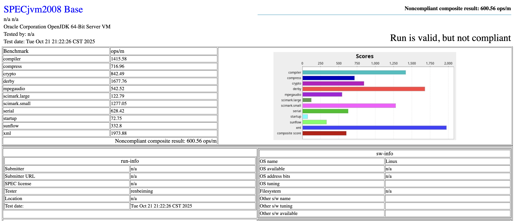
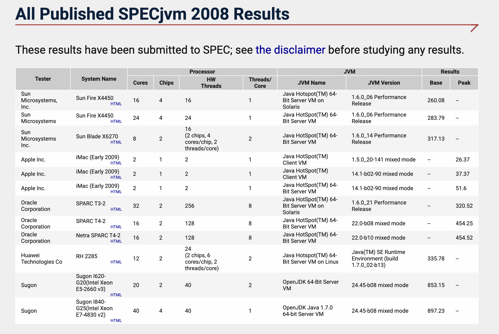
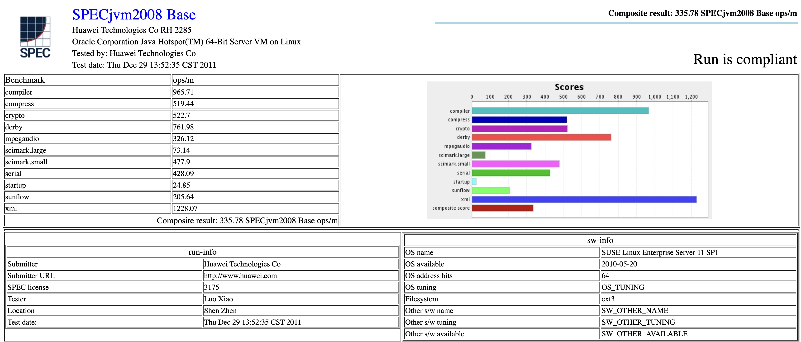
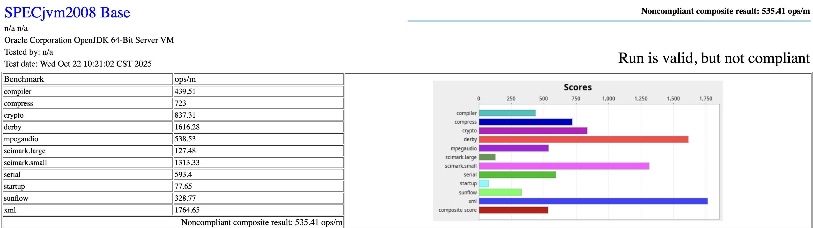

# 软件系统优化 上机作业 A2：SPECjvm2008 基准评测

10244511412 任北鸣

## 实验环境

| 项目 | 说明 |
|------|------|
| 操作系统 | Ubuntu 24.04.3 LTS (Noble Numbat) |
| 内核架构 | x86_64 |
| 处理器型号 | 12th Gen Intel® Core™ i5-12400F |
| 主频范围 | 0.8 GHz – 5.6 GHz |
| CPU 核心数 | 6 核 12 线程 |
| 内存容量 | 31 GiB |

## 任务一

> 访问 SPECjvm2008 官方网站，阅读 User’s Guide、Run and Report Rules、Known Issues、FAQ 四份文档，了解 SPEC 组织和一个标准的基准评测集的基本情况。  
> 相关地址：  
> https://www.spec.org/jvm2008/  
> https://www.spec.org/jvm2008/docs/UserGuide.html  
> https://www.spec.org/jvm2008/docs/RunRules.html  
> https://www.spec.org/jvm2008/docs/KnownIssues.html  
> https://www.spec.org/jvm2008/docs/FAQ.html  

### SPEC 组织简介

SPEC（Standard Performance Evaluation Corporation，标准性能评估公司）是一个非营利性组织，致力于制定和维护统一、公正、与厂商无关的性能基准和评测工具。其目标是为最新一代计算机系统提供性能与能效的标准化评估方法。SPEC 发布的基准测试被广泛用于学术研究、硬件厂商和软件开发领域，用以衡量不同系统在相同条件下的表现。

### 一个标准的基准评测集的基本情况

SPECjvm2008 是由 SPEC 发布的标准化基准评测集，其主要目的是测量 Java 运行时环境（JRE）在执行实际应用负载时的性能。  

在评测 JRE 性能的同时，SPECjvm2008 也间接反映了底层 **操作系统与硬件**（尤其是处理器与内存子系统）的运行效率。该评测集对文件 I/O 的依赖极低，且完全不包含跨机器的网络 I/O，从而确保测试结果主要体现计算与内存性能，而非外部输入输出开销。

SPECjvm2008 的设计理念是通过一系列 **通用应用工作负载** 来模拟真实世界的 Java 程序执行场景，从而评估系统的综合 Java 执行能力。测试负载涵盖了多个实际应用领域，如 **Derby 数据库**、**Javac 编译器**、**XML 处理（XML Processing）**、**加密运算（Crypto）** 等。这些工作负载共同构成了一个能够代表主流 Java 应用特征的测试集合，适用于不同类型的客户端与服务器系统。

为了确保结果的 **公平性、可比性与可复现性**，SPECjvm2008 制定了严格的运行标准，其中有两种核心运行类别：

- **Base 模式**：用于测量 JRE “开箱即用” 的性能，**禁止任何形式的手动调优或参数修改**，例如更改 JVM 堆大小或垃圾回收策略。该模式的运行结果是生成合规报告的**必要条件**，这也是接下来我们要在实验中尝试的。  
- **Peak 模式**：允许用户对 JVM 参数进行优化与调优，以展示系统在最优配置下的峰值性能表现。该模式为可选项。

评测的执行过程由若干 **迭代** 组成，其中：
- 第一个迭代为 **热身阶段**，默认运行 **120 秒**，用于让 JVM 充分加载类文件、触发 JIT 编译并稳定性能，其结果不计入最终成绩；
- 随后的迭代为 **测量阶段**，默认每轮持续 **240 秒**，用于正式记录性能数据。

在每个迭代中，测试程序会多次调用相应的工作负载，每次调用称为一次 **操作**。当一个操作结束后，程序会立即启动下一个操作，通常要求在单次迭代中至少完成 **5 次操作**。  
最终性能指标以 **每分钟操作数（operations per minute，ops/m）** 表示，综合得分为各工作负载得分的 **几何平均值**。

OK，了解了这些，我们就可以正式开始做评测了。

## 任务二

> 下载和安装 SPECjvm2008，根据上述文档的指引，跑一次完整的基准评测（大约 2~3 小时），记录安装和测试的过程和结果，了解一个标准的基准评测集的基本执行过程。  
> 注意：
> - 该程序支持 JDK 8，但不支持 JDK 11。建议安装 OpenJDK 1.8.0_41 RI Binaries 版本（下载地址：https://jdk.java.net/java-se-ri/8-MR3 ）。
> - 学习如何配置和修改Linux环境变量以使得程序正常运行，如，PATH、JAVA_HOME、CLASSPATH 等。
> - 只需运行 Base 类别，无需运行 Peak 类别，请注意 Base 类别运行的要求。
> - 无需修改 properties，运行完成后，同时提交完整的 results 目录。

### 准备 Java 环境

**下载 OpenJDK 1.8.0_41**

当前的环境中没有任何 Java 版本：

``` bash
(base) renbeiming@renbeiming-ubuntu:~/projects/software_sys_optimization/10244511412_A2$ java
Command 'java' not found, but can be installed with:
sudo apt install default-jre              # version 2:1.17-75, or
sudo apt install openjdk-17-jre-headless  # version 17.0.16+8~us1-0ubuntu1~24.04.1
sudo apt install openjdk-21-jre-headless  # version 21.0.8+9~us1-0ubuntu1~24.04.1
sudo apt install openjdk-19-jre-headless  # version 19.0.2+7-4
sudo apt install openjdk-20-jre-headless  # version 20.0.2+9-1
sudo apt install openjdk-22-jre-headless  # version 22~22ea-1
sudo apt install openjdk-11-jre-headless  # version 11.0.28+6-1ubuntu1~24.04.1
sudo apt install openjdk-25-jre-headless  # version 25+36-1~24.04.2
sudo apt install openjdk-8-jre-headless   # version 8u462-ga~us1-0ubuntu2~24.04.2
```

因此我们按照 SPEC 文档的指示来到 https://jdk.java.net/java-se-ri/8-MR3 来下载所需的 OpenJDK 1.8.0_41，选择 Oracle Linux 7.6 x64 Java Development Kit 版本然后将其下载在 `~/Downloads/` 文件夹下。

**解压并安装**

接着将其解压到 `/usr/lib/jvm/`（这是一个标准做法）：

```bash
sudo mkdir -p /usr/lib/jvm/openjdk-1.8.0_41
sudo tar -xzvf openjdk-8u41-b04-linux-x64-14_jan_2020.tar.gz -C /usr/lib/jvm/openjdk-1.8.0_41 --strip-components=1
```

**配置环境变量**

我们需要配置环境变量，这样你可以告诉系统在哪里可以找到我们刚才安装的 Java。

打开 `~/.bashrc`：

```bash
nano ~/.bashrc
```

在文件的最末尾，添加以下两行：

```bash
export JAVA_HOME=/usr/lib/jvm/openjdk-1.8.0_41
export PATH=$JAVA_HOME/bin:$PATH
```

保存并退出然后加载刚才的更改：

```bash
source ~/.bashrc
```

**检验是否安装成功**

在终端中输入 `java -version`：

```bash
(base) renbeiming@renbeiming-ubuntu:~/projects/software_sys_optimization/10244511412_A2$ java -version
openjdk version "1.8.0_41"
OpenJDK Runtime Environment (build 1.8.0_41-b04)
OpenJDK 64-Bit Server VM (build 25.40-b25, mixed mode)
```

发现正是我们要安装的 1.8.0_41 版本，说明成功！

### 安装 SPECjvm2008

我们在 https://www.spec.org/jvm2008/ 上点击 “Download the SPECjvm® 2008 benchmark” 即可下载 `SPECjvm2008_1_01_setup.jar`，然后我们在终端进行安装：

```bash
java -jar SPECjvm2008_1_01_setup.jar -i console
```

一路 `enter` 即可，只是中间要设置一个安装路径，我们只能选择用户有权限的文件夹，最终安装成功！

```bash
===============================================================================
Installation Complete
---------------------

Congratulations. SPECjvm2008 has been successfully installed to:

   /home/renbeiming/SPECjvm2008
``` 

### 验证安装

根据官方文档的指示我们可以运行以下指令试运行，来看看是否安装成果。它会运行 compress 基准测试，预热 5 秒，迭代 5 秒，预计在几分钟内完成。

```bash
java -jar SPECjvm2008.jar -wt 5s -it 5s -bt 2 compress
```

得到如下输出结果：

```bash
(base) renbeiming@renbeiming-ubuntu:~/SPECjvm2008$ java -jar SPECjvm2008.jar -wt 5s -it 5s -bt 2 compress

SPECjvm2008 Peak
  Properties file:   none
  Benchmarks:        compress

  WARNING: Run will not be compliant.
  Not a compliant sequence of benchmarks for publication.
  Property specjvm.iteration.time must be at least 240 seconds for publication.

  Kit signature and checksum is validated.
  This can take several minutes.
  Use argument '-ikv' to skip this.
  ....................................passed.

--- --- --- --- --- --- --- --- ---

  Benchmark:   check
  Run mode:    static run
  Test type:   functional
  Threads:     1
  Iterations:  1
  Run length:  1 operation

Iteration 1 (1 operation) begins: Tue Oct 21 20:32:14 CST 2025
Iteration 1 (1 operation) ends:   Tue Oct 21 20:32:14 CST 2025
Iteration 1 (1 operation) result: PASSED

Valid run!


--- --- --- --- --- --- --- --- ---

  Benchmark:   compress
  Run mode:    timed run
  Test type:   multi
  Threads:     2
  Warmup:      5s
  Iterations:  1
  Run length:  5s

Warmup (5s) begins: Tue Oct 21 20:32:14 CST 2025
Warmup (5s) ends:   Tue Oct 21 20:32:20 CST 2025
Warmup (5s) result: 171.66 ops/m

Iteration 1 (5s) begins: Tue Oct 21 20:32:20 CST 2025
Iteration 1 (5s) ends:   Tue Oct 21 20:32:27 CST 2025
Iteration 1 (5s) result: 175.54 ops/m

Valid run!
Score on compress: 175.54 ops/m

Results are stored in: 
/home/renbeiming/SPECjvm2008/results/SPECjvm2008.001/SPECjvm2008.001.raw
Generating reports in:
/home/renbeiming/SPECjvm2008/results/SPECjvm2008.001

Noncompliant composite result: 175.54 ops/m
```

- 说明安装成果！

### 正式进行基准测试

**尝试测试**

然后我们就可以正式进行基准测试啦：

```bash
java -jar SPECjvm2008.jar --base
```

**发现堵塞问题**

奇怪的事情发生了，发现会在 `sunflow` 这个进程卡很久，根据《FAQ》文档[Q1.9] 和《User's Guide》[1.10]，startup 类型的测试应该很快完成。

```bash
--- --- --- --- --- --- --- --- ---

  Benchmark:   startup.compiler.sunflow
  Run mode:    static run
  Test type:   single
  Threads:     1
  Iterations:  1
  Run length:  1 operation

Iteration 1 (1 operation) begins: Tue Oct 21 20:37:56 CST 2025
```

**排查原因**

长时间的停滞说明评测程序遇到了些问题，那我们来排查一下吧。我们打开一个新的终端窗口，使用 `ps axu | grep java` 命令来检查当前 Java 进程的状态：

```bash
renbeim+   14179 66.2  0.2 11511792 68492 pts/2  Sl+  20:52   0:09 java -jar SPECjvm2008.jar --base
renbeim+   14306  127  0.9 11383128 304184 pts/2 Sl+  20:52   0:05 /usr/lib/jvm/openjdk-1.8.0_41/jre/bin/java -classpath SPECjvm2008.jar -Dspecjvm.home.dir=. spec.harness.Launch -bt 1 -ops 1 -crf false -ict -icsv -ss SMALL compiler.sunflow
renbeim+   14339  0.0  0.0  12384  2492 pts/3    S+   20:52   0:00 grep --color=auto java
```

- 我们能看到两个关键的 Java 进程。一个是主程序（PID 14179），另一个是它为 compiler.sunflow 任务启动的子进程（PID 14306）。
- 两个进程的状态均为 `Sl+`，这意味着它们都处于“可中断睡眠”状态，并且正在等待某个事件完成。这说明程序并非在计算，而是陷入了等待或阻塞。

这个问题官方文档中也确有提到，《FQA》文档[Q4.8]说明在 Java SE8 之后的环境下，下面的测试是无法运行的：
- The following SPECjvm2008 benchmarks are known to not work.
  - startup.compiler.compiler
  - startup.compiler.sunflow
  - compiler.compiler
  - compiler.sunflow
  - However, you may be able to run the remaining benchmarks by using the command line, or using a properties file, to specify all the benchmarks (except for the above).

我想知道究竟为什么无法运行，`ps` 命令发现的堵塞状态又由什么引起呢？

查阅了一些资料后，得知是因为 SPECjvm2008 的父进程启动了 javac 编译器子进程来进行编译。在启动过程中，父进程重定向了子进程的 stderr（标准错误流），但是父进程自身并没有去读取这个流中的内容，而是使用 futex 等待子进程结束。与此同时，由于我们使用的 JDK 8 编译器版本不符，子进程在编译 sunflow 代码时产生了大量的警告信息，并试图将这些信息通过 stderr 输出。由于父进程没有读取 stderr，导致 stderr 的管道缓冲区很快被写满。子进程因此被阻塞在 write 系统调用处，无法继续运行。最终，子进程被阻塞了，父进程也永远等不到子进程的结束，两者陷入了死锁的境地。

**解决方案**

知道问题所在，一个简单的解决方案就是跳过 `sunflow`，虽然这违背了违反了《Run Rules》[2.3] 中“必须运行完整测试套件” 的规定，可能会导致结果“不合规的” (Noncompliant)。

```bash
java -jar SPECjvm2008.jar --base startup.helloworld startup.compress startup.crypto.aes startup.crypto.rsa startup.crypto.signverify startup.mpegaudio startup.scimark.fft startup.scimark.lu startup.scimark.monte_carlo startup.scimark.sor startup.scimark.sparse startup.serial startup.sunflow startup.xml.transform startup.xml.validation compress crypto.aes crypto.rsa crypto.signverify derby mpegaudio scimark.fft.large scimark.lu.large scimark.sor.large scimark.sparse.large scimark.fft.small scimark.lu.small scimark.sor.small scimark.sparse.small scimark.monte_carlo serial sunflow xml.transform xml.validation
```

资料中也指出了这个问题的修复方法，就是通过修改 `Main.java` 添加 ` -nowarn` 来禁止警告输出，从而解决死锁。但是这种方法还是会违反《Run Rules》[2.2] 中“禁止修改或使用重新编译的类文件” 的规定。这么看这似乎是个无解的问题。

综合看下来，为了评测的完整性，还是采用修复方案吧。在报告中明确记录这一操作，也符合《Run Rules》[5.0] 中关于学术研究用途应“披露与规则的偏差” 的精神，不算啥大问题。

**着手开始修复**

那么我们就开始修复吧，先进入安装目录：

```bash
cd /home/renbeiming/SPECjvm2008
```

然后编辑 `Main.java` 文件：

```bash
nano src/spec/benchmarks/compiler/sunflow/Main.java
```

找到启动 javac 编译器的代码行，添加 ` -nowarn` 参数：

```java
public class Main extends spec.benchmarks.compiler.MainBase {    
    
    public Main(BenchmarkResult bmResult, int threadId) {
        super(bmResult, threadId, 2);        
        String[] args = new String[] {
                        "-proc:none",
                        "-nowarn",  
                "@" + srcsFile.getPath()};
        compiler = new Compiler(args);
    }
```

最后重新编译基准测试：

```bash
unzip build-tools.zip    # 解压构建工具
bash ./build-specjvm.sh  # 运行编译脚本
```

输出：

```bash
BUILD SUCCESSFUL
Total time: 2 seconds
```

大功告成！

**运行新编译的评测程序**

然后我们进入新编译的 SPECjvm2008 路径下：

```bash
cd build/release/SPECjvm2008
```

运行基准测试：

```bash
java -jar SPECjvm2008.jar --base
```

得到了这样的输出结果，最终得分是：600.56



更多详细的输出结果请见 `results/` 下的 `SPECjvm2008.001` 文件夹。

## 任务三

> 查阅过去官方发布结果，对比最近任意一次发布结果（可从表格中任选一项）与自己执行结果的差异，并尝试解释原因。  
> 官方发布结果：https://www.spec.org/jvm2008/results/jvm2008.html   
> 注意，以上述表格第一行测试为例，发布结果包括：  
> Summary Report：  
> https://www.spec.org/jvm2008/results/res2008q3/jvm2008-20080617-00001.html  
> Base Report：  
> https://www.spec.org/jvm2008/results/res2008q3/jvm2008-20080617-00001.base/SPECjvm2008.base.html

**选择对比版本**

我们先来到官网查看官方发布的结果：



我采用的 Ubuntu 机器 CPU 硬件有 6 核 12 线程，刚好 Huawei Technologies Co RH 2285 服务器每块芯片也是这个配置。因此我决定选择这个版本来进行对比：



**对比数据**

| 测试项目 | 我的分数 (ops/m) | 官方分数 (ops/m) |
|-----------|------------------|------------------|
| compiler | 1415.58 | 965.71 |
| compress | 716.96 | 519.44 |
| crypto | 842.49 | 522.70 |
| derby | 1677.76 | 761.98 |
| mpegaudio | 542.52 | 326.12 |
| scimark.large | 122.79 | 73.14 |
| scimark.small | 1277.05 | 477.90 |
| serial | 628.42 | 428.09 |
| startup | 72.75 | 24.85 |
| sunflow | 332.80 | 205.64 |
| xml | 1973.88 | 1228.07 |
| composite | 600.56 | 335.78 |

**各项测试含义**

在开始分析之前，我查询并整理了一下各项指标的含义，这样可以让我们的理解更加深入：

1. **compiler**
    * 此基准测试评估 JRE 在执行编译任务时的效率，涵盖了从 Java 源代码到字节码的生成与优化过程。它包括了通用的代码编译（`compiler.compiler`）和针对 Sunflow 渲染应用的特定编译（`compiler.sunflow`）。

2. **compress**
    * 此测试用于衡量数据压缩算法的执行效率，它模拟了文件备份或存储前的文件处理工作负载。

3. **crypto**
    * 此基准测试评估 CPU 和 JRE 在执行加密与解密操作时的吞吐能力。这对安全通信至关重要，测试中包含了 AES 加密（`crypto.aes`）、RSA 加密（`crypto.rsa`）以及数字签名验证（`crypto.signverify`）等多种算法。

4. **derby**
    * 这是一个嵌入式数据库性能测试，通过执行 SQL 查询和各种数据库事务操作来衡量 Apache Derby 数据库的性能表现。

5. **mpegaudio**
    * 此测试评估多媒体应用中常见的音频处理性能，特指 MPEG 音频的编码速度。

6. **scimark**
    * 这是一套面向科学计算和数值计算的基准测试。它包含了多种计算密集型任务，如快速傅里叶变换（`fft`）、LU 分解（`lu`）、稀疏矩阵乘法（`sparse`）和蒙特卡罗方法（`monte_carlo`）等。该测试分为 `large` 和 `small` 两种数据集规模。

7. **serial**
    * 此测试用于衡量那些无法或难以并行化的单线程计算任务的性能。

8. **startup**
    * 此测试专注于测量 Java 应用程序的初始化和启动速度，这对于需要频繁冷启动的应用场景（如 `helloworld` 或 `compiler` 等）是一个关键指标。

9. **sunflow**
    * 这是一个 3D 渲染基准测试，用于评估 JRE 在执行图形和动画应用中常见的图像渲染任务时的能力。

10. **xml**
    * 此测试评估 JRE 在处理 XML 文档时的性能，这在 Web 服务和数据交换中非常普遍。它主要包括 XML 文档转换（`xml.transform`）和 XML 验证（`xml.validation`）两大操作。

**对比及分析原因**

官方的服务器由于有 2 个芯片，那么核心和线程都是我们的 2 倍，但是测试分数我们每一项都高于官方版本，综合分数更是高了接近 80%。考虑到官方是在 2011 进行的测试，已经过去了将近 15 年。我想这种差异可能跟硬件性能以及 Java 编译器的进步和提升有关。

我们先来对比一下硬件，虽然本地的 results 里 hw_info 都是 N/A，查看官方文档发现这是正常的，一般都需要用户手动填入，那么我们可以利用之前学习到的 `lscpu`，`free -h` 等指令来获取这些信息：

| 硬件信息 | 我的测试平台 (renbeining) | 官方平台 (Huawei RH 2285) |
| :--- | :--- | :--- |
| **CPU vendor** | GenuineIntel | Intel |
| **CPU name** | 12th Gen Intel(R) Core(TM) i5-12400F | Intel Xeon E5645 |
| **CPU frequency** | 5600.0000 MHz (Max) | 2.4 GHz |
| **# of logical cpus** | 12 | 24 (2 chips, 6 cores/chip, 2 threads/core) |
| **# of chips** | 1 | 2 |
| **# of cores** | 6 | 12 |
| **Cores per chip** | 6 | 6 |
| **Threads per core** | 2 | 2 |
| **Primary cache** | 288 KiB (L1d) + 192 KiB (L1i) | 32KBI+32KBD on chip per core |
| **Secondary cache** | 7.5 MiB | 256KB(I+D) on chip, per core |
| **Other cache** | 18 MiB (L3) | 12MB (I+D) on chip, per chip |
| **Memory size** | 31Gi | 48GB |

我查了一下资料，官方服务器使用的是 **2011 年的 Intel Xeon E5645**，基于 Westmere-EP 架构；而我的平台是 **2022 年的 Intel Core i5-12400F**，采用最新的 Alder Lake 架构。两者之间整整差了十多年，制程工艺从 32nm 进步到 10nm，单核性能（IPC）提升非常明显。

频率上的差距也很大，我的 CPU 最高能跑到 **5.6GHz**，而官方只有 **2.4GHz**。在计算机体系结构中，单核性能大致等于 “IPC × 主频”，所以我的 CPU 理论上每个核心的处理能力是对方的好几倍。  

这一点在 `serial`测试中体现得非常明显，我的得分高出 47%。这直接印证现代 CPU 的单线程性能比十几年前提升了好多。单核性能更高，也意味着所有计算密集型任务，比如 `scimark`、`crypto`、`compress` 等，都能在更短时间内完成。

然后观察缓存参数，我的 CPU 拥有更大的缓存，结合 csapp 的知识，缓存越大，CPU 能直接在芯片内存中拿到更多数据，减少频繁访问内存的次数，从而显著降低延迟、提升吞吐。

内存之间也差了一代，我使用的是 **DDR4 高速内存**，而官方服务器还停留在 **DDR3-1333**。这种老内存的带宽和延迟都比 **DDR4** 差不少。具体体现在测试上，比如 `scimark.large` 项目中，我的得分比官方高出 68%；在更依赖缓存性能的 `scimark.small` 测试中，我的分数甚至是官方的 2.6 倍。

可以说，这种性能差距完全就是现代 CPU 和内存等技术升级带来的影响。

除了硬件的影响，我们来分析一下软件吧。官方报告使用的是一个非常早期的 Java 7 版本（`build 1.7.0_02-b13`），而我使用的是 OpenJDK 1.8.0_41。

以下信息基本都是我从查询到的资料中整合而来的，描述了 Java 7 和 Java 8 的许多差异和升级：

在 Java 7 及更早版本中，类的元数据被存储在一个名为 **PermGen** 的固定区域中。这一区域容量有限，类加载较多时极易触发 **Full GC** 或 **OutOfMemoryError**，严重影响性能。  

而在 Java 8 中，**PermGen** 被彻底移除，取而代之的是使用本地内存的 **Metaspace**。这一变化使类加载和卸载的效率显著提升，也从一定程度上消除了 **PermGen** 带来的性能瓶颈。

这种改进在多个测试中体现得非常明显：  
- 在 **`startup`** 测试中，JVM 的启动和类加载速度提升近 3 倍；  
- 在 **`derby`** 和 **`xml`** 测试中，由于动态加载类和对象创建频繁，Java 8 中更灵活的 Metaspace 有效避免了 GC 压力，性能提升超过 1.6 倍。  

可以说，Metaspace 的引入从根本上改善了 JVM 的内存管理逻辑，为整体性能打下了坚实基础。

同时，Java 8 在 **垃圾回收** 和 **即时编译器** 两个核心模块上都有大幅优化。虽然两个版本默认都采用 **ParallelGC**（吞吐量优先的垃圾收集器），但 Java 8 的实现经过了深度调优：它能更智能地自适应调整堆区分配，缩短“Stop-the-World”暂停时间，从而显著提升了整体吞吐量。这种改进在 `compiler`、`derby`、`xml` 等分配密集型负载中尤为明显。

与此同时，Java 8 的 JIT 编译器引入了更完善的 **逃逸分析** 和激进的 **代码内联优化**。 例如，当某些对象不会逃逸出方法作用域时，JIT 可以将其直接分配在栈上，从而减少堆内存压力并降低 GC 频率。所以像 `crypto`、`scimark` 这样的计算密集型测试，这一机制带来了切实的性能提升。

这样就可以从硬件和软件两个方面来解释为什么我的本地结果要比官方的结果好啦。

## 任务四

> 谈谈自己运行一次标准的基准评测的感想和体会，以及遇到的问题和相应的解决方案。

老实说，我最大的体会是在没人注意的角落，竟然有人在做这些工作。讲真的，如果没有这次作业，我可能一辈子都接触不到 SPECjvm 基准测试。不过仔细想来，这些工作都是很有意义的，虽然今天的人们都在搞 ai，但所有的人工智能程序、操作系统乃至各种应用软件，最终都要在这些底层机制上运行。正是因为有那些默默优化 JVM、调整垃圾回收器、改进编译器、提升硬件架构以及创建这些评测基准的人，计算机系统才能不断变得更高效、更稳定，也让上层的创新得以顺利发生。

更进一步，这可能也是为什么计算机技术可以得到这么飞速的发展，世界上有无数个人在自己的领域默默付出，造出了很多高效有用的工具，不断把这栋楼越搭越高，才有了今天的计算机世界。

扯的有点远，回到这次测评本身，我觉得自己解决问题的能力得到了提升。这个作业其实就是给你一些文档，然后让你完成相应任务，那么需要我们在短时间内掌握一定的相关知识。在遇到 `sunflow` 堵塞的问题时，我借助 ai 的网络搜索功能找到了问题描述和解决文档，大大加速了解决问题的效率和时间。

除此之外，这个测评还启示我要有探索和发问精神，我想知道为什么我的测评分数比官方高好多，这带动我去搜寻相关资料，然后了解了 CPU 架构甚至 Java 底层机制的一些相关知识。这说明我们要勇于探索，这样才可以不断进步，收获更多。虽然这个道理很简单，但是要真的身体力行还是不易。

比较遗憾的是，我还是比较好奇是硬件提升还是 Java 版本的更迭对测试结果影响比较大，可惜没有时间做更多对比测试了。

## 任务五

>（选做）完成 Base 类别测试后，选择一个 JVM 参数进行修改，使用修改后的参数重新运行 SPECjvm2008（可以考虑只运行部分 Workload，报告中需注明）。对比调整参数前后的性能变化，结合相关知识，简要分析该参数为何会带来这样的性能影响。

我添加了一个 ` -Xmx4g`，这可以将 JVM 最大堆内存显式地限制为 4GB

```bash
java -Xmx4g -jar SPECjvm2008.jar
```

得到这样的结果：


列个表格，完整的数据在 `results/` 下的 `SPECjvm2008.002` 文件夹：

| 测试项目 | Base (ops/m) | -Xmx4g (ops/m) |
|-----------|------------------|------------------|
| compiler | 1415.58 | 1340.57 |
| compress | 716.96 | 712.53 |
| crypto | 842.49 | 870.77 |
| derby | 1677.76 | 1657.98 |
| mpegaudio | 542.52 | 533.46 |
| scimark.large | 122.79 | 125.06 |
| scimark.small | 1277.05 | 1267.71 |
| serial | 628.42 | 634.99 |
| startup | 72.75 | 75.41 |
| sunflow | 332.80 | 324.92 |
| xml | 1973.88 | 1942.58 |
| composite | 600.56 | 598.43 |

emm，区别好像不是很大，有升有降。官方会自动设置最大堆内容的大小，这可能说明 Base 模式下的默认内存也就比 4GB 大一点或者甚至可能就是 4GB，两次测试的差距都是可以接受的正常“run-to-run variation”。

这些调优让我有点失望，因为差异不明显，那么就换一个指标来调整吧。我想到之前分析 Java 7 和 Java 8 版本差异的时候学习到了垃圾回收器的不同实现和机制，那么我们就把默认的 ParallelGC 切换到 G1GC 来试一下，这样可能会使分数变低：

```bash
java -XX:+UseG1GC -jar SPECjvm2008.jar
```

得到这样的结果，完整的数据在 `results/` 下的 `SPECjvm2008.003` 文件夹。上图：



老规矩，列表：

| 测试项目 | Base (ops/m) | -g1gc (ops/m) |
|-----------|---------------|----------------|
| compiler | 1415.58 | 439.51 |
| compress | 716.96 | 723 |
| crypto | 842.49 | 837.31 |
| derby | 1677.76 | 1616.28 |
| mpegaudio | 542.52 | 538.53 |
| scimark.large | 122.79 | 127.48 |
| scimark.small | 1277.05 | 1313.33 |
| serial | 628.42 | 593.4 |
| startup | 72.75 | 77.65 |
| sunflow | 332.80 | 328.77 |
| xml | 1973.88 | 1764.65 |
| composite | 600.56 | 535.41 |

嘶，综合分数下降了大约 10%，下跌最明显的是 `compiler`，暴跌，其他的其实没有明显差距。

先来了解一下 G1GC 的机制，G1GC 是一个典型的“低延迟收集器”——它的首要目标是将单次 GC 暂停时间控制在可预测的范围内（通常不超过 200 ms）。

这就导致了一个根本性的冲突。SPECjvm2008 是一个纯吞吐量型基准测试，它只关心在 240 秒内程序能完成多少操作（ops/m），并不会因为某次 GC 暂停稍长而扣分。

而且 G1GC 为了实现短暂停顿，会在后台并发执行大量额外的工作，比如标记、分区整理等。这些后台线程会消耗 CPU 与内存带宽，相当于在与业务线程“抢资源”。

所以，当我用一个专注于降低延迟的 GC 去跑一个只评估吞吐量的测试，性能下降是必然的结果。

具体到我们的 `compiler` 测试指标，也是下降最明显的一项。compiler 基准测试的本质会在极短时间内分配和销毁数百万个临时对象（如 AST 节点、Token、字符串等）。这类负载对垃圾回收器的分配与回收效率极其敏感。

G1GC 将堆切成许多小区块，依靠后台并发标记来决定清理顺序。但在 Java 8 上，G1GC 的并发标记速度赶不上 compiler 的垃圾生成速度。当后台标记没完成而 Eden 已被填满时，G1GC 会被迫触发 单线程的 Full GC，清理整个堆。

这样就会会显著降低吞吐量，导致性能暴跌。

没想到这里面环环相扣，一个垃圾回收机制也能大有文章！