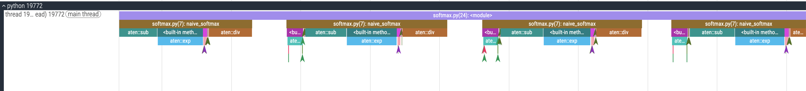
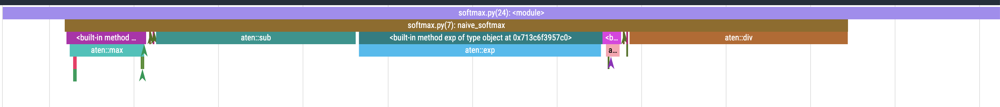
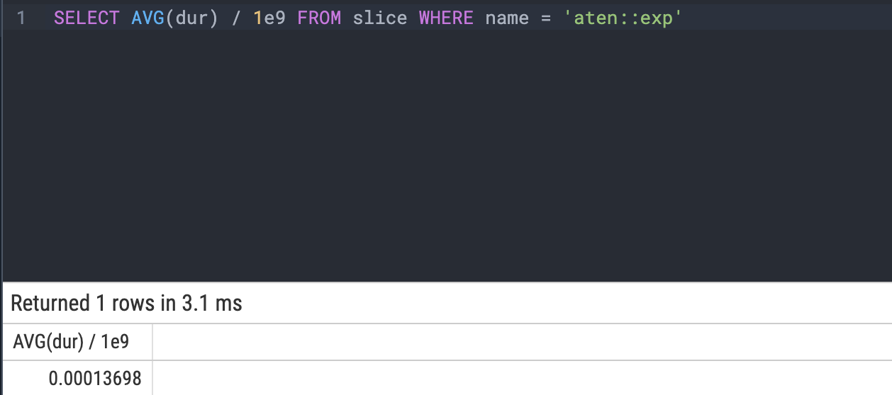
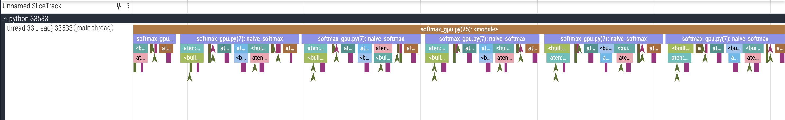
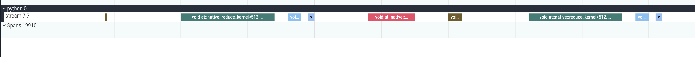
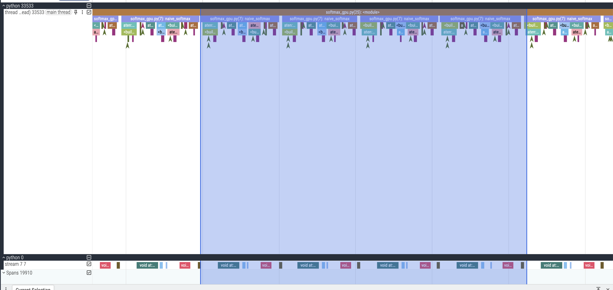
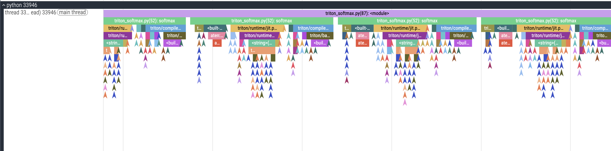
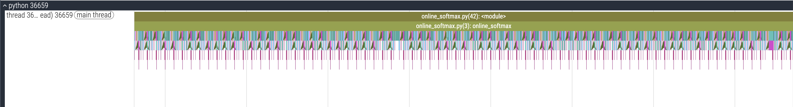
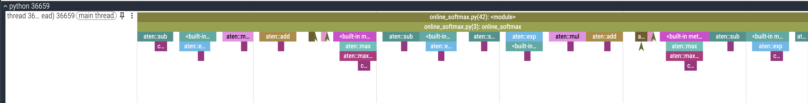

# Homework 3: 异构编程和性能分析

10244511412 任北鸣

## Step 1: 创建环境

采用本地 GPU 环境，以下是本地的硬件配置和软件包的版本：

| 类别 | 项目 | 配置内容 |
|------|------|-----------|
| **硬件** | CPU | Intel 12th Gen Core i5-12400F（6 核 12 线程） |
|  | GPU | NVIDIA GeForce RTX 4090 D（24 GB 显存） |
|  | GPU 驱动版本 | 580.95.05 |
|  | CUDA Runtime | 13.0 |
|  | 内存 | 31 GiB |
|  | Swap | 8 GiB |
|  | 主板 PCIe 信息 | AD102 [GeForce RTX 4090 D] |
| **系统** | 操作系统版本 | Ubuntu 24.04.3 LTS（Noble） |
|  | 内核版本 | Linux 6.14.0-35-generic |
| **软件环境** | Python | 3.11.14 |
|  | PyTorch 版本 | 2.3.1+cu121 |
|  | PyTorch CUDA | 12.1 |
|  | Triton 版本 | 3.5.1 |

---

## Step 2: Softmax

### 2.1 分析元素读写个数的数量

**分析**:

`z = x - x_max[:,None]`
- 读：访问 `x` 有 $N \times M$ 个元素，`x_max` 形状是 $(N, 1)$，虽然会自动广播成 $(N, M)$，但是实际只需要访问 $N$ 个元素，因此总共读了 $N \times M + N$ 个元素。
- 写：生成一个新的矩阵 `z`，其维度与 `x` 相同，所以需要写入 $N \times M$ 个元素。

`numerator = torch.exp(z)`
- 读：读取矩阵 $z$ 的每一个元素，读取量为 $N \times M$。
- 写：对每个元素做指数运算，然后写入 `numerator`，所以写入 $N \times M$ 个元素。

`denominator = numerator.sum(dim=1)`
- 读：该操作会对 `numerator` 中的每个元素的所有特征进行求和，因此仍然需要读取 $N \times M$ 个元素。
- 写：进行求和后会输出形状为 $N \times 1$ 的数组然后写入 `denominator`，因此写入 $N$ 个元素。

`ret = numerator / denominator[:, None]`
- 读该操作和 `x - x_max[:, None]` 类似，先读取 `numerator` 中的 $N \times M$ 个元素，然后读取 `denominator` 中的 $N \times 1$ 个元素并将其广播，所以一共读取 $N \times M + N$ 个元素。
- 写：生成新矩阵 `ret`，其维度和 `numerator` 一样，因此要写入 $N \times M$ 个元素。

**总表**:

| 操作 (Operation) | 读元素个数 (Read) | 写元素个数 (Write) |
| :--- | :--- | :--- |
| `x_max = x.max(dim=1)[0]` | $N \times M$ | $N$ |
| `z = x - x_max[:, None]` | $N \times M + N$ | $N \times M$ |
| `numerator = torch.exp(z)` | $N \times M$ | $N \times M$ |
| `denominator = numerator.sum(dim=1)` | $N \times M$ | $N$ |
| `ret = numerator / denominator[:, None]` | $N \times M + N$ | $N \times M$ |
| **总计 (Total)** | **$5 \times N \times M + 2 \times N$** | **$3 \times N \times M + 2 \times N$** |

### 2.2 针对 softmax 进⾏性能分析

我们先运行性能分析，得到输出：

```
------------------------------  ------------  ------------  ------------  ------------  ------------  ------------  
                          Name    Self CPU %      Self CPU   CPU total %     CPU total  CPU time avg    # of Calls  
------------------------------  ------------  ------------  ------------  ------------  ------------  ------------  
         cudaDeviceSynchronize        46.36%      79.855ms        46.36%      79.855ms      79.855ms             1  
                     aten::exp        15.85%      27.307ms        15.85%      27.307ms     136.535us           200  
                     aten::div        14.63%      25.194ms        14.63%      25.194ms     125.970us           200  
                     aten::sub        14.05%      24.207ms        14.05%      24.207ms     121.035us           200  
                     aten::max         5.23%       9.008ms         5.38%       9.272ms      46.360us           200  
    cudaGetDeviceProperties_v2         1.66%       2.863ms         1.66%       2.863ms       2.863ms             1  
                     aten::sum         1.09%       1.869ms         1.10%       1.895ms       9.475us           200  
            cudaGetDeviceCount         0.62%       1.065ms         0.62%       1.065ms     532.500us             2  
                   aten::slice         0.26%     444.000us         0.26%     449.000us       1.123us           400  
              aten::unsqueeze_         0.13%     218.000us         0.14%     235.000us       0.588us           400  
------------------------------  ------------  ------------  ------------  ------------  ------------  ------------  
Self CPU time total: 172.240ms
```

#### 1. 哪些算子占用了最多的时间？请列出前 3 名

忽略仅执行一次的同步与初始化操作（如 `cudaDeviceSynchronize` 和 `cudaGetDeviceProperties`），在 `naive_softmax` 循环计算中占用时间最多的前 3 名算子为：

1.  **`aten::exp`** (指数运算) - 耗时约 **27.31ms**
2.  **`aten::div`** (除法运算) - 耗时约 **25.19ms**
3.  **`aten::sub`** (减法运算) - 耗时约 **24.21ms**

#### 2. 结合 2.1 小题中元素读写个数的数量，分析这些算子耗时的原因

这三个算子之所以耗时最长，主要受 **内存访问量** 和 **计算复杂度** 双重影响：

**高内存读写**：
* 根据 2.1 的分析，这三个算子（`exp`, `div`, `sub`）都是 **逐元素 (Element-wise)** 操作，且输出维度均为 $(N, M)$。
* **读数据**：每次调用都需要读取 $N \times M$（或 $N \times M + N$）个浮点数。
* **写数据**：每次调用都需要将 $N \times M$ 个计算结果写回内存。
* **对比**：相比之下，`aten::sum` 虽然也读取 $N \times M$ 个数据，但它只写入 $N$ 个数据（降维），因此其耗时（1.87ms）远低于上述三个算子。

**计算复杂度**：
* **`aten::exp`**：除了巨大的内存读写开销外，指数运算本身在 CPU 上属于超越函数，计算成本显著高于简单的加减法，因此总耗时位居第一。
* **`aten::div`**：除法运算的指令周期通常也长于加减法，结合同样级别的内存访问量，使其耗时紧随 `exp` 之后。

#### 3. Self CPU 和 CPU total 分别表示什么含义？为什么两者会有差异？

**含义解释**：
* **Self CPU (自身 CPU 时间)**：指算子**本身**的代码逻辑在 CPU 上执行所消耗的时间，**不包含**它所调用的子算子的时间。
* **CPU total (总 CPU 时间)**：指执行该算子及其**所有子算子**在 CPU 上消耗的总时间。即：`CPU total = Self CPU + Children CPU`。

**差异分析**：
* **差异来源**：当一个算子内部调用了其他算子来实现功能时，两者会出现差异（Total > Self）。
* **本例观察**：在提供的表格中，`aten::exp`、`aten::div` 等算子作为**叶子算子**，不再调用其他 PyTorch 算子，因此它们的 `Self CPU` 和 `CPU total` 几乎完全相等。
* **`aten::max` 的差异**：表格中 `aten::max` 的 Total (9.27ms) 略大于 Self (9.00ms)。这主要是因为 `max` 算子底层需要同时返回最大值和索引两个张量，因此内部调用了一些子算子来分配额外的输出内存空间，产生了约 0.27ms 的调度与分配开销。
* **`aten::sum` 的差异**：同理，`aten::sum` 的 Total (1.90ms) 与 Self (1.87ms) 之间也存在极微小的差异。这同样源于其内部调用了基础内存算子（如 `aten::resize_` 或 `aten::empty`）来准备输出张量，但由于其仅需输出一个数值张量且逻辑简单，这种子调用开销比 `max` 更小。

### 2.3 采⽤ perfetto 进⾏性能分析

由于有 $200$ 次 `for` 循环，我们会得到如下的调用栈



我们选择其中一个查看即可



#### 1. 结合时间序列给出的调⽤栈分析，2.2 ⼩题中显示算⼦分别对应 naive_softmax 函数中的哪些操作？

观察 Perfetto 时间轴，算子按从左到右的时间顺序执行，与代码逻辑一一对应。关系如下：

| Perfetto 算子 (Name) | 对应代码操作 | 说明 |
| :--- | :--- | :--- |
| **`aten::max`** | `x_max = x.max(dim=1)[0]` |  计算每行最大值 |
| **`aten::sub`** | `z = x - x_max[:, None]` | 减法平移操作 |
| **`aten::exp`** | `numerator = torch.exp(z)` | 指数运算 (耗时最长) |
| **`aten::sum`** | `denominator = numerator.sum(dim=1)` | 求和计算归一化因子 |
| **`aten::div`** | `ret = numerator / denominator[:, None]` | 除法归一化 |

#### 2. 执⾏ SQL 语句 `SELECT AVG(dur) / 1e9 FROM slice WHERE name = 'aten::exp'` ，分析输出结果的时间，其对应 2.2 输出结果中的那⼀列？

先运行 SQL 语句



* **对应关系**：
    * `aten::exp 15.85% 27.307ms 15.85% 27.307ms 136.535us 200`  
    * 可以直观地看出该查询结果对应 2.2 节输出表格中的 **`CPU time avg`** 列（即 `aten::exp` 的平均执行时间）。

#### 3. 编写 SQL 语句，计算 aten::exp 算子的总 CPU 时间和比例；

可以使用如下 SQL 语句进行查询：

```sql
SELECT 
    SUM(dur) AS total_exp_time_ns,
    SUM(dur) / 1e9 AS total_exp_time_s,
    (SUM(dur) * 100.0) / (SELECT SUM(dur) FROM slice WHERE name = 'naive_softmax') AS ratio_percentage
FROM slice 
WHERE name = 'aten::exp';
```

**结果**:

| total_exp_time_ns | total_exp_time_s | ratio_percentage   |
| ----------------- | ---------------- | ------------------ |
| 27396000          | 0.027396         | 29.550529074847102 |

**分析**:

* **时间验证**：
    SQL 查询得出的总耗时 `0.027396 s`（即 **27.40 ms**）与 2.2 节 Profiler 表格中 `aten::exp` 的耗时 **27.31 ms** 高度吻合，证明查询结果准确涵盖了所有指数运算算子。

* **比例差异解释 (29.55% vs 15.85%)**：
    这里的 **29.55%** 高于 2.2 节表格中的 **15.85%**，这是因为计算基准（分母）不同：
    * **2.2 节表格**：分母是**整个 Trace 的总时间**，包含大量的 `cudaDeviceSynchronize` 等待时间（约占 46%）和其他开销。
    * **本 SQL 查询**：分母仅为 `naive_softmax` 函数的**纯计算时间**。
    * **验证**：如果我们去除同步等待时间，仅看计算部分：$15.85 / (100 - 46.36) \approx 29.5$。结果就对上了，说明 `aten::exp` 确实占据了 Softmax 核心计算逻辑约 **30%** 的时间，是主要的计算瓶颈。

### 2.4 在 GPU 上进⾏性能分析

我们将初始化 `x = torch.randn((N, M))` 的过程放到 `cuda` 上运行：

```python
device = torch.device("cuda" if torch.cuda.is_available() else "cpu")
x = torch.randn((N, M), device=device)
```

#### 1. 哪些算⼦占⽤了最多的 CPU 时间？请列出前 3 名，并简要分析原因

我们通过 `print(prof.key_averages().table(sort_by="cpu_time_total", row_limit=10))` 得到如下输出:

```
-------------------------------------------------------  ------------  ------------  ------------  ------------  ------------  ------------  ------------  ------------  ------------  ------------  
                                                   Name    Self CPU %      Self CPU   CPU total %     CPU total  CPU time avg     Self CUDA   Self CUDA %    CUDA total  CUDA time avg    # of Calls  
-------------------------------------------------------  ------------  ------------  ------------  ------------  ------------  ------------  ------------  ------------  ------------  ------------  
                                       cudaLaunchKernel        82.98%      44.674ms        82.98%      44.674ms      44.674us     346.000us         6.62%     346.000us       0.346us          1000  
                                              aten::max         6.52%       3.512ms        31.27%      16.833ms      84.165us       2.815ms        53.85%       2.815ms      14.075us           200  
                                              aten::exp         2.36%       1.270ms        21.25%      11.443ms      57.215us     211.000us         4.04%     295.000us       1.475us           200  
                                              aten::sub         2.67%       1.438ms        17.01%       9.158ms      45.790us     401.000us         7.67%     449.000us       2.245us           200  
                                              aten::sum         2.22%       1.194ms        14.95%       8.048ms      40.240us       1.400ms        26.78%       1.448ms       7.240us           200  
                                              aten::div         1.63%     878.000us        14.62%       7.871ms      39.355us     400.000us         7.65%     566.000us       2.830us           200  
                                            aten::slice         0.82%     444.000us         0.83%     448.000us       1.120us       0.000us         0.00%       0.000us       0.000us           400  
                                       aten::as_strided         0.56%     303.000us         0.56%     303.000us       0.216us       0.000us         0.00%       0.000us       0.000us          1400  
                                             cudaMalloc         0.16%      88.000us         0.16%      88.000us      88.000us       0.000us         0.00%       0.000us       0.000us             1  
                                        aten::unsqueeze         0.06%      31.000us         0.06%      32.000us       0.080us       0.000us         0.00%       0.000us       0.000us           400  
-------------------------------------------------------  ------------  ------------  ------------  ------------  ------------  ------------  ------------  ------------  ------------  ------------  
Self CPU time total: 53.839ms
Self CUDA time total: 5.227ms
```

该 `print` 会根据 CPU 时间降序输出，除去 cuda 启动内核的时间，我们可以看到占用CPU时间最多的前三名算子分别是:
1.  **`aten::max`** (CPU Total: ~16.83ms)
2.  **`aten::exp`** (CPU Total: ~11.44ms)
3.  **`aten::sub`** (CPU Total: ~9.16ms)

**原因分析**:

1. `aten::max` (CPU Total: ~16.83ms)
* **双输出开销**：与 `exp` 或 `sub` 不同，PyTorch 的 `max(dim=1)` 算子默认是一个 **规约操作**，它不仅要计算最大值，还要计算最大值的索引。这意味着 CPU 在发射内核前，需要检查、分配或调整**两个**输出张量（Float 和 Long 类型）的元数据（Shape, Stride, DataType）。
* **规约设置**：规约操作（Reduction）相比逐元素操作，涉及到维度坍缩（$(N, M) \to N$），CPU 需要进行更复杂的参数检查和内核配置（Grid/Block 维度计算），这导致其 `Self CPU`（3.5ms）和总调度时间都显著高于其他算子。

2. `aten::exp` (CPU Total: ~11.44ms)
* **主要瓶颈在 Launch**：观察表格，`aten::exp` 的 `Self CPU`（1.27ms）其实很低，但 `CPU Total` 很高。这说明大部分时间花在了子事件 `cudaLaunchKernel` 上。
* **指令发射时间**：作为 Softmax 中的核心计算算子，它在 200 次循环中被频繁调用。虽然它是逐元素操作，逻辑简单，但每次调用 CPU 都必须通过 CUDA 驱动向 GPU 命令队列提交任务。在 `sub` 之后紧接着发射 `exp`，可能会受到驱动层序列化或队列处理微小延迟的影响，导致其总计入的 CPU 等待/交互时间较高。

3. `aten::sub` (CPU Total: ~9.16ms)
* **广播开销**：该算子执行的是 `x - x_max[:, None]`，输入 `x` 是 $(N, M)$，而 `x_max` 是 $(N, 1)$。
* **Tensor Iterator 设置**：在发射内核之前，CPU 必须先处理**广播逻辑**——计算如何将 $(N, 1)$ 的张量虚拟扩展为 $(N, M)$。这涉及到张量步长（Strides）的推导和 `TensorIterator` 的构建。相比于不需要广播的 `exp`（输入输出形状一致），`sub` 在 CPU 端有额外的 **形状推导（Shape Inference）** 工作，这体现在其 `Self CPU` (1.44ms) 略高于 `exp` (1.27ms) 上。

#### 2. 哪些算⼦占⽤了最多的 GPU 时间？请列出前 3 名，并简要分析原因

我们可以通过 `print(prof.key_averages().table(sort_by="cuda_time_total", row_limit=10))` 让打印输出以 GPU 降序排列:

```
-------------------------------------------------------  ------------  ------------  ------------  ------------  ------------  ------------  ------------  ------------  ------------  ------------  
                                                   Name    Self CPU %      Self CPU   CPU total %     CPU total  CPU time avg     Self CUDA   Self CUDA %    CUDA total  CUDA time avg    # of Calls  
-------------------------------------------------------  ------------  ------------  ------------  ------------  ------------  ------------  ------------  ------------  ------------  ------------  
                                              aten::max         7.19%       2.809ms        34.45%      13.469ms      67.345us       2.824ms        53.90%       2.824ms      14.120us           200  
void at::native::reduce_kernel<512, 1, at::native::R...         0.00%       0.000us         0.00%       0.000us       0.000us       2.824ms        53.90%       2.824ms      14.120us           200  
                                              aten::sum         3.00%       1.174ms        13.74%       5.371ms      26.855us       1.400ms        26.72%       1.448ms       7.240us           200  
void at::native::reduce_kernel<512, 1, at::native::R...         0.00%       0.000us         0.00%       0.000us       0.000us       1.400ms        26.72%       1.400ms       7.000us           200  
                                              aten::div         2.09%     818.000us        12.34%       4.824ms      24.120us     400.000us         7.64%     569.000us       2.845us           200  
                                              aten::sub         2.19%     858.000us        16.04%       6.271ms      31.355us     401.000us         7.65%     449.000us       2.245us           200  
void at::native::elementwise_kernel<128, 2, at::nati...         0.00%       0.000us         0.00%       0.000us       0.000us     401.000us         7.65%     401.000us       2.005us           200  
void at::native::elementwise_kernel<128, 2, at::nati...         0.00%       0.000us         0.00%       0.000us       0.000us     400.000us         7.64%     400.000us       2.000us           200  
                                       cudaLaunchKernel        82.21%      32.136ms        82.21%      32.136ms      32.136us     349.000us         6.66%     349.000us       0.349us          1000  
                                              aten::exp         1.84%     720.000us        22.20%       8.679ms      43.395us     214.000us         4.08%     298.000us       1.490us           200  
-------------------------------------------------------  ------------  ------------  ------------  ------------  ------------  ------------  ------------  ------------  ------------  ------------  
Self CPU time total: 39.092ms
Self CUDA time total: 5.239ms
```

除去内核运行时间，我们可以看到占用 GPU 时间最长的3个算子为:
1.  **`aten::max`** (CUDA Total: ~2.82ms)
2.  **`aten::sum`** (CUDA Total: ~1.45ms)
3.  **`aten::div`** (CUDA Total: ~0.57ms)

**原因分析：**

1. `aten::max`
* **内核证据**：Profiler 明确显示其底层调用了 `at::native::reduce_kernel`，属于典型的**规约 (Reduction)** 操作。
* **规约开销**：`max` 需要将每行 $M=5000$ 个元素聚合成 1 个最大值。这无法像逐元素操作那样让每个线程独立跑到底，而是需要线程间频繁通信（如 Warp Shuffle 或 Shared Memory）来进行多轮比较，同步开销极大。
* **双输出压力**：PyTorch 的 `max` 默认行为是同时返回 **Values** 和 **Indices**。
    * 在规约树的每一步比较中，线程不仅要交换数值，还要交换并更新对应的索引，寄存器压力和逻辑复杂性翻倍。
    * 最终写回显存时，需要同时写入浮点型结果（Values）和长整型结果（Indices），写入量是单纯数值规约的两倍。

2. `aten::sum`
* **内核类型**：同样调用了 `reduce_kernel`，受限于线程同步和跨线程数据交换的开销，无法完全跑满 GPU 的流水线，因此耗时显著高于普通的 Element-wise 操作。
* **比 `max` 快的原因**：`sum` 只需要做单纯的浮点加法，**不需要追踪索引**。这意味着它的寄存器占用更少，且最终只需写回一个结果张量。因此，它的耗时（~1.45ms）大约只有 `max`（~2.82ms）的一半。

3. `aten::div`
* **内核类型**：Profiler 显示其底层为 `at::native::elementwise_kernel`，并行度高，但受限于显存带宽。
* **访存瓶颈**：相比于仅需读取一个输入张量的 `aten::exp` (~0.30ms)，`div` 需要读取 **两个** 输入张量（分子矩阵 $N \times M$ 和分母向量 $N \times 1$）。
* **广播开销**：读取分母向量涉及广播操作，虽然 L2 Cache 会缓解一部分压力，但总体显存访问次数显著多于单输入的 `exp`，导致其耗时约为 `exp` 的两倍。

#### 3. 分析 perfetto 中 GPU 时间线的调⽤栈，对⽐ CPU 和 GPU 的差异，简要分析原因

我们先查看 CPU 的调用栈:



再单独 GPU 的调用栈:



最后将它们合并对比:



**执行时机错位**
* 首先我们可以发现它们的执行时机是错位的，观察时间轴，CPU 端的算子（如 `aten::max`）总是显著早于 GPU 端的对应内核（`void at::native::reduce_kernel...`）执行。同时，CPU 完成一次 `cudaLaunchKernel` 仅需约 1.85µs，迅速完成所有发射任务；而 GPU 内核随后才开始排队执行，且单次规约耗时达 14µs。
* 这是 CUDA **异步执行模型**的核心机制，CPU 仅负责将计算任务推入命令队列，不等待结果即可处理下一行代码；GPU则从队列中 取出任务依次执行。这种机制有效隐藏了 CPU 的调度延迟。

**调用栈层级的本质不同**
* **差异**：
    * **CPU 侧**：显示的是 PyTorch 框架的高层调度逻辑（如 `softmax_gpu.py` -> `aten::exp` -> `cudaLaunchKernel`），反映了 Python 解释器和 PyTorch 分发器的工作。
    * **GPU 侧**：显示的是底层的 C++ CUDA 模板内核（如 `elementwise_kernel<128, ...>` 或 `reduce_kernel<512, ...>`），反映了真实的硬件计算过程。
* **分析**：这验证了 PyTorch "即时编译/分发" 的架构——前端负责图层面的逻辑，后端执行预编译好的二进制内核。

**算子间隙的不同含义**
* **差异**：
    * **CPU 轨道**中的间隙代表 Python 解释器的开销，即读取下一行代码的时间。
    * **GPU 轨道**中的间隙通常很小或紧密相连，代表 GPU 流水线的饱和度。
* 在当前 Softmax 实现中，CPU 发射指令的速度（~40µs/iter）要快于 GPU 执行速度（~50µs/iter），因此 GPU 轨道显得较为紧凑，所以 GPU 侧的显存带宽是一定的瓶颈。

### 2.5 在 Triton 实现的 Softmax 上进⾏性能分析

#### 1. 从算⼦⻆度结合调⽤栈分析，Triton 实现的 softmax 相较于 naive_softmax 有哪些不同？有什么原因使得 Triton 实现的 softmax 相较于 naive_softmax 更快？简要分析其原因

我们先运行 triton 实现的 softmax，得到这样的性能输出:

```
-------------------------  ------------  ------------  ------------  ------------  ------------  ------------  ------------  ------------  ------------  ------------  
                     Name    Self CPU %      Self CPU   CPU total %     CPU total  CPU time avg     Self CUDA   Self CUDA %    CUDA total  CUDA time avg    # of Calls  
-------------------------  ------------  ------------  ------------  ------------  ------------  ------------  ------------  ------------  ------------  ------------  
           softmax_kernel         0.00%       0.000us         0.00%       0.000us       0.000us     601.000us       100.00%     601.000us       3.005us           200  
         aten::empty_like        11.76%     216.000us        99.56%       1.829ms       9.145us       0.000us         0.00%       0.000us       0.000us           200  
      aten::empty_strided        87.97%       1.616ms        87.97%       1.616ms       8.080us       0.000us         0.00%       0.000us       0.000us           200  
    cudaDeviceSynchronize         0.27%       5.000us         0.27%       5.000us       5.000us       0.000us         0.00%       0.000us       0.000us             1  
-------------------------  ------------  ------------  ------------  ------------  ------------  ------------  ------------  ------------  ------------  ------------  
Self CPU time total: 1.837ms
Self CUDA time total: 601.000us
```

然后放到 perfetto 里查看调用栈:



**Triton 实现的 Softmax 相较于 naive_softmax 有哪些不同？**

***注：我们分析 cuda 版本的 naive_softmax***

1.  **算子构成的本质差异**
    * **Naive Softmax**: 由 **5 个独立算子**构成流水线。在 Trace 中表现为 CPU 反复调用 `cudaLaunchKernel`，GPU 端对应执行 5 个独立的小内核（`max`, `sub`, `exp`, `sum`, `div`），中间伴随着大量的显存读写。
    * **Triton Softmax**: 逻辑被完全融合为 **1 个算子** (`softmax_kernel`)。
        * **调用栈证据**：Trace 中完全没有出现 `aten::exp` 或 `aten::max` 等数学算子。取而代之的是 Triton JIT 运行时的调用链：`triton/runtime/jit.py` $\rightarrow$ `driver.py: __call__` $\rightarrow$ `<built-in function launch>`。
        * 这表明计算逻辑不再由 PyTorch 的 C++ 前端分发，而是直接由 Triton 编译器生成的单一微码控制。

2.  **瓶颈转移**
    * **Naive Softmax**: CPU 时间主要消耗在 **5 次内核发射** 和 **PyTorch 调度开销** 上。
    * **Triton Softmax**: 
        * **内存分配成为显性开销**：由于计算内核极快（~3µs），Profiler 表格显示 `aten::empty_like`（用于分配输出张量 $y$）占据了 CPU Total 的绝大部分时间。
        * **JIT 运行时开销**：从 Raw Data 可见，`warmup` 和 `specialize_impl` 等 Python 函数占据了约 20µs 的 CPU 时间。这意味着 Triton 的主要 CPU 成本在于 **检查缓存和参数特化**，而非发射内核本身。

**有什么原因使得 Triton 实现的 Softmax 相较于 naive_softmax 更快？**

1.  **极致的访存优化 (SRAM vs HBM)**
    Softmax 是典型的 **IO Bound**（带宽受限）算子。
    * **Naive**: 必须多次读写高延迟的 **HBM (Global Memory)**。计算 `x-max`、`exp`、`sum` 的中间结果都需要写回显存再读出，总访存量约为 $8 \times N \times M$。
    * **Triton**: 利用 **SRAM (Shared Memory)** 进行数据复用。
        * 内核将一行数据加载到片上 SRAM 后，所有的减法、指数、求和操作都在 SRAM 中完成。
        * **仅发生 1 次 HBM 读取和 1 次 HBM 写入**，理论访存量降至 $2 \times N \times M$。在带宽受限的 GPU 上，访存量的减少直接转化为性能的成倍提升。

2.  **消除内核启动与同步开销**
    * **减少发射次数**：从 $1000$ 次启动（$200 \times 5$）减少到 $200$ 次启动（$200 \times 1$）。这极大地减轻了 CPU 与 GPU 之间的交互压力（CPU-GPU Latency）。
    * **消除全局同步**：Naive 实现中，每个算子结束后 GPU 必须将数据刷回显存并进行全局同步；Triton 实现中，数据依赖都在 **Block 内部** 通过 `tl.max` 和 `tl.sum` 解决，线程间同步极其高效。

3.  **寄存器与计算密度的提升**
    * Triton 编译器会自动优化寄存器分配和指令流水线。通过 `BLOCK_SIZE` 的分块处理，保证了 GPU 的 SM（流多处理器）处于高负载状态，避免了 Naive 实现中因小算子（如 `sum`）导致的 GPU 资源闲置。

### 2.6 实现 Online Softmax

#### 1. 采⽤ pytorch 实现上述 online softmax 算法

```Python
import torch

def online_softmax(x):
    rows, cols = x.shape
    
    # 1. 初始化 (对应 Algorithm 3: line 1-2)
    # 我们维护 N 行的状态，利用 PyTorch 在 batch 维度并行
    m_prev = torch.full((rows,), float('-inf'), device=x.device, dtype=x.dtype)
    d_prev = torch.zeros((rows,), device=x.device, dtype=x.dtype)
    
    # 2. 第一次遍历：流式计算最大值和归一化因子 (对应 Algorithm 3: line 3-6)
    for j in range(cols):
        val = x[:, j]
        
        m_curr = torch.max(m_prev, val)
        
        correction = torch.exp(m_prev - m_curr)
        new_term = torch.exp(val - m_curr)
        
        d_curr = d_prev * correction + new_term

        m_prev = m_curr
        d_prev = d_curr

    # 循环结束后，m_prev 即为最终的 m_V (每行的最大值)
    # d_prev 即为最终的 d_V (每行的归一化因子)
    
    # 为了广播计算，扩展维度为 (N, 1)
    m_final = m_prev.unsqueeze(1)
    d_final = d_prev.unsqueeze(1)
    
    # 3. 第二次遍历：生成最终输出 (对应 Algorithm 3: line 7-9)
    ret = torch.exp(x - m_final) / d_final
    
    return ret

if __name__ == "__main__":
    # 创建测试数据
    N, M = 100, 5000
    device = torch.device("cuda" if torch.cuda.is_available() else "cpu")
    x = torch.randn((N, M), device=device)

    with torch.profiler.profile(
        activities=[
            torch.profiler.ProfilerActivity.CPU,
            torch.profiler.ProfilerActivity.CUDA,
        ],
        on_trace_ready=torch.profiler.tensorboard_trace_handler("log/online_softmax/"),
        with_stack=True
    ) as prof:
        for i in range(2):
            online_softmax(x)

    print(prof.key_averages().table(sort_by="cuda_time_total", row_limit=10))
```

我发现在对 Online Softmax 进行 `torch.profiler` 性能分析时，若循环次数设为 200 次，内存会爆掉。这应该是因为 **Naive Softmax** 采用向量化实现，单次计算仅调用约 5 个粗粒度算子（如 `aten::exp`, `aten::sum`），200 次循环仅产生约 **1,000 个** Profiler 事件，内存占用极低。而**Online Softmax** 依算法逻辑在特征维度（$M=5000$）使用了 Python `for` 循环，这意味着单次计算会触发 $5000 \times \text{Ops}$ 次微小的算子调用。在 200 次循环下，累计产生的 Profiler 事件数量高达**数百万级**。因此我把循环次数由 200 次降为了 2 次。

#### 2. 结合 torch.profiler 和 perfetto 的分析结果，⽐较 online softmax 和 naive_softmax 的性能差异，并简要分析原因（参考⽅⾯：内存访问次数，内核启动次数，计算密度等）；

`torch.profiler` 结果:

```
CPU 时间排序
-------------------------------------------------------  ------------  ------------  ------------  ------------  ------------  ------------  ------------  ------------  ------------  ------------  
                                                   Name    Self CPU %      Self CPU   CPU total %     CPU total  CPU time avg     Self CUDA   Self CUDA %    CUDA total  CUDA time avg    # of Calls  
-------------------------------------------------------  ------------  ------------  ------------  ------------  ------------  ------------  ------------  ------------  ------------  ------------  
                                       cudaLaunchKernel        35.22%      86.022ms        35.22%      86.022ms       2.457us       1.897ms         9.61%       1.897ms       0.054us         35005  
                                              aten::exp        15.94%      38.920ms        24.89%      60.779ms       6.077us       9.723ms        49.26%      10.265ms       1.026us         10001  
                                              aten::sub        16.91%      41.304ms        24.45%      59.725ms       5.972us       5.004ms        25.35%       5.549ms       0.555us         10001  
                                              aten::max         3.05%       7.445ms        16.70%      40.791ms       8.158us       0.000us         0.00%       4.566ms       0.913us          5000  
                                          aten::maximum         7.57%      18.493ms        15.32%      37.407ms       7.481us       4.999ms        25.33%       5.268ms       1.054us          5000  
                                              aten::mul         8.46%      20.673ms        12.37%      30.200ms       6.040us       5.000us         0.03%     273.000us       0.055us          5000  
                                              aten::add         8.17%      19.944ms        11.00%      26.867ms       5.373us       3.000us         0.02%     273.000us       0.055us          5000  
                                             aten::full         0.01%      32.000us         3.22%       7.859ms       7.859ms       0.000us         0.00%       2.000us       2.000us             1  
                                            aten::fill_         0.02%      49.000us         2.70%       6.582ms       3.291ms       1.000us         0.01%       3.000us       1.500us             2  
                                            aten::slice         2.52%       6.163ms         2.53%       6.180ms       1.236us       0.000us         0.00%       0.000us       0.000us          5000  
-------------------------------------------------------  ------------  ------------  ------------  ------------  ------------  ------------  ------------  ------------  ------------  ------------  
Self CPU time total: 244.230ms
Self CUDA time total: 19.739ms
```

```
Cuda 时间排序
-------------------------------------------------------  ------------  ------------  ------------  ------------  ------------  ------------  ------------  ------------  ------------  ------------  
                                                   Name    Self CPU %      Self CPU   CPU total %     CPU total  CPU time avg     Self CUDA   Self CUDA %    CUDA total  CUDA time avg    # of Calls  
-------------------------------------------------------  ------------  ------------  ------------  ------------  ------------  ------------  ------------  ------------  ------------  ------------  
                                              aten::exp        16.20%      39.461ms        24.91%      60.698ms       6.069us       9.728ms        49.27%      10.267ms       1.027us         10001  
void at::native::vectorized_elementwise_kernel<4, at...         0.00%       0.000us         0.00%       0.000us       0.000us       9.729ms        49.28%       9.729ms       0.973us         10001  
                                              aten::sub        17.17%      41.842ms        24.51%      59.727ms       5.972us       5.004ms        25.35%       5.546ms       0.555us         10001  
                                          aten::maximum         7.76%      18.899ms        15.56%      37.904ms       7.581us       4.999ms        25.32%       5.267ms       1.053us          5000  
void at::native::elementwise_kernel<128, 2, at::nati...         0.00%       0.000us         0.00%       0.000us       0.000us       5.003ms        25.34%       5.003ms       1.000us          5001  
void at::native::elementwise_kernel<128, 2, at::nati...         0.00%       0.000us         0.00%       0.000us       0.000us       5.000ms        25.33%       5.000ms       1.000us          5000  
                                              aten::max         3.07%       7.472ms        16.82%      40.989ms       8.198us       0.000us         0.00%       4.498ms       0.900us          5000  
                                       cudaLaunchKernel        34.70%      84.533ms        34.70%      84.533ms       2.415us       1.890ms         9.57%       1.890ms       0.054us         35005  
                                              aten::mul         8.32%      20.270ms        12.37%      30.139ms       6.028us       4.000us         0.02%     277.000us       0.055us          5000  
                                              aten::add         8.38%      20.408ms        10.93%      26.642ms       5.328us       3.000us         0.02%     269.000us       0.054us          5000  
-------------------------------------------------------  ------------  ------------  ------------  ------------  ------------  ------------  ------------  ------------  ------------  ------------  
Self CPU time total: 243.644ms
Self CUDA time total: 19.743ms
```

查看 perfetto 调用栈:



  

根据 Profiling 结果，我们将 PyTorch 实现的 `online_softmax`（细粒度循环，运行 1 次）与 `naive_softmax`（向量化，参考值）进行核心指标对比：

| 性能指标 | Online Softmax (PyTorch Loop) | Naive Softmax (Vectorized) | 差异分析 |
| :--- | :--- | :--- | :--- |
| **CUDA Kernel 启动次数** | **35,005 次** | ~5 次 | **差约 7 千倍** (核心瓶颈) |
| **Self CPU Time** | **244.23 ms** | ~0.26 ms | **CPU 耗时极高** |
| **Self CUDA Time** | **19.74 ms** | ~0.03 ms | GPU 利用率低 |
| **CPU/GPU 时间比** | **~12.4**  | ~10  | 严重受限于 Python 调度 |
| **主要耗时算子** | `cudaLaunchKernel` (35.22%) | `aten::exp` (计算为主) | 调度开销占主导 |

**原因分析**

1. 内核启动次数
* **数据证据**：Profiler 表格显示 `cudaLaunchKernel` 被调用了 **35,005 次**。这对应了 `aten::exp` (10,001次), `aten::sub` (10,001次), `aten::mul` (5,000次), `aten::add` (5,000次) 等基础算子的累加。
* **Perfetto 证据**：
    * **图1** 展示了密密麻麻的“针状”调用条纹，时间轴被切分得极碎，这代表了数万次微小的内核发射。
    * **图2** 展示了单次循环内部的细节：`sub` -> `exp` -> `max` -> `mul` -> `add` 依次排开，而这样的循环在一次 Softmax 计算中进行了 5000 次。
* **分析**：由于 PyTorch 实现的 Online Softmax 使用了 Python `for` 循环遍历特征维度 ($M=5000$)，导致每一列的简单计算都必须作为一个独立的 CUDA Kernel 发射。CPU 发射指令的延迟（约 2.4 us）远大于 GPU 执行该指令的时间（约 0.05~1 us），导致 GPU 长期处于等待状态。

2. 内存访问模式
* **Naive Softmax**：虽然显存读写总量大（需要读写整个 $N \times M$ 矩阵多次），但它是**合并访问 (Coalesced Access)**，带宽利用率高。
* **Online Softmax**：
    * 虽然算法理论上只需要 $O(1)$ 的空间，但在 PyTorch 循环实现中，每一步 $j$ 的更新都需要读取上一轮的 $m_{prev}, d_{prev}$ 并写入新的 $m_{curr}, d_{curr}$ 到 HBM（高带宽内存）。
    * 这导致了大量的**小碎片化内存读写**。由于没有像 Triton 那样把中间变量保留在 SRAM（共享内存）或寄存器中，这种“伪 Online”实现反而增加了总的显存访问延迟。

3. 计算密度
* **分析**：`online_softmax` 的计算密度极低。
* **证据**：Profiler 中 `aten::exp` 和 `aten::maximum` 的平均 GPU 执行时间仅为 **1.0 us** 左右，而 `aten::sub` 甚至只有 **0.55 us**。这意味着 GPU 刚启动一个核，还没热身计算就结束了。相比之下，CPU 为了管理这些微小计算，消耗了 **244.23 ms** 的时间进行调度。

**结论**：
从实验可以看出，虽然 **Online Softmax** 算法在数学上具备单次遍历和数值稳定的优势，但**它非常不适合在 PyTorch 层面使用 Python 循环实现**，因为会带来巨大的 CPU 调度开销和缺乏算子融合，导致效率甚至可能更低。

## Step 3: 实现 Attention

#### PyTorch 实现

```Python
import torch
import torch.nn.functional as F
import math

def naive_attention(q, k, v):
    # 获取维度 d_k 
    d_k = q.size(-1)
    
    # 1. 计算 QK^T (Batch, Seq_Len, Seq_Len)
    # transpose(-2, -1) 用于交换最后两个维度进行矩阵乘法
    scores = torch.matmul(q, k.transpose(-2, -1))
    
    # 2. 缩放 (Scaling)
    scores = scores / math.sqrt(d_k)
    
    # 3. Softmax 归一化，得到注意力权重
    attn_weights = F.softmax(scores, dim=-1)
    
    # 4. 加权求和 (Batch, Seq_Len, Seq_Len) x (Batch, Seq_Len, Dim) -> (Batch, Seq_Len, Dim)
    output = torch.matmul(attn_weights, v)
    
    return output

if __name__ == "__main__":
    # 初始化参数
    # Batch=32, Seq_Len=1024, Dim=128
    # 这样的规模会产生一个 1024x1024 的 Attention Matrix，能明显看出内存瓶颈
    B, N, D = 32, 1024, 128
    
    device = torch.device("cuda" if torch.cuda.is_available() else "cpu")
    
    q = torch.randn((B, N, D), device=device)
    k = torch.randn((B, N, D), device=device)
    v = torch.randn((B, N, D), device=device)

    naive_attention(q, k, v)

    with torch.profiler.profile(
        activities=[
            torch.profiler.ProfilerActivity.CPU,
            torch.profiler.ProfilerActivity.CUDA,
        ],
        on_trace_ready=torch.profiler.tensorboard_trace_handler("./log/attention"),
        record_shapes=True,
        with_stack=True
    ) as prof:
        for i in range(10):
            naive_attention(q, k, v)
    
    # print(prof.key_averages().table(sort_by="cpu_time_total", row_limit=10))
    print(prof.key_averages().table(sort_by="cuda_time_total", row_limit=10))
```

#### 1. 结合 torch.profiler 的结果，分析 Attention 机制的性能瓶颈，并简要分析原因；

```
CUDA 排序
-------------------------------------------------------  ------------  ------------  ------------  ------------  ------------  ------------  ------------  ------------  ------------  ------------  
                                                   Name    Self CPU %      Self CPU   CPU total %     CPU total  CPU time avg     Self CUDA   Self CUDA %    CUDA total  CUDA time avg    # of Calls  
-------------------------------------------------------  ------------  ------------  ------------  ------------  ------------  ------------  ------------  ------------  ------------  ------------  
                                           aten::matmul         5.37%     698.000us        16.67%       2.169ms     108.450us       0.000us         0.00%       5.434ms     271.700us            20  
                                              aten::bmm        10.24%       1.332ms        10.60%       1.379ms      68.950us       5.199ms        46.87%       5.434ms     271.700us            20  
                                         aten::_softmax         0.36%      47.000us         0.54%      70.000us       7.000us       3.059ms        27.58%       3.620ms     362.000us            10  
                                              aten::div         0.51%      66.000us         0.70%      91.000us       9.100us       2.835ms        25.56%       3.113ms     311.300us            10  
void (anonymous namespace)::softmax_warp_forward<flo...         0.00%       0.000us         0.00%       0.000us       0.000us       3.059ms        27.58%       3.059ms     305.900us            10  
                                ampere_sgemm_128x128_nn         0.00%       0.000us         0.00%       0.000us       0.000us       2.863ms        25.81%       2.863ms     286.300us            10  
void at::native::vectorized_elementwise_kernel<4, at...         0.00%       0.000us         0.00%       0.000us       0.000us       2.835ms        25.56%       2.835ms     283.500us            10  
                                          aten::softmax         2.38%     310.000us         2.78%     362.000us      36.200us       0.000us         0.00%       2.371ms     237.100us            10  
                                ampere_sgemm_128x128_tn         0.00%       0.000us         0.00%       0.000us       0.000us       2.336ms        21.06%       2.336ms     233.600us            10  
                                       cudaLaunchKernel         0.73%      95.000us         0.73%      95.000us       2.375us       1.074ms         9.68%       1.074ms      26.850us            40  
-------------------------------------------------------  ------------  ------------  ------------  ------------  ------------  ------------  ------------  ------------  ------------  ------------  
Self CPU time total: 13.008ms
Self CUDA time total: 11.093ms
```

```
CPU排序
-------------------------------------------------------  ------------  ------------  ------------  ------------  ------------  ------------  ------------  ------------  ------------  ------------  
                                                   Name    Self CPU %      Self CPU   CPU total %     CPU total  CPU time avg     Self CUDA   Self CUDA %    CUDA total  CUDA time avg    # of Calls  
-------------------------------------------------------  ------------  ------------  ------------  ------------  ------------  ------------  ------------  ------------  ------------  ------------  
                                  cudaDeviceSynchronize        84.93%      10.358ms        84.93%      10.358ms      10.358ms       0.000us         0.00%       0.000us       0.000us             1  
                                           aten::matmul         1.18%     144.000us        13.29%       1.621ms      81.050us       0.000us         0.00%       5.411ms     270.550us            20  
                                              aten::bmm        10.86%       1.324ms        11.33%       1.382ms      69.100us       5.179ms        46.75%       5.411ms     270.550us            20  
                                       cudaLaunchKernel         0.86%     105.000us         0.86%     105.000us       2.625us       1.100ms         9.93%       1.100ms      27.500us            40  
                                              aten::div         0.52%      63.000us         0.72%      88.000us       8.800us       2.837ms        25.61%       3.143ms     314.300us            10  
                                          aten::softmax         0.23%      28.000us         0.63%      77.000us       7.700us       0.000us         0.00%       2.728ms     272.800us            10  
                                         aten::_softmax         0.37%      45.000us         0.55%      67.000us       6.700us       3.063ms        27.65%       3.625ms     362.500us            10  
                                           aten::expand         0.41%      50.000us         0.42%      51.000us       1.275us       0.000us         0.00%       0.000us       0.000us            40  
                                          aten::reshape         0.25%      30.000us         0.34%      41.000us       1.025us       0.000us         0.00%       0.000us       0.000us            40  
                                        aten::transpose         0.25%      30.000us         0.28%      34.000us       3.400us       0.000us         0.00%       0.000us       0.000us            10  
-------------------------------------------------------  ------------  ------------  ------------  ------------  ------------  ------------  ------------  ------------  ------------  ------------  
Self CPU time total: 12.196ms
Self CUDA time total: 11.079ms
```

根据 **CUDA 排序** 的表格数据，Attention 机制的性能瓶颈主要集中在**访存密集型算子**和**计算密集型算子**两方面，其中访存瓶颈尤为显著：

1. 访存密集型瓶颈 —— `div` & `softmax`
* **数据证据**：
    * **`aten::_softmax`**：占用 **27.58%** 的 GPU 时间 (Self CUDA)。
    * **`aten::div`**：占用 **25.56%** 的 GPU 时间 (Self CUDA)。
    * **合计**：两者总耗时占比高达 **53.14%**，**超过了核心的矩阵乘法计算时间**。
* **原因分析**：
    * **巨大的中间矩阵**：这两个算子都需要在形状为 $(B, N, N)$ 的巨大 Attention Score 矩阵上进行逐元素或行规约操作。
    * **IO 瓶颈**：虽然除法和指数运算本身的计算量很小，但 GPU 必须将庞大的 $N \times N$ 矩阵从 HBM（高带宽内存）读入芯片，处理后再写回 HBM。这种“搬运数据时间远大于计算时间”的现象是典型的 **Memory Bound** 瓶颈。

2. 计算密集型瓶颈 —— `bmm`
* **数据证据**：
    * **`aten::bmm`** (Batch Matrix Multiplication)：占用 **46.87%** 的 GPU 时间，单次耗时约 5.2ms。
    * **底层内核**：主要调用 `ampere_sgemm_128x128_nn` 等 GEMM 内核。
* **原因分析**：
    * **计算复杂度**：Attention 包含两次大规模矩阵乘法 ($Q K^T$ 和 $Score \times V$)。其计算复杂度为 $O(N^2 d)$。
    * **平方级增长**：随着序列长度 $N$ 的增加，浮点运算次数（FLOPs）呈平方级增长，导致其始终占据显著的 GPU 计算资源。

#### 2. Attention 算子的内存访问模式是怎样的，请简要分析

Attention 的实现涉及中间结果反复读写 HBM ，这直接导致了严重的显存带宽瓶颈:

1.  **多轮 HBM 读写**：
    * **计算 Scores**: 读取 $Q, K$ ($N \times d$)，计算 $Q K^T$，将巨大的中间结果 $S$ ($N \times N$) **写入 HBM**。
    * **缩放 (Scaling)**: 为了执行 `aten::div`，需要重新从 HBM **读取** $S$，除以 $\sqrt{d_k}$ 后，将结果 $S'$ **写回 HBM**。
    * **归一化 (Softmax)**: 为了执行 `aten::_softmax`，再次从 HBM **读取** $S'$，计算指数和归一化概率，将 Attention Weights $P$ **写回 HBM**。
    * **加权求和**: 最后读取 $P$ 和 $V$，计算乘积。

2.  **瓶颈分析**：
    * 结合 Profiler 数据，`aten::div` (25.56%) 和 `aten::_softmax` (27.58%) 占据了大部分 GPU 时间。
    * 这正是由于上述的访问模式导致的：这两个算子的计算极其简单（仅做除法或指数），但必须搬运庞大的 $N \times N$ 矩阵。这种 **"计算少、搬运多"** 的模式使得 GPU 核心大部分时间都在等待显存数据。

#### 3. Attention 算子的时间复杂度，空间复杂度，计算密度分别是多少？请简要分析

设序列长度为 $N$，特征维度为 $d$ (即 $d_k$)，Batch 大小为 $B$。

* **时间复杂度**: $O(B \cdot N^2 \cdot d)$
    * 来源于两次核心的矩阵乘法 (`aten::bmm`)：$(N \times d) \times (d \times N) \rightarrow (N \times N)$ 和 $(N \times N) \times (N \times d) \rightarrow (N \times d)$。
* **空间复杂度**: $O(B \cdot N^2)$
    * 来源于必须存储中间的 Attention Matrix ($B \times N \times N$)。PyTorch 需要保留这张巨大的表用于反向传播时的梯度计算。
* **计算密度**:
    * **`aten::bmm`**: **高计算密度**。FLOPs 为 $2N^2d$，访存量为 $2Nd + N^2$。当 $d$ 较大时，计算量远大于访存量。
    * **`aten::div` / `aten::_softmax`**: **极低计算密度**。这些是 Element-wise 操作，FLOPs 与访存量成线性比例 ($O(1)$ FLOPs/Byte)。由于 $N^2$ 数据量巨大，它们深受显存带宽限制。

#### 4. Attention 机制在处理长序列时会面临哪些挑战？请简要分析

随着序列长度 $N$ 的增加，Attention 机制面临 **平方级** 的资源消耗挑战：

1.  **显存爆炸**
    * 由于空间复杂度为 $O(N^2)$，当序列长度从 1k 增加到 8k 时，中间 Attention Matrix 的显存占用将增加 **64倍**。这极易导致显存溢出（Out Of Memory），限制了模型能处理的最大上下文长度。

2.  **IO 瓶颈恶化 (Severe Memory Bound)**
    * 序列变长后，`div` 和 `softmax` 需要搬运的数据量呈平方级爆炸。Profiler 中看到的 "53% GPU 时间消耗在缩放和归一化上" 的现象会变得更加极端，导致 GPU 算力被严重浪费。

3.  **计算延迟激增**
    * 虽然矩阵乘法在 GPU 上通过 Tensor Core 加速很快，但 $O(N^2)$ 的增长速度意味着长序列的推理和训练时间会显著拉长。