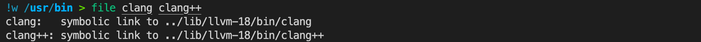
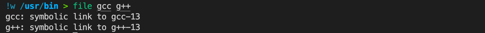
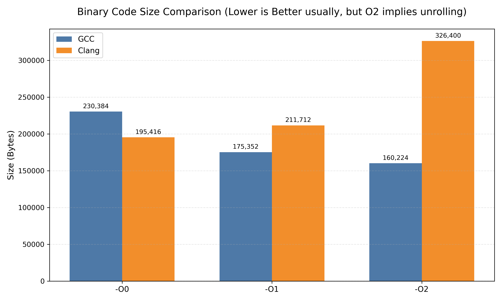
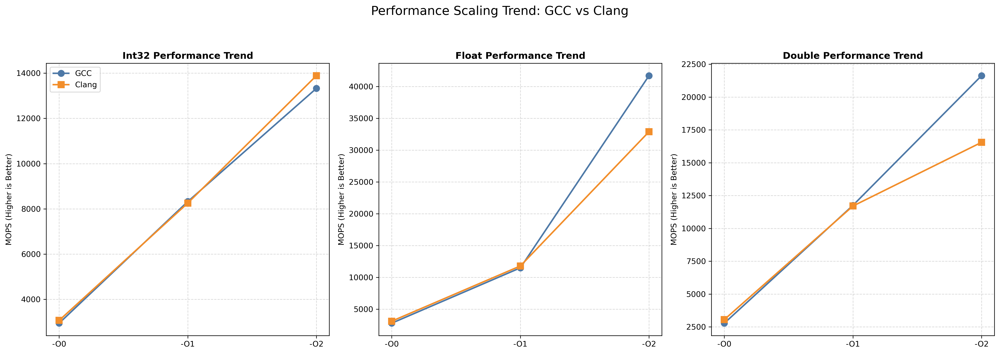
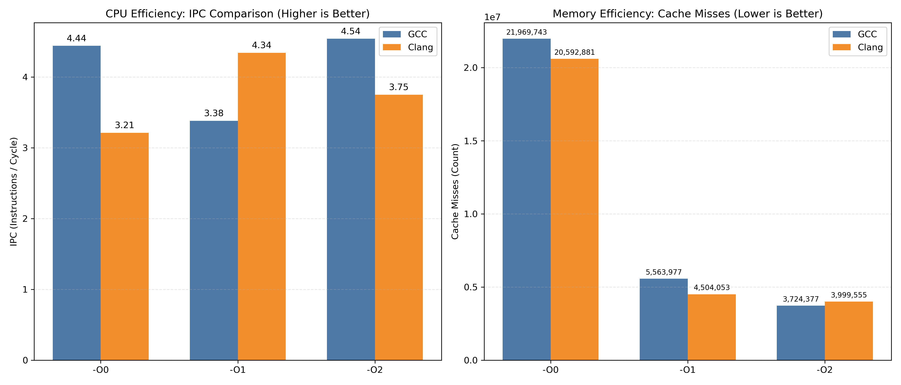

# A4：GCC 与 Clang/LLVM 的优化比较

## 实验环境

| 类别 | 项目 | 配置内容 |
|------|------|-----------|
| **硬件** | CPU | Intel 12th Gen Core i5-12400F（6 核 12 线程） |
|  | GPU | NVIDIA GeForce RTX 4090 D（24 GB 显存） |
|  | GPU 驱动版本 | 580.95.05 |
|  | CUDA Runtime | 13.0 |
|  | 内存 | 31 GiB |
|  | Swap | 8 GiB |
|  | 主板 PCIe 信息 | AD102 [GeForce RTX 4090 D] |
| **系统** | 操作系统版本 | Ubuntu 24.04.3 LTS（Noble） |
|  | 内核版本 | Linux 6.14.0-35-generic |

## Write-up 1：找出 gcc/g++和 clang/clang++的对应可执行文件分别在哪并且解释有何不同？为什么要使用符号链接？

***请找到各自对应的可执行文件并截图，回答上述问题***

### 检查 gcc, g++, clang, clang++ 在可执行文件的搜索路径上

```bash
which gcc g++
which clang clang++
```

输出：

```
/usr/bin/gcc
/usr/bin/g++
/usr/bin/clang
/usr/bin/clang++
```
- 正确

### 检查版本

```bash
gcc --version
clang --version
```

得到：

```
gcc (Ubuntu 13.3.0-6ubuntu2~24.04) 13.3.0
Copyright (C) 2023 Free Software Foundation, Inc.
This is free software; see the source for copying conditions.  There is NO
warranty; not even for MERCHANTABILITY or FITNESS FOR A PARTICULAR PURPOSE.

Ubuntu clang version 18.1.3 (1ubuntu1)
Target: x86_64-pc-linux-gnu
Thread model: posix
InstalledDir: /usr/bin
```
- 符合 gcc 11.0+
- 符合 Clang 14.0+

### 找出对应的可执行文件

先切换到 `/usr/bin` 目录，然后运行 `file` 指令：

```bash
file gcc g++
file clang clang++
```

发现它们都只是符号链接：

```
gcc: symbolic link to gcc-13
g++: symbolic link to g++-13
clang:   symbolic link to ../lib/llvm-18/bin/clang
clang++: symbolic link to ../lib/llvm-18/bin/clang++
```

**clang/clang++**

其实刚才的 `file` 已经给出了它们符号链接指向的位置，分别是：



- `clang: ../lib/llvm-18/bin/clang`
- `clang++: ../lib/llvm-18/bin/clang++`

我们也可以用 `ls -l /usr/bin/clang /usr/bin/clang++` 检验一下：

```
lrwxrwxrwx 1 root root 24  3月 30  2024 /usr/bin/clang -> ../lib/llvm-18/bin/clang
lrwxrwxrwx 1 root root 26  3月 30  2024 /usr/bin/clang++ -> ../lib/llvm-18/bin/clang++
```

- 结果完全一样。

**gcc/g++**

刚才的 `file` 指令似乎没有直接给出 `gcc/g++` 的可执行文件地址，只是显示它们链接到了 `gcc-13/g++-13`：



这其实是正确的，因为这意味着它们在同一个目录下，也就是说对应可执行文件的位置就在：

```
gcc: /usr/bin/gcc-13
g++: /usr/bin/g++-13
```

我查了一下这似乎是 Ubuntu 对 gcc 的打包策略，不同版本都直接放在 /usr/bin 目录下，只是名字带有后缀。

我们可以用 `grep` 来辅助验证一下：

```bash
ls /usr/bin | grep gcc-13  
ls /usr/bin | grep g++-13  
```

得到：

```
gcc-13
x86_64-linux-gnu-gcc-13
g++-13
x86_64-linux-gnu-g++-13
```

### 解释有何不同？

通过 `file` 命令的输出我们可以发现，GCC 与 Clang 采用了截然不同的文件组织策略。**GCC 采用平铺式布局**，其真实可执行文件（如 `gcc-13`）与符号链接共同位于 `/usr/bin` 目录下，链接仅指向同目录下的具体版本文件。相比之下，**Clang 采用隔离式布局**，其真实可执行文件被安置在独立的库目录中，系统通过跨目录的符号链接将其映射到 `/usr/bin`。这种隔离策略使得不同版本的工具链可以完全独立共存，避免库文件冲突，同时也保持了系统标准二进制目录的整洁。

### 为什么要使用符号链接？

操作系统使用符号链接主要是想实现**多版本共存的管理**与**用户调用的解耦**。在开发环境中，经常需要同时安装多个版本的编译器。符号链接允许用户仅通过标准命令（`gcc` 或 `clang`）调用编译器，而无需记忆复杂的版本后缀或绝对路径。此外，这种机制极大地提升了兼容性与灵活性：管理员可以通过修改链接指向轻松切换系统的默认编译器版本，而无需修改用户的环境变量或 Makefile 构建脚本，确保了依赖标准编译器名称的程序能正常运行。

符号链接本质上是把“命令名”与“具体版本的二进制文件”解耦，使 ABI 兼容的版本切换可以在系统层面完成，而不是强迫应用修改源码或构建脚本。

## Write-up 2

### 请说明一下你选择了哪个测试例，以及你选择这个测试例的原因。

我选择了矩阵乘法 `matrix_multiply` 作为测试例，主要有以下几个理由：

1.  **应用广泛**
- 矩阵乘法是现代计算机科学中最基础且最重要的核心算子之一，它也是深度学习模型训练与推理的基石（如卷积神经网络 CNN 和 Transformer 中的 Attention 机制），同时也是计算机图形学中进行 3D 变换（缩放、旋转、平移）的关键运算。所以对其进行优化比较有很高的实际意义。

2.  **典型的计算密集型负载**
- 矩阵乘法是高性能计算中最经典的基准测试之一，其核心逻辑涉及三重嵌套循环，时间复杂度为 $O(n^3)$。这种高强度的算术运算能够非常直观地反映出编译器在指令调度、寄存器分配以及 SIMD（单指令多数据）自动向量化方面的优化能力。

3.  **丰富的循环优化空间**
- 我看了一下该测试例的源码，发现其不仅包含了朴素的矩阵乘法实现（如 `matmul_IJK`, `matmul_KIJ` 等），还包含了多种手动优化版本（如循环展开 `unrolled`、分块 `blocked`）。这使得我们能够深入观察编译器优化选项（-O1, -O2）是如何处理循环交换（Loop Interchange）、循环展开（Loop Unrolling）以及循环分块（Loop Tiling）的，可以对比自动优化与手动优化的效果差异。

4.  **多数据类型覆盖**
- 该测试例同时涵盖了 `int32_t`、`float` 和 `double` 类型的运算，能够全面测试编译器针对整数运算单元和浮点运算单元（FPU）的优化策略差异。

5. **可以与 P1 对照**
- 还有一点就是我们在 P1 中完成的自动调优器刚好就是基于矩阵乘法的，我们可以结合那次实验的经验来进行分析。

## Write-up 3：你对 makefile 及所选测试例对应的源文件做了哪些修改，为什么？

***请解释修改的原因，谈谈 makefile 中各部分作用***

### Makefile 各部分作用解析

`makefile` 定义了项目的构建规则和自动化测试流程，以下是其关键组成部分以及作用：

* **宏定义 (Macros / Variables):**
    * `CC` 和 `CXX`: 分别定义了 C 和 C++ 的编译器命令。通过在命令行覆盖这两个变量（例如 `make CC=clang`），实现了在不修改文件的情况下动态切换编译器（GCC vs Clang）。
    * `CFLAGS` 和 `CPPFLAGS`: 定义了编译选项。这里包含了头文件路径 `$(INCLUDE)` 和优化等级（如 ` -O2`, ` -O3`），是控制实验变量（优化程度）的关键。
* **目标程序列表 (`BINARIES`):**
    * 定义了默认构建目标包含的所有可执行文件列表。`make` 命令会根据此列表决定需要编译哪些源文件。
* **构建规则 (Build Rules):**
    * 定义了如何从 `.c` 或 `.cpp` 源码生成可执行文件。`all : $(BINARIES)` 指定了默认行为是构建列表中所有程序。
* **测试报告目标 (`report`):**
    * 这部分是一个自动化脚本，依序执行编译好的程序，并将标准输出（stdout）重定向追加到 `report.txt` 文件中，用于收集实验数据。

### 对源文件 `matrix_multiply.cpp` 的修改

* 根据注释的提示 `For best results, times should be about 1.0 seconds for the minimum test run`，我测试出在本机器以及环境上循环次数为 $300$ 刚好可以让最短的测试样例运行时间保持在 $1s$ 左右。

### 对 `makefile` 的修改

**1. 引入 `OPTLEVEL` 变量**

* **修改前：** 
    ```makefile
    CFLAGS = $(INCLUDE) -O3
    CPPFLAGS = -std=c++14 $(INCLUDE) -O3
    ```

* **修改后：**
    ```makefile
    OPTLEVEL ?= -O0
    CFLAGS = $(INCLUDE) $(OPTLEVEL)
    CPPFLAGS = -std=c++14 $(INCLUDE) $(OPTLEVEL)
    ```

* **修改原因：**
    原始 Makefile 硬编码了 ` -O3` 优化，而为了通过命令行参数（如 `OPTLEVEL=-O1`）动态控制优化等级，必须将硬编码部分替换为变量 `$(OPTLEVEL)`。

**2. 精简 `BINARIES` 列表**
* 将其他几十个无关紧要的测试注释掉即可。
* **修改后：**
    ```makefile
    BINARIES = machine matrix_multiply
    ```
* **修改原因：**
    * 仅保留系统信息采集工具 `machine` 和选定的测试例 `matrix_multiply`，避免编译无关代码，显著缩短构建时间。
    * 我查了一下，`machine` 程序用于在报告头部输出 CPU 型号、OS 版本等关键环境信息，所以最好保留，这样也符合实验规范。

**3. 重构 `report` 运行脚本**
* **修改内容：** 删除了 `report:` 目标下所有无关的运行指令，并添加了编译器版本记录。
    ```makefile
    report:  $(BINARIES)
        echo "##STARTING Version 1.0" > $(REPORT_FILE)
        date >> $(REPORT_FILE)
        echo "##Compiler: $(CC) $(CXX)" >> $(REPORT_FILE)  # 新增：记录编译器名称
        # ... (保留 CFlags 记录) ...
        echo "System Information collected by program: " >> $(REPORT_FILE)
        ./machine >> $(REPORT_FILE)          # 保留：采集硬件信息
        ./matrix_multiply >> $(REPORT_FILE)  # 保留：运行核心测试
        # ... (删除其他测试) ...
        date >> $(REPORT_FILE)
	    echo "##END Version 1.0" >> $(REPORT_FILE)
    ```
* **修改原因：**
    * **净化数据：** 确保 `report.txt` 只包含当前关注的矩阵乘法性能数据，便于后续的数据处理和图表绘制。
    * **记录实验环境：** 增加 `echo "##Compiler..."` 是为了在报告中明确标识当前数据是由哪个编译器（GCC 还是 Clang）生成的，防止数据混淆。

## Write-up 4：自动化脚本实现对测试组合进行测试并获得结果

***通过修改 makefile 以及编写 shell 脚本来实现，在报告中写明脚本思路***

### 脚本思路

该脚本的核心逻辑是通过双重循环遍历所有可能的测试组合，动态调用 `make` 命令，并将产生的性能数据与二进制文件大小整合到独立的报告文件中。具体实现步骤如下：

* **测试组合遍历**
    * 脚本定义了两个数组：编译器数组 `{"gcc g++", "clang clang++"}` 和优化等级数组 `{"-O0", "-O1", "-O2"}`。通过嵌套的 `for` 循环，自动生成作业要求的 $2 \times 3 = 6$ 种测试组合。

* **动态构建与执行**
    * 在每一轮循环中，脚本首先执行 `make clean` 清理旧的构建文件。随后，利用 `make` 的变量覆盖功能，执行如下命令：
    `make report CC=$cc_cmd CXX=$cxx_cmd OPTLEVEL=$opt`
    * 这确保了每次测试都在干净的环境下使用指定的编译器和优化选项进行。

* **结果收集与文件管理**
    * 脚本会自动创建 `outputs/` 目录用于存放结果。生成的默认 `report.txt` 会被立即重命名为具有标识性的文件名（如 `report.txt.clang-O2`）并移动到输出目录，防止被下一次测试覆盖。

* **二进制代码大小记录**
    * 脚本在编译完成后，使用 Linux 的 `stat -c %s` 命令精确获取可执行文件（`matrix_multiply`）的字节数，并将其追加写入（`>>`）到对应报告文件的末尾。这样每份报告都完整包含了“运行时性能”与“编译产物大小”两类数据。

### 脚本内容

```bash
# 定义配置
TARGET_BIN="matrix_multiply"       
OUTPUT_DIR="outputs"               

# 创建输出目录（如果不存在）
if [ ! -d "$OUTPUT_DIR" ]; then
    mkdir -p "$OUTPUT_DIR"
    echo "创建目录: $OUTPUT_DIR"
fi

# 定义编译器组合
declare -a compilers=(
    "gcc g++"
    "clang clang++"
)

# 定义优化等级
declare -a opt_levels=("-O0" "-O1" "-O2")

echo "=== 开始自动化测试 ==="
echo "结果将保存至: $OUTPUT_DIR/"

# 2. 开始循环
for compiler_pair in "${compilers[@]}"; do
    read -r cc_cmd cxx_cmd <<< "$compiler_pair"

    for opt in "${opt_levels[@]}"; do
        echo "[正在测试] 编译器: $cc_cmd | 优化: $opt"

        # 清理环境
        make clean > /dev/null 2>&1

        # 编译并运行
        if make report CC=$cc_cmd CXX=$cxx_cmd OPTLEVEL=$opt > /dev/null 2>&1; then
            
            # 定义文件路径, eg: outputs/report.txt.gcc-O2
            REPORT_FILENAME="report.txt.${cc_cmd}${opt}"
            FULL_REPORT_PATH="${OUTPUT_DIR}/${REPORT_FILENAME}"
            
            # 移动报告到指定文件夹
            if [ -f "report.txt" ]; then
                mv report.txt "$FULL_REPORT_PATH"
                
                # 获取文件大小并追加到报告末尾
                if [ -f "$TARGET_BIN" ]; then
                    file_size=$(stat -c %s "$TARGET_BIN")
                    
                    echo "" >> "$FULL_REPORT_PATH"
                    echo "#############################################" >> "$FULL_REPORT_PATH"
                    echo "# Additional Metric: Binary Size" >> "$FULL_REPORT_PATH"
                    echo "#############################################" >> "$FULL_REPORT_PATH"
                    echo "Code Size (Bytes): $file_size" >> "$FULL_REPORT_PATH"
                    
                    echo "  -> 成功: 已保存 $REPORT_FILENAME (大小: $file_size 字节)"
                else
                    echo "  -> 警告: 找不到二进制文件 $TARGET_BIN"
                fi
            else
                 echo "  -> 错误: 未生成 report.txt，测试可能失败"
            fi

        else
            echo "  -> 失败: 编译出错"
        fi
    done
done

echo "=== 全部完成 ==="
echo "请查看 $OUTPUT_DIR/ 目录下的报告文件。"
```

## Write-up 5：请针对选定的测试例及收集到的 6 个测试数据结果文件（以及相应测试例编译后的代码大小），进行数据分析，总结分析洞见。

>要求：
>
>1. 需要对不同组合下测试例的代码大小及运行性能进行分析 
>2. 尽量用可视化的形式来呈现分析结果 
>3. 分析洞见的总结尽量简明扼要，如有可能请加上对所总结洞见的合理解释
>4. （选做）使用 Perf 工具收集硬件计数器数据进行分析，例如 cycles、instructions、IPC（Instructions Per Cycle）、cache-misses、branch-misses 等指标

### 1. 代码大小和优化等级的关系



我们首先关注编译器优化等级对生成二进制文件体积的影响，因为这是衡量编译器策略（空间换时间 vs. 精简指令）的重要指标。

从上图中，我们可以观察到两种截然不同的优化策略：

1.  **GCC 的递减趋势**
    * 随着优化等级的提升，GCC 生成的可执行文件体积呈现**持续下降**的趋势。
    * 这是因为在 ` -O0` 阶段，GCC 保留了最原始的指令映射，甚至包含了一些为了调试方便而存在的冗余栈操作，所以体积最大。开启 ` -O1` 后，编译器进行了死代码消除和公共子表达式消除等操作，大幅削减了无效指令，使体积减少了约 24%。有趣的是，到了 ` -O2`，体积进一步减小至 160KB。这说明在矩阵乘法这一特定测试例中，GCC 的优化策略相对保守，它在进行指令调度和重排时，更倾向于生成紧凑的代码，而没有盲目地进行大规模代码复制。

2.  **Clang 的递增趋势**
    * Clang 展现了完全相反的趋势。虽然在 ` -O0` 阶段它生成的代码比 GCC 更小，但随着优化开启，体积一路飙升。特别是在 ` -O2` 阶段，文件大小激增至 326KB，几乎是同等级 GCC 的 2 倍。
    * 这应该是因为 Clang 采取的优化策略太激进了。为了追求极致的计算速度，Clang 在 -O2 级别就大量使用了循环展开。循环展开通过复制循环体内的指令来减少循环控制（比较、跳转）的开销，并为指令流水线提供更多的并行机会。此外，Clang 极有可能为了凑齐 SIMD 向量化所需的数据格式，插入了大量的辅助指令（如数据重排 `shufps` 等），这直接导致了二进制文件体积的膨胀。

**总结：**
在代码大小这一维度上，GCC 比较保守，倾向于生成紧凑、通用的代码；而 Clang 十分激进，呈现出明显的以空间换时间的策略倾向。

### 2. 运行性能的对比

为了全面评估编译器在不同计算任务下的表现，我绘制了 **Int32**、**Float** 和 **Double** 三种数据类型的 **MOPS (Millions of Operations Per Second)** 折线图：



我们可以发现所有数据类型在开启优化后均表现出显著的性能提升，但提升幅度因数据类型而异：
* **浮点运算**：Float 类型从 -O0 到 -O2 的提升最为惊人。以 GCC 为例，性能从 **2,786 MOPS** 飙升至 **41,715 MOPS**，加速比达到了约 **15倍**。这直接证明了 -O2 级别开启的 SIMD（AVX2）自动向量化对于科学计算的性能有很大影响。
* **整数运算**：Int32 的提升幅度相对较小（约 4.5倍），说明整数乘法的优化空间受限于指令集特性（如缺乏类似 FMA 的高吞吐指令）和算术单元瓶颈。

根据实验数据，我观察到在 Int32 中两者都差不多，Clang 的表现还略好一点，但 GCC 在浮点密集型任务中很快反超了 Clang。

* **Float/Double 场景 (GCC 胜)**：
    * **Float**: `GCC -O2 (41,715) > Clang -O2 (32,901)`。GCC 领先约 **26%**。
    * **Double**: `GCC -O2 (21,635) > Clang -O2 (16,556)`。GCC 领先约 **30%**。
    * **原因推测**：结合维度一的代码大小分析（Clang -O2 体积是 GCC 的 2 倍），Clang 应该采取了过于激进的循环展开策略。虽然这减少了分支预测开销，但在矩阵乘法这种对内存带宽敏感的应用中，过大的代码体积和激进的数据预取可能导致了 L1 指令缓存 或数据缓存的抖动，从而抵消了向量化带来的红利。相比之下，GCC 生成的紧凑代码在缓存局部性上表现更优。

* **Int32 场景 (Clang 险胜)**：
    * **Int32**: `Clang -O2 (13,889) > GCC -O2 (13,326)`。Clang 领先约 **4%**。
    * **分析**：在整数运算中，由于没有极其复杂的浮点向量化流水线，Clang 的指令调度优势得以体现，略微压过 GCC。

我还发现一个有趣的现象，观察 `GCC -O2` 的数据，Float 性能 (41,715) 几乎恰好是 Double 性能 (21,635) 的 2倍。结合 csapp 的知识，这完美印证了硬件架构的物理特性，在 Intel AVX2 指令集中，YMM 寄存器宽 256 位，可以同时容纳 **8 个 32位 Float** 或 **4 个 64位 Double**，编译器的优化结果刚好反应出了 CPU 的物理位宽极限。

### 3. 补充分析：为何在 -O0 和 -O1 阶段表现趋同

从实验数据来看，GCC 和 Clang 在 `O0` 和 ` -O1` 阶段的性能差距极小，我之前忘了分析这个现象，现在补上。

这应该跟它们的优化策略有关系，在 -O0 阶段，两款编译器基本上都采用直接翻译策略，将 C++ 语句一对一地转换为汇编指令，不进行复杂的指令重排，虽然之前看到指令数会有一些差别，但是整体的代码结构应该还是高度相似的。

而且编译器会将大量变量强制写回栈内存，而不是驻留在寄存器中。程序的瓶颈主要在于**内存读写延迟**，掩盖了编译器本身的指令生成差异，所以最终体现在时间上差不多。

在 -O1 阶段，两者的目标转向 **低成本优化**，即在不显著增加编译时间和代码体积的前提下提升性能。它们都启用了一套经典的、标准化的优化集合，例如：
* **公共子表达式消除**：去除重复计算。
* **死代码消除**：删除永远不会执行的代码。
* **常量传播**：预计算已知结果。

` -O1` 阶段通常不会启用循环展开或自动向量化等优化手段，这意味着代码的核心循环结构没有改变，依然是标量计算。在没有 SIMD 向量化加持的情况下，CPU 的算术逻辑单元（ALU）吞吐量是固定的，既然大家都在跑标量指令，且指令序列优化程度类似，性能自然就会收敛到 CPU 单核标量性能的物理上限上。

### 4. Perf 分析

为了更深入地探究编译器优化背后的微架构行为，我使用 `perf` 工具收集了 Cycles、Instructions、IPC、Cache Misses 等关键指标。

测试结果汇总如下表所示：

| 编译器 | 优化等级 | Cycles (总周期) | Instructions (总指令数) | IPC | Cache Misses | Branch Misses |
| :--- | :--- | :--- | :--- | :--- | :--- | :--- |
| **GCC** | -O0 | 1.51T | 6.71T | **4.44** | 21.97M | 753M |
| **GCC** | -O1 | 430G | 1.45T | 3.38 | 5.56M | 758M |
| **GCC** | -O2 | 300G | 1.36T | **4.54** | **3.72M** | 715M |
| **Clang** | -O0 | 1.31T | 4.21T | 3.21 | 20.59M | 856M |
| **Clang** | -O1 | 326G | 1.41T | 4.34 | 4.50M | 787M |
| **Clang** | -O2 | **266G** | **0.99T** | 3.75 | 4.00M | **432M** |

为了更清晰地对比，我还制作了 IPC 和 Cache Misses 的柱状图：



观察 ` -O0` 阶段的数据，我发现 GCC ` -O0` 的 IPC 为 4.44，甚至接近 ` -O2` 的水平，然而，其总指令数高达 6.71T，是 ` -O2` 的近 5 倍。

这可能恰好揭示了 IPC 指标的局限性。比方说在 ` -O0` 阶段，GCC 生成了大量冗余的栈操作（push/pop）和无效计算。这些指令虽然数量巨大，但彼此依赖性低，CPU 的超标量架构可以轻松地并行发射这些“廉价”指令，从而刷高了 IPC 数值。但这种“高效率”是虚假的，因为执行的都是无用功，导致总周期数依然最高。所以我们不能盲目的比较单一指标，还是要综合起来看。

对比 ` -O2` 阶段的 GCC 和 Clang，尽管 Clang ` -O2` 的 IPC (3.75) 明显低于 GCC ` -O2` (4.54)，但 Clang 的 Cycles 却比 GCC 少了约 11%。我觉得这个现象可以结合指令数来分析，Clang 生成的指令总数比 GCC 少了 27%（0.99T vs 1.36T）。虽然这些指令可能更复杂、依赖性更强（导致 IPC 下降），但由于“要干的活”总量大幅减少，最终完成任务的速度反而更快。

写到这里，我本来以为可以结束了，但突然想到一个令我不安的事情，之前的代码大小不是 clang 比 gcc 多很多吗，难道刚才的分析是错的？可是数据又不会说谎，我陷入了疑惑和沉思。

细想了一会，乍看之下这似乎矛盾，但这正是循环展开优化的典型特征：Clang 在编译时将循环体内的代码复制了多份，导致二进制文件体积剧增，比 GCC 大了约一倍；不过虽然代码变长了，但“展开”后的循环大幅减少了 `CMP` 和 `JMP` 等控制流指令的执行频率。

Branch Misses 数据可以支持这一推测。Clang ` -O2` 的分支预测未命中数仅为 **432M**，远低于 GCC ` -O2` 的 **715M**。这说明 Clang 成功减少了大量的循环跳转判断，从而在“干同样的活”的前提下，硬生生减少了 **27%** (`1.36T -> 0.99T`) 的指令执行总量。

小结一下，perf 分析进一步证实了 GCC 和 Clang 的设计哲学差异：
* **GCC -O2** 倾向于 **高吞吐** 和 **高局部性**，通过生成对流水线友好的代码来维持高性能。
* **Clang -O2** 则倾向于**极致的逻辑精简**，通过大幅减少指令总数和分支预测失误来暴力缩短运行时间，即便这会牺牲一部分 IPC 和缓存命中率。

### 5. 横向对比分析：编译器性能与策略的综合评估

我还想结合一下不同的矩阵乘法方法来做分析，所以选取了三种代表性实现进行横向评测，数据单位为 **MOPS (百万次操作/秒)**。

| 编译器组合 | 朴素基准 (IJK) | 自动向量化友好 (JKI) | 手动极致优化 (Blocked Unrolled2) | 二进制大小 (Bytes) |
| :--- | :--- | :--- | :--- | :--- |
| **GCC -O0** | 864.5 | 921.3 | 2,155.2 | 230,384 |
| **GCC -O1** | 1,069.3 | 5,068.9 | 11,019.9 | 175,352 |
| **GCC -O2** | 4,598.0 | 5,576.8 | **41,714.7** | **160,224** |
| **Clang -O0** | 1,000.8 | 1,139.7 | 2,640.1 | 195,416 |
| **Clang -O1** | 4,630.6 | 6,987.5 | 10,561.4 | 211,712 |
| **Clang -O2** | 4,501.4 | **22,058.9** | 32,900.8 | 326,400 |

在 **JKI** 这一组对比中，**Clang -O2 (22,058 M)** 的性能是 **GCC -O2 (5,577 M)** 的近 **4 倍**，这表明 Clang/LLVM 的自动向量化（Auto-Vectorization）分析器非常强大。面对结构简单的连续内存访问循环（JKI），Clang 能够极其激进地将其转换为 AVX2 指令。而 GCC 在此场景下似乎表现得过于保守，未能充分利用 SIMD 指令集并行度，仅比其 -O1 版本略有提升。

有趣的是，当我们考察手动优化过的代码（Blocked Unrolled2）时，战局发生了反转：**GCC -O2 (41,714 M)** 反超了 **Clang -O2 (32,901 M)**，性能领先约 **27%**。当程序员手动完成了循环展开和分块后，GCC 的后端代码生成器展现出了极高的效率。这说明 GCC 在处理复杂的、寄存器压力大的代码块时，其寄存器分配算法和指令调度可能比 Clang 更优。这也解释了为什么在高性能计算（HPC）领域，GCC 依然是编译手写优化代码的首选。

观察朴素实现 (IJK)，Clang 在 ` -O1` 阶段就达到了 4,630 M 的性能，这与它在 ` -O2` 下的表现几乎持平。这意味着 Clang 在低优化等级下就已经启用了很多激进的优化 Pass。而 GCC 在 ` -O1` 下仅达到 1,069 M，直到开启 ` -O2` 才提升至 4,598 M，简直是“等级森严”。

本次对比进一步揭示了两者的不同特征：
* **Clang**能把普通的代码自动优化得非常快，但代价是生成的代码体积巨大。
* 当你把代码逻辑手动理顺后（Hand-Tuned 组），**GCC** 能生成比 Clang 更精简、执行效率更高的机器码。
  
## 总结

这份作业中我们对比了 GCC 和 Clang，让我对它们有了更加深入的理解，原来我以为他们只是不同的编译器，其实对性能没有太大的影响，现在看来并不是这样。两者在优化策略上还是有很大的不同，要根据具体任务选择更适合的编译器才好。