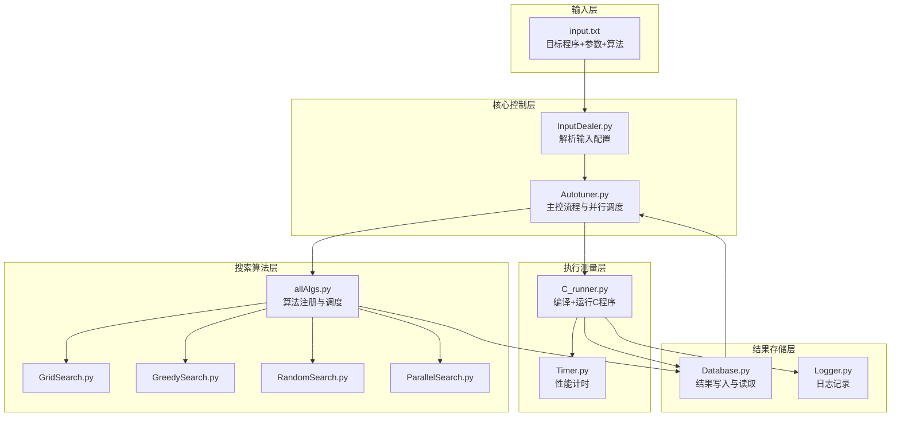

# 实践项目 P1：Matrix Multiplication Autotuner

## 实验环境

## 一、系统环境

本次实验在 Apple MacBook Air (M2, 2022) 上完成，系统及软件环境如下所示：

- **操作系统（OS）：** macOS Sequoia 15.6 （Darwin Kernel Version 24.6.0）
- **CPU：** Apple M2（8 核，包含 4 性能核 + 4 能效核）
- **逻辑核心数：** 8  
- **编译器（Compiler）：** Apple Clang version 17.0.0 (clang-1700.0.13.5)
- **目标架构（Target）：** arm64-apple-darwin24.6.0
- **线程模型（Thread Model）：** POSIX
- **Python 版本：** Python 3.10.19

## 实验目的

### 要求

简单来说，这个项目要求我们实现一个 Autotuner，可以自动测试程序的可配置参数，并根据性能选择最优配置输出。我们需要给它一个目标程序，然后对应的配置参数值组合，同时指定搜索算法来找到最优的参数配置并输出。

因此，根据要求我们需要严格实现三个接口：
1. 输入的目标程序；
2. 输入的配置参数值组合；
3. 输入的参数值搜索算法。

这也为我们的 autotuner 设计提供了明确的思路，在这里使用面向对象的思想来完成接口是最好的。一个强大的 autotuner 应该是可以很泛化，可移植性很高的，可以适用于不同的调优任务。

但是在这里已经明确了我们要调优的程序就是 `matrix_multiplication.c`，那我们先来分析一下这个程序吧。

### 目标程序分析

```C
#include <stdlib.h>
#include <stdio.h>
#include <sys/time.h>
#include <assert.h>

#define n 4096

double A[n][n];
double B[n][n];
double C[n][n];

float tdiff(struct timeval *start,
            struct timeval *end) {
    return(end->tv_sec - start->tv_sec) +
        1e-6*(end->tv_usec - start->tv_usec);
}

int main(int argc, const char *argv[]){
    assert(argc==2);
    int s = atoi(argv[1]);
    if (s < 1 || s > n) {
        printf("Invalid input values.\n");
        return -1;
    }

    for(int i = 0; i < n; ++i){
        for(int j = 0; j < n; ++j) {
            A[i][j] = (double)rand() / (double)RAND_MAX;
            B[i][j] = (double)rand() / (double)RAND_MAX;
            C[i][j] = 0;
        }
    }

    struct timeval start, end;
    gettimeofday(&start, NULL);
    for(int ih = 0; ih < n; ih += s)
        for(int jh = 0; jh < n; jh += s)
            for(int kh = 0;kh < n; kh += s)
                for(int il = 0; il < s; ++il)
                    for(int kl = 0; kl < s; ++kl)
                        for(int jl = 0; jl < s; ++jl)
                            C[ih+il][jh+jl] += A[ih+il][kh+kl] * B[kh+kl][jh+jl];
    gettimeofday(&end, NULL);
    printf("%0.6f\n",tdiff(&start, &end));
    return 0;
}
```

目标程序是一个用 **C 语言** 实现的分块矩阵乘法程序，有两个参数，矩阵的总大小 n （默认为 4096），以及分块矩阵的大小 s。然后调用 C 库里的 `gettimeofday` 来计算运行时间并输出，注意我们在运行的时候需要加上分块矩阵的大小 s 作为参数，例如：

```bash
./matrix_multiplication 64
```
得到这样的时间输出：

```bash
~/Doc/S/software_sys_assignments/10244511412_P1 main ?1 ❯ ./matrix_multiplication 64                                                                                            
141.046722
```

更具体的来说，程序先定义了三个全局静态数组 $A, B, C$，大小均为 $n \times n$。然后用 0 - 1 之间的随机数填充矩阵 $A$ 和 $B$，并将 $C$ 初始化为 0，然后用六层循环嵌套来实现块级矩阵乘法。

结合 csapp 的知识，由于矩阵过大，在访问数据时会在多级缓存和主存中不断地来回搬用，因此如果缓存不命中多的话，程序运行的时间就会大大增加。而块的大小（步长）则会影响缓存命中率，具体的原因我们后面再深入分析，不过这也就是为什么我们要对其进行调优。

除此之外优化等级也会对性能产生影响，因为它主要由编译器决定，能改变汇编层面的指令生成方式，例如 ` -O3` 通常启用循环展开、指令重排和 SIMD 并行优化；而 ` -O0` 则完全不做优化。但是优化等级也不完全是越高越好，因此它也是后续 Autotuning 系统中最核心需要的搜索参数。

## opentuner

根据作业文档的提示，我们先来学习一下 opentuner 的设计。由于我只想学习它的设计思路而不是直接搬用代码，所以我去阅读了一下 opentuner 的论文。

openTuner 的框架设计核心是将搜索过程和测量过程解耦，二者通过一个中心数据库进行异步通信，这种设计便于并行化与扩展不同语言的测量模块。

系统主要分为两个并行的进程：
* **搜索 (Search) 进程:**
    * 包含**搜索驱动 (Search Driver)** 和一个或多个**搜索技术 (Search Techniques)**。
    * 通过**配置操纵器 (Configuration Manipulator)** 来创建和修改配置。
    * 向数据库写入“期望测试的配置” (Desired Results)。
* **测量 (Measurement) 进程:**
    * 包含**测量驱动 (Measurement Driver)** 和用户定义的 **测量函数 (User Defined Measurement Function)**。
    * 从数据库读取“期望测试的配置”。
    * 执行测量（例如编译并运行程序），并将 Results 写回数据库。
* **结果数据库 (Results Database):**
    * 一个 SQL 数据库（默认为 SQLite）。
    * 是搜索和测量进程之间**唯一**的通信媒介。

这个架构也与我们之前设想的配置搜索空间和搜索算法接口一致，更进一步，我们可以学习它的并行进程设计，这样可以大大提升调优效率。

除此之外，opentuner 论文指出，调优问题实际上可以转化为一个搜索问题，这也提示我们应该在搜索算法的实现上多下功夫。

OpenTuner 采用了一种多搜索技术协同运行的机制，框架会同时运行多种搜索算法，并根据它们在调优过程中的表现动态分配测试资源——表现好的算法获得更多的测试预算，而表现差的算法则逐渐减少。其核心调度策略是 AUC Bandit 元技术，这一机制基于“多臂老虎机（Multi-Armed Bandit）”原理，在“探索”（尝试新的搜索算法）与“利用”（优先使用当前效果最好的算法）之间取得平衡，从而实现搜索效率与全局最优性的兼顾。甚至所有技术可以通过结果数据库共享它们发现的最佳结果。比方说一个进化算法可以将其他技术发现的好结果吸纳到它自己的“种群”中。

这给了我们一个很好的尝试方向，但是为了更清晰地探索不同算法之间的直观差距，还是要每个算法单独实现，不过仍然可以将这种多算法并行的机制作为一种新的算法来与原始的算法进行比较。

## Autotuner

### 设计思路

现在就要设计我们自己的调优器 Autotuner 了。为了保证系统的可扩展性和复用性，以及搜索效率，整体设计遵循“模块解耦、接口抽象、可并行化”的原则。

为了更好的完成并行化机制，以及方便维护系统，我选择将搜索过程与测量过程分离，通过一个中间结果数据库实现异步通信，但是不必使用 SQLite，我们用 Python 写一个简单的实现就行了，只要记录每个搜索算法的历史结果就行。

具体而言，在代码编写方面，我采用面向对象的方式设计模块接口，使得每个部分（输入、搜索、执行、记录）都能独立替换或扩展。

系统整体可分为四个核心模块：
1. 输入模块（Input Module）：解析目标程序路径、参数空间和搜索算法；
2. 搜索模块（Search Module）：实现具体的搜索算法，如网格搜索、随机搜索、贪心搜索等；
3. 执行模块（Runner Module）：负责编译、执行目标程序并测量运行时间；
4. 结果模块（Result & Database Module）：存储每次运行的结果与最优配置，为异步与并行执行提供支持。

我们设计的 Autotuner 架构对这个分块矩阵乘法优化的问题可能有些大炮打蚊子了，因为它的搜索空间其实很小，只有 20 个。但是我认为一个优秀的调优器一定要有很强的拓展型，所以这样的设计还是必要的。而且这样的设计即方便记录实验数据，比较不同搜索算法的优劣，也便于实现并行化机制，这都得益于数据库模块的加入。

### 文件结构

简单介绍一下文件结构：

```
├─ autotuner.py                # 主控程序，负责整体流程控制
├─ input.txt                   # 输入文件，定义目标程序、参数空间与算法类型
├─ matrix_Multiplication.c     # 被调优的目标程序
│
├─ codes/
│  ├─input/                    # 输入模块
│  │      InputDealer.py       # 解析输入文件，生成参数空间
│  │
│  ├─search_algs/              # 搜索算法模块
│  │      allAlgs.py           # 搜索算法注册表与调度逻辑
│  │      GridSearch.py        # 网格搜索实现
│  │      GreedySearch.py      # 贪心搜索实现
│  │      RandomSearch.py      # 随机搜索（扩展算法）
│  │      ParallelSearch.py    # 并行搜索（扩展算法）
│  │
│  ├─runners/                  # 执行模块
│  │      C_runner.py          # 编译与执行 C 程序
│  │
│  └─utils/                    # 工具模块
│         Timer.py             # 统一时间统计
│         Logger.py            # 日志系统
│         Database.py          # 结果数据库接口
│
├─results/                     # 实验结果模块
│
```

### 框架设计图



## 代码实现

### `Autotuner.py`

由于我们有并行化机制，可能在多个进程同时运行搜索算法，因此我定义了一个 `evaluate` 函数，作为单个调优任务执行函数，在子进程中运行。

```Python
def evaluate(task):
    target_program, config, db_path = task
    runner = CRunner(target_program)
    db = Database(db_path)
    try:
        result = runner.run(config)
        db.save(config, result)
        return config, result
    except Exception:
        return config, float("inf")
```

```Python
class Autotuner:
    def __init__(self, input_file="input.txt", max_workers=4, exp_name=None):
        self.inputDealer = InputDealer(input_file)
        self.target_program, self.params, self.algorithm_name = self.inputDealer.parse_input()

        timestamp = datetime.datetime.now().strftime("%Y%m%d_%H%M%S")
        exp_folder = exp_name if exp_name else f"{self.algorithm_name}_{timestamp}"
        self.exp_dir = os.path.join("results", self.algorithm_name, exp_folder)
        os.makedirs(self.exp_dir, exist_ok=True)

        self.db_path = os.path.join(self.exp_dir, "best_config.json")
        self.db = Database(self.db_path)
        self.logger = Logger("Autotuner", log_dir=self.exp_dir)

        self.search_algorithm = get_search_algorithm(self.algorithm_name, self.params)
        self.max_workers = max_workers

        self.logger.log(f"Experiment initialized in {self.exp_dir}")
```

然后是 `Autotuner` 类的初始化，主要借助 `InputDealer` 模块来解析输入，明确参数空间和搜索算法。然后是创建实验文件夹，初始化搜索算法示例，为后续的运行做准备。

```Python
    def run(self):
        self.logger.log("Starting autotuning process...")
        start_time = time.time()

        if hasattr(self.search_algorithm, "custom_run"):
            self.logger.log("Detected custom algorithm. Delegating execution to algorithm.")
            self.search_algorithm.custom_run(self.target_program, self.db, self.logger)

        elif hasattr(self.search_algorithm, "next_config"):
            self.logger.log("Detected dynamic search algorithm. Switching to iterative mode.")
            self.run_dynamic()

        else:
            self.logger.log("Detected static search algorithm. Using parallel batch mode.")
            self.run_static()

        best = {
            "config": self.search_algorithm.best_config,
            "time": self.search_algorithm.best_result
        }

        total_time = time.time() - start_time
        self.db.add_summary(self.algorithm_name, total_time)
        self.logger.log(f"Best Configuration: {best}")
        self.logger.log(f"Total runtime: {total_time:.2f}s")

        print("\n===== AUTOTUNING FINISHED =====")
        print("Best configuration:", best)
        print(f"Total runtime: {total_time:.2f}s")
```

这是运行函数，包含了搜索记录的全流程，但是这仍然是一个抽象，可以看到会根据算法的不同来调用子运行函数来实际运行。这是因为我们要实现并行化机制，但是在实际操作中并不是所有搜索算法都可以并行运行，比如贪心算法，模拟退火等依赖之前运行结果的就不能简单的分派给几个进程来运行，只能顺序进行。

所以根据算法的不同，有相应子运行函数，`run_static` 是指可以并行的静态算法，例如 Grid Search，Random Search；而 `run_dynamic` 则给动态算法例如贪心来准备，这两个接口已经适用于大多数搜索算法，只要搜索算法实现了搜索空间和提供下一个搜索参数是什么这两个功能接口即可。

值得注意的是，在 `run_static` 函数中，我通过 `ProcessPoolExecutor` 创建多个独立的子进程来并行执行参数探测任务，每个任务会调用 `evaluate()` 函数，并将目标程序路径、参数配置及数据库路径作为输入元组传入。而后续的 `CRunner` 和 `Database` 模块则保证了资源隔离，不同进程之间不会互相影响，我稍后会在讲解这两个模块时详细说明。

```Python
    def run_static(self):
        configs = self.search_algorithm.all_configs()
        tasks = [(self.target_program, config, self.db_path) for config in configs]

        with ProcessPoolExecutor(max_workers=self.max_workers) as executor:
            futures = [executor.submit(evaluate, task) for task in tasks]
            for future in as_completed(futures):
                config, result = future.result()
                self.logger.log(f"Finished: {config} -> {result:.6f}s")
                self.search_algorithm.update(config, result)

    def run_dynamic(self):
        while not self.search_algorithm.stop():
            config = self.search_algorithm.next_config(self.db.get_all())
            result = CRunner(self.target_program).run(config)
            self.logger.log(f"Finished: {config} -> {result:.6f}s")
            self.db.save(config, result)
            self.search_algorithm.update(config, result)
```

但是如果我们想实现其他搜索算法的话，只靠 `run_static` 和 `run_dynamic` 是不够的。比方说之前提到动态算法无法并行化运行，但是我们可以设计一个 `parallelsearch` 算法，让每个进程都运行一种搜索算法，达到另一种形式上的并行，又或者模拟退火其实可以在传统的算法上做局部并行处理，提升搜索效率。因此我设计了一个 `run_custom` 函数来运行这些特殊算法，由于它们的运行逻辑千奇百怪，所以我选择在算法文件中具体实现，这里只留一个接口，只需要传递数据库给它，这样也进一步保证了 autotuner 的强拓展性，可以适配任何我们想要尝试的算法。

```Python
    def run_custom(self):
        start_time = time.time()
        self.logger.log("Delegating control to custom algorithm...")

        self.search_algorithm.custom_run(
            target_program=self.target_program,
            db=self.db,
            logger=self.logger
        )

        elapsed = time.time() - start_time
        self.db.add_summary(self.algorithm_name, elapsed)
        self.logger.log(f"Custom algorithm completed in {elapsed:.2f}s")
```

以上就是整个 Autotuner 的核心调度逻辑，主要思想就是高度模块化，而且支持任意算法，同时保证并行化机制。接下来介绍其他辅助模块。

### `input.txt`

```text
target_program = MatrixMultiplication.c
search_algorithm = GridSearch
optimize_level = O0,O1,O2,O3
block_size = 8,16,32,64,128
```

为了方便拓展，我定义了 `input.txt` 来定义调优任务和调优参数，在这里可以修改采用的搜索算法（前提是算法在 `allalgs.py` 中注册了）。

### `codes/input/InputDealer.py`

```Python
class InputDealer:
    def __init__(self, input_file):
        self.input_file = input_file

    def parse_input(self):
        target_program = None
        algorithm = None
        params = {}

        with open(self.input_file, "r") as f:
            for line in f:
                line = line.strip()
                if not line or line.startswith("#"):
                    continue
                key, value = [x.strip() for x in line.split("=")]
                if key == "target_program":
                    target_program = value
                elif key == "search_algorithm":
                    algorithm = value
                else:
                    params[key] = [v.strip() for v in value.split(",")]

        if not target_program or not algorithm:
            raise ValueError("Missing required configuration fields in input.txt")

        return target_program, params, algorithm
```

`InputDealer.py` 的作用是读取并解析输入文件 `input.txt`，把用户在文本中定义的调优任务（包括目标程序、搜索算法和参数空间）转换成程序可识别的格式。最终返回目标程序路径、参数空间字典和搜索算法名称，供主控模块 Autotuner.py 使用。

### `codes/runners/C_runner.py`

```Python
class CRunner:
    def __init__(self, target_program):
        self.target_program = target_program
        self.tmp_dir = "tmp"
        os.makedirs(self.tmp_dir, exist_ok=True)

    def run(self, config):
        opt_flag = config.get("optimize_level", "O0")
        block_size = config.get("block_size", "64")

        exe_name = f"matrix_{opt_flag}_{uuid.uuid4().hex[:6]}"
        exe_path = os.path.join(self.tmp_dir, exe_name)

        compile_cmd = ["clang", f"-{opt_flag}", self.target_program, "-o", exe_path]

        try:
            subprocess.run(compile_cmd, check=True, capture_output=True, text=True)
        except subprocess.CalledProcessError as e:
            print(f"[Compile Error] {compile_cmd}\n{e.stderr}")
            return float("inf")

        try:
            with Timer() as t:
                result = subprocess.run([exe_path, str(block_size)],
                                        capture_output=True, text=True)
        except Exception as e:
            print(f"[Runtime Error] {exe_path}: {e}")
            return float("inf")

        if result.returncode != 0:
            print(f"[Error] Program crashed for {config}:\n{result.stderr}")
            return float("inf")

        try:
            runtime = float(result.stdout.strip())
        except ValueError:
            print(f"[Warning] Invalid output for {config}: '{result.stdout.strip()}'")
            runtime = float("inf")

        try:
            os.remove(exe_path)
        except FileNotFoundError:
            pass

        return runtime
```

`C_runner.py` 用于执行被调优的 C 程序，是整个系统的“测量执行层”，当然后续可以根据测量程序的不同拓展到比方说 `Java_runner`，`Python_runner` 等。它的逻辑相对简单，负责将特定参数配置（如编译优化等级和分块大小）应用到目标程序上，借助 Python 的 `subprocess` 包自动完成编译、运行和性能测量的全过程。

为了实现并行化下的资源隔离，我做了两点设计，首先程序会创建一个独立的临时目录 tmp/，用于存放每次编译生成的可执行文件，防止并行执行时不同实例之间的文件冲突；然后每个进程独立调用 clang 编译程序，生成唯一的二进制文件并立即运行，整个过程在子进程中完成，不共享内存，也不依赖外部全局状态。

### `codes/utils/`

这些都是一些简单的工具函数。

`Timer.py`:

```Python
import time

class Timer:
    def __enter__(self):
        self.start = time.time()
        return self

    def __exit__(self, *args):
        self.end = time.time()
        self.interval = self.end - self.start
```

- 记录程序运行的时间。

`Logger.py`：

```Python
import datetime

class Logger:
    def __init__(self, name="Autotuner"):
        self.name = name

    def log(self, msg):
        time_str = datetime.datetime.now().strftime("%H:%M:%S")
        print(f"[{self.name} {time_str}] {msg}")
```

- 打印输出日志。

`Database.py`：

```Python
class Database:
    def __init__(self, db_path="results/summary/best_config.json"):
        self.db_path = db_path
        self.lock = Lock()
        os.makedirs(os.path.dirname(db_path), exist_ok=True)

        if not os.path.exists(db_path):
            with open(db_path, "w") as f:
                json.dump({"records": [], "best": {"config": None, "time": float("inf")}}, f, indent=4)

    def save(self, config, result):
        with self.lock:
            data = self._read_db()

            record = {"config": config, "time": result}
            data["records"].append(record)

            if result < data["best"]["time"]:
                data["best"] = {"config": config, "time": result}

            self._write_db(data)

    def get_best(self):
        with self.lock:
            data = self._read_db()
            return data["best"]

    def get_all(self):
        with self.lock:
            data = self._read_db()
            return {str(rec["config"]): rec["time"] for rec in data["records"]}

    def _read_db(self):
        with open(self.db_path, "r") as f:
            return json.load(f)

    def _write_db(self, data):
        with open(self.db_path, "w") as f:
            json.dump(data, f, indent=4)

    def add_summary(self, algorithm_name, total_runtime):
        with self.lock:
            data = self._read_db()
            data["summary"] = {
                "algorithm": algorithm_name,
                "total_runtime_sec": round(total_runtime, 3)
            }
            self._write_db(data)
```

这是我们的数据库实现，它主要负责记录所有实验配置与运行结果；维护当前最优配置；以及为搜索算法提供历史查询接口；还可以为主控程序输出最终最优结果与总耗时。有了数据库，我们可以很方便的查看实验数据，来做分析：

```
├── GreedySearch
│   ├── GreedySearch_20251104_132639
│   │   ├── best_config.json
│   │   └── log.txt
│   ├── GreedySearch_20251104_133241
│   │   ├── best_config.json
│   │   └── log.txt
│   ├── GreedySearch_20251104_134911
│   │   ├── best_config.json
│   │   └── log.txt
│   └── GreedySearch_20251104_140006
│       ├── best_config.json
│       └── log.txt
├── GridSearch
│   └── GridSearch_20251104_163627
│       ├── best_config.json
│       └── log.txt
...
```

在我们的并行化架构中，多个调优任务会同时运行在不同的进程中，如果所有任务都尝试同时写入同一个文件，就可能出现竞争条或数据损坏问题。因此我引入了线程锁机制，每当某个进程调用 `save()` 或 `add_summary()` 时，都会自动获取文件锁，确保写入操作是原子性的，不会被其他进程打断，这样就实现了安全的并行写入。

## 搜索算法

### 调度器

```Python
from codes.search_algs.GridSearch import GridSearch
from codes.search_algs.GreedySearch import GreedySearch
from codes.search_algs.RandomSearch import RandomSearch
from codes.search_algs.ParallelSearch import ParallelSearch


def get_search_algorithm(name, params):
    algs = {
        "GridSearch": GridSearch,
        "GreedySearch": GreedySearch,
        "RandomSearch": RandomSearch,
        "ParallelSearch": ParallelSearch,
    }

    if name not in algs:
        raise ValueError(f"Unsupported search algorithm: {name}")

    return algs[name](params)
```

`allAlgs.py` 是整个搜索算法层的调度模块，起到算法注册表的作用，方便 `Autotuner` 里的搜索算法实例化。后续有新的算法只要在这里添加并注册就好了。

### Grid Search

网格搜索的本质就是暴力枚举，穷举搜索空间中所有可能的参数组合，并逐一测量每个配置的性能，从而找到全局最优解。

在实现上，`GridSearch` 类借助生成器来与 `Autotuner` 对接，通过 `itertools.product()` 枚举所有参数的笛卡尔积，并依次生成待测试的配置字典 `config`，该配置会被传递给执行模块 `CRunner` 进行编译与运行测试。所有配置测试完成后，算法会根据运行时间更新 `best_config` 与 `best_result` 两个变量，记录当前最优结果。

网格搜索的优点是简单粗暴，能够保证一定找到全局最优解；但对应的计算开销大、效率较低，尤其当参数空间维度增多时，搜索时间会呈指数增长。所以引入并行化执行是非常必要的，即使在这个搜索空间不大（仅仅20个）的任务里，并行执行直接把搜索时间从 20 分钟干到了 6分钟。

还有一点，其他算法不一定会测试每一种参数组合，而网格搜索刚好可以提供一个参照，方便我们对比分析。

```Python
import itertools

class GridSearch:
    def __init__(self, params):
        self.params = params
        self.best_config = None
        self.best_result = float("inf")

    def all_configs(self):
        keys = list(self.params.keys())
        values = list(self.params.values())
        for combination in itertools.product(*values):
            config = dict(zip(keys, combination))
            yield config 

    def update(self, config, result):
        if result < self.best_result:
            self.best_result = result
            self.best_config = config
```

### Random Search

随机搜索是一种基于**随机抽样**的启发式搜索算法，通过在参数空间中随机挑选若干组参数组合进行测量，以近似的方式获得最优或次优解。相较于穷举式的网格搜索，它能在保证较高搜索质量的前提下降低时间开销。但是这就面临一个问题，我们要挑选几组参数呢？直观的想，太大的话，基本又退回到网格搜索了，太小又可能找不到最优解，因此要选择一个适当的值，这里就涉及一些概率推导。

设参数空间中共有 $N$ 个候选参数组合，其中存在唯一的全局最优解。若算法随机抽取 $K$ 组样本（不放回抽样），则至少命中最优解的概率为：

$$
P(\text{hit best}) = \frac{\binom{N-1}{K-1}}{\binom{N}{K}} = \frac{K}{N}
$$

这⼀结果表明命中概率与抽样比例成线性关系。当 $K = N$ 时等价于穷举；而当 $K \ll N$ 时，算法以 $K/N$ 的概率命中最优解，以 $\mathcal{O}(K)$ 的复杂度替代 $\mathcal{O}(N)$ 的全局搜索。

如果选定 $K$ 为 $N$ 的一半的话，那么找到最优解的概率只有 $0.5$，这看起来似乎不大，很容易漏掉最优解。但如果我们放宽一下要求呢，找到次优解也是允许的，那么概率就会变为：

$$
P(\text{hit top-2}) = 1 - \frac{\binom{N-2}{K}}{\binom{N}{K}}
$$

以实际参数空间 $N=20$、抽样次数 $K=10$ 为例，有：

$$
P(\text{hit best}) = \frac{10}{20} = 0.5, \quad
P(\text{hit top-2}) = 1 - \frac{\binom{18}{10}}{\binom{20}{10}} \approx 0.60
$$

$0.6$ 的概率似乎也不大，难道要把 $K$ 选的再大些吗？其实没有必要，因为在实际实验中，为了避免性能波动带来的试验误差，往往需要测试多次，那么只要多次测试中存在最优解的概率和期望足够大，那么就说明 $K$ 取 $N$ 的一半就已经满足需求。我们来计算一下：

若我们独立运行随机搜索 $T$ 次（每次重新随机抽样），则“在至少一次运行中命中最优解”的概率为：

$$
P_T = 1 - (1 - P(\text{hit best}))^T
$$

代入 $P(\text{hit best}) = 0.5$，当 $T=3$ 时：

$$
P_3 = 1 - (1 - 0.5)^3 = 1 - 0.125 = 0.875
$$

即连续运行三次随机搜索，命中全局最优配置的概率可提升至 **87.5%**。

进一步地，设随机变量 $X$ 表示在 $T$ 次运行中命中最优解的次数，则 $X \sim \mathrm{Binomial}(T, P(\text{hit best}))$，其数学期望为：

$$
E[X] = T \cdot P(\text{hit best}) = 3 \times 0.5 = 1.5
$$

意味着若独立运行三次随机搜索，期望能命中约 1.5 次最优解，换句话说，平均每两次运行就能找到一次全局最优配置。这就从理论上为我们把 `random size` 定为 `10` 提供了数学支撑。

具体实现的话，`RandomSearch` 类依然利用 `itertools.product()` 枚举所有参数组合，并在 `all_configs()` 中通过 `random.sample()` 执行不放回抽样，生成随机测试样本。每次测量结果通过 `update()` 函数动态维护最优配置与最优运行时间。

```Python
import random
import itertools

class RandomSearch:
    def __init__(self, params, sample_size=10):
        self.params = params
        self.sample_size = sample_size
        self.best_config = None
        self.best_result = float("inf")

        keys = list(params.keys())
        values = list(params.values())
        self.all_possible_configs = [
            dict(zip(keys, v)) for v in itertools.product(*values)
        ]

    def all_configs(self):
        sample_configs = random.sample(
            self.all_possible_configs,
            min(self.sample_size, len(self.all_possible_configs))
        )

        for config in sample_configs:
            yield config

    def update(self, config, result):
        if result < self.best_result:
            self.best_result = result
            self.best_config = config
```

### Greedy Search

完成了两个基础算法后，我想尝试更多算法，第一个想到了贪心算法，因为贪心算法往往可以在少量步数中逼近最优解，而且比随机算法要稳定一些。虽然在这个任务中，参数空间是离散的，我们不能使用梯度下降法，但是可以采取这样的思路，从当前点出发，找一个相邻的、下降幅度最大的点作为下一个取值点。因为矩阵乘法调优中参数变化较小导致性能变化不会特别大，所以贪心算法应该是可行的，那么我们先来说明一下贪心算法的原理。

贪心搜索是一种基于局部最优迭代思想的启发式算法，它在每一次搜索步骤中都选择当前邻域中性能最优的参数配置作为下一个搜索点，从而不断向全局最优解逼近。具体到我们的参数调优问题，我们将每一个参数组合看作参数空间中的一个节点，若两个节点仅有一个参数不同，则称它们为邻居，贪心搜索的基本思路是在这一图结构上进行邻域搜索：
1. 首先随机选择一个初始参数配置作为起点
2. 对其所有邻居进行测量，计算对应的运行时间
3. 选择运行时间最短的邻居作为新的当前配置
4. 若新配置的性能优于上一次结果，则继续搜索其邻居，否则认为已收敛

在实现上，`GreedySearch` 类通过 `_get_neighbors()` 函数生成当前配置的所有邻域参数，并在 `next_config()` 中选择尚未访问的邻居进行测试。若邻域内再无未测试点，或迭代次数超过设定上限 `max_iters`，则判定为收敛 `converged = True`。

要说明的是，贪心搜索的搜索过程需要借助历史测量信息，因此我们不能直接对其并行化运行。这就导致一个问题，由于参数空间不大，贪心算法可能会把周边的点都算一遍，导致实际效率可能还不如并行的网格搜索。但不管怎么说，我们都需要实验验证一下。

```Python
class GreedySearch:
    def __init__(self, params, max_iters=20):
        self.params = params
        self.param_names = list(params.keys())
        self.param_values = [params[k] for k in self.param_names]
        self.max_iters = max_iters

        self.history = {}           
        self.current_config = self._random_config() 
        self.best_config = None
        self.best_result = float("inf")
        self.iter_count = 0
        self.converged = False

    def _random_config(self):
        return {k: random.choice(vs) for k, vs in self.params.items()}

    def _get_neighbors(self, config):
        neighbors = []
        for k in self.param_names:
            values = self.params[k]
            idx = values.index(config[k])
            if idx > 0:
                new_cfg = dict(config)
                new_cfg[k] = values[idx - 1]
                neighbors.append(new_cfg)
            if idx < len(values) - 1:
                new_cfg = dict(config)
                new_cfg[k] = values[idx + 1]
                neighbors.append(new_cfg)
        return neighbors

    def next_config(self, history):
        self.iter_count += 1
        if self.iter_count == 1:
            return self.current_config

        neighbors = self._get_neighbors(self.current_config)
        neighbors = [n for n in neighbors if str(n) not in history]

        if not neighbors:
            self.converged = True
            return self.current_config

        return random.choice(neighbors)

    def update(self, config, result):
        self.history[str(config)] = result

        if result < self.best_result:
            self.best_result = result
            self.best_config = config
            self.current_config = config  
        else:
            if self.iter_count > self.max_iters:
                self.converged = True

    def stop(self):
        return self.converged or self.iter_count >= self.max_iters
```

在实现了三个基础算法后，我想尝试更多算法，但这些更多是从算法的多样性角度去探究而不是性能调优上，因此在后续的理论性分析中不会涉及这些额外算法，仅在此处进行补充。

### 模拟退火

这其实也是一个优化问题，所以我立马想到了数模比赛中常用的模拟退火算法。模拟退火算法的思想来源于固体物理中“退火”过程的模拟，是一种带有随机扰动的全局优化方法。在搜索过程中，允许一定概率接受“更差”的解，以跳出局部最优陷阱，随着温度下降，这种随机性逐渐减弱，最终收敛到全局最优附近。

在实现上，我为每次搜索定义了“温度” $T$，并通过以下概率函数决定是否接受新解：

$$
P(\text{accept}) = e^{-\Delta E / T}
$$

其中 $\Delta E = \text{new\_result} - \text{best\_result}$。  

当温度较高时，即使新解更差，也可能被接受；随着温度逐步降低（通过 `cooling_rate` 控制），算法逐渐转向贪心式的搜索，从而实现探索到收敛的过程。

模拟退火具有全局搜索能力，能在早期阶段跳出局部最优，与 Greedy 不同，退火算法引入了温度控制机制，使得搜索过程更平滑、更稳定。但是在这个实验中，模拟退火反而表现很差，运行了 2800s，远高于其他三个基础算法，这是因为该算法收敛速度较慢，参数（初温与降温率）对性能影响较大。综合来看，这个算法并不适用于该调优任务。

```Python
class SimulatedAnnealing:
    def __init__(self, params, initial_temp=100.0, cooling_rate=0.9, stop_temp=1.0, max_iter=100):
        self.params = params
        self.param_keys = list(params.keys())
        self.current_config = self.random_config()
        self.best_config = self.current_config
        self.best_result = float("inf")

        self.temp = initial_temp
        self.cooling_rate = cooling_rate
        self.stop_temp = stop_temp
        self.max_iter = max_iter
        self.iter_count = 0

    def random_config(self):
        return {k: random.choice(v) for k, v in self.params.items()}

    def neighbor_config(self, config):
        new_config = copy.deepcopy(config)
        key = random.choice(self.param_keys)
        values = self.params[key]
        new_config[key] = random.choice(values)
        return new_config

    def next_config(self, history=None):
        if self.iter_count == 0:
            return self.current_config

        candidate = self.neighbor_config(self.current_config)

        if history and str(candidate) in history:
            return self.random_config()

        return candidate

    def update(self, config, result):
        self.iter_count += 1

        if result < self.best_result:
            self.best_config = config
            self.best_result = result


        delta = result - self.best_result
        prob = math.exp(-delta / self.temp) if delta > 0 else 1.0

        if random.random() < prob:
            self.current_config = config

        self.temp *= self.cooling_rate

    def stop(self):
        return self.temp < self.stop_temp or self.iter_count >= self.max_iter
```

### Parallel Search 

我还尝试了一种多算法协同的机制，实现比较简单，就是把三个基础搜索算法分派给三个不同的进程并行化处理，但是效果不是很理想，运行实现是单独运行它们的两倍多，这可能是因为同时运行三个实在太吃资源了，只能说是一次失败的尝试。但是我想要真正实现类似机制的话，应该让三个算法得到的结果可以互相通信，这样才能大大减少无效搜索，使并行运行的收益最大化。

不过值得注意的是这个算法用上了我们预留的 `run_custom` 接口，也算是侧面印证了我设计的 autotuner 的拓展性，像这样奇怪的算法都能塞进去。

由于没有新的算法实现，只是将它们并行运行，所以代码这里就不放了，在 `codes/search_algs` 文件夹里的 `ParallelSearch.py` 可以查看。

## 实验数据

### 实验说明

我们知道做实验就一定有试验误差，所以要采取一些措施来减少试验误差。具体到性能调优实验，我查了网上一些资料，了解到有性能可变性这样一个概念，由于操作系统调度、缓存状态、后台进程干扰等因素，即使在相同配置下，多次运行的结果也可能存在轻微波动。为了确保测量结果的稳定性与可信度，我在实验过程中采取了以下几个措施：
1. 在每轮搜索算法运行期间，关闭所有可见后台进程与非必要任务，尽量减少系统负载波动。虽然系统肯定还有一些后台服务持续运行，但基本保证了运行环境的一致性。
2. 对每组参数配置均重复测量 3-5 次，并取算术平均值作为最终结果。事实上，多次测量结果间的方差极小，波动幅度都在 5% 以内，所以说取平均值可以有效消除实验干扰带来的误差。

但是需要指出的是，由于 autotuner 本身的运行也是需要消耗资源的，测量出的平均时间可能会包含一些调度与文件操作等额外开销，但是总的来说，矩阵乘法部分的运行时间还是占总耗时绝对主导，这样的误差可以忽略不计。而且做性能调优是横向比较，所以没有太大关系。

### Grid Search 结果

Grid Search 的平均运行结果如下所示（五次实验取平均值）：

| 优化\块大小 | 8        | 16       | 32       | 64       | 128      |
| ------------ | -------- | -------- | -------- | -------- | -------- |
| O0           | 250.334  | 196.905  | 174.625  | 174.227  | 173.627  |
| O1           | 75.898   | 62.430   | 39.522   | 35.440   | 37.847   |
| O2           | 51.880   | 37.400   | 24.472   | 18.593   | 17.836   |
| O3           | 46.713   | 37.635   | 24.712   | 18.410   | 15.919   |

最佳参数及运行时间：O3, 128, 15.919s

总运行时间：397.990s

### Random Search

一共测了五次取平均，需要注意的是，由于随机算法每次只测十个，所以有的配置是测不到五次的，这可能会导致一些误差。

| 优化\块大小 | 8        | 16       | 32       | 64       | 128      |
| ------------ | -------- | -------- | -------- | -------- | -------- |
| O0           | 246.333  | 184.563  | 160.998  | 161.943  | 149.807  |
| O1           | 73.946   | 60.908   | 33.951   | 28.382   | 30.553   |
| O2           | 44.646   | 31.046   | 22.984   | 15.876   | 15.590   |
| O3           | 41.051   | 31.988   | 22.700   | 15.683   | 14.182   |

最佳参数及运行时间：O3, 128, 14.182s

平均总运行时间：244.751s

### Greedy Search

Greedy Search 一共做了四次实验，到这里已经可以初见端倪了，整体趋势是越往右下性能越好，而且可能是因为初始点没有随机到左上这片区域，导致它们在 4 次实验中一次都没有被测量过。不过这也说明贪心算法的局限性，万一，我是说万一最优解恰恰非常反常的出现在 O0 8 这个位置怎么办？那么贪心算法可能就搜索不出来了，当然这种概率很小，而且在本实验中是不存在的。

| 优化\块大小 | 8        | 16       | 32       | 64       | 128      |
| ------------ | -------- | -------- | -------- | -------- | -------- |
| O0           | ——       | ——       | ——       | ——       | 144.381  |
| O1           | ——       | ——       | ——       | 26.635   | 29.985   |
| O2           | 44.668   | 33.399   | 18.724   | 14.059   | 14.073   |
| O3           | 38.844   | 33.034   | 18.188   | 14.313   | 13.757   |

最佳参数及运行时间：O3, 128, 13.757s

平均总运行时间：272.973s

## 理论性分析

我们会发现一个现象，就是相同的配置在不同算法中测出来的时间会有波动，最后可以差到 2s 左右。但是这都是实验确确实实测出来的数据，我们也只能严格按照实验结果对其进行分析。不过有一点好的就是同一组数据中横向的差异趋势仍然是一致的，所以我们仍然可以分析块大小和优化等级对性能的影响。至于不同算法导致的性能差异，我们在最后对其进行讨论。

### 块大小的影响

从实验结果可以明显看出，随着块大小从 8 逐步增大到 128，程序运行时间整体呈下降趋势。也就是说，块越大，程序执行速度越快。回想起在 csapp 学到的知识，我认为这一现象可以从缓存局部性和循环控制开销两个方面来解释。

首先，从缓存局部性的角度来看，块大小的增大会直接影响数据在缓存中的命中率。当块较小时，每个块中包含的数据量有限，程序频繁地在主存与缓存之间交换数据，导致缓存命中率较低，CPU 需要更多时间等待数据加载。而当块增大时，程序在一个块内可以完成更多计算，数据被多次重复利用，空间局部性和时间局部性都得到了增强，缓存命中率显著提升，访存延迟下降，整体运行时间缩短。

其次，从循环控制开销的角度来看，较小的块意味着需要进行更多次循环迭代，每次循环都包含固定的控制语句（如计数、判断、跳转等），这些开销会随着迭代次数的增加而累积，降低总体效率。块变大后，循环次数减少，控制语句的相对占比下降，循环控制和分支跳转的开销被有效摊薄，从而进一步提升运行效率。

但是，是不是块越大越好呢？当我们把块大小提升到 256,512 会怎么样？很遗憾，受限于实验条件，我没有对其进行测试。但是，我可以试着从理论上分析猜测一下，当块过大时，可能会导致缓存溢出，使得数据无法完全保存在高速缓存中，反而造成性能下降。

总的来看，块大小在 64 至 128 的范围内，仍然能保持稳定的性能提升，因此可以认为在该实验环境下，这一范围是较优的块设置区间。

### 优化等级的影响

而优化等级也和块大小一样有着类似的规律，由 O0 提升至 O3，程序运行时间显著下降。这一趋势在所有块大小下均表现一致，说明优化等级对程序性能也有决定性的影响。由于没有学过编译原理等课，我对优化等级的具体原理不是很了解，于是我查了一下不同优化等级都会做些什么，然后尝试分析之。

总的来说，优化等级本质上决定了编译器在生成机器代码时所采用的优化策略，不同的优化等级会在代码层面引入指令级优化、循环优化以及寄存器分配等多种机制，以充分利用 CPU 的计算能力。

O0 不做任何优化，自然时间是最长的，而 O1 对比 O0 性能提升巨大，这是因为引入了寄存器分配，常量传播与表达式合并，以及简单的循环优化与跳转优化等机制 ，虽然这些改动并未改变程序逻辑，也几乎不会增加编译时间，却极大地减少了 CPU 等待内存和执行无效指令的时间。

O2，O3 相比 O1 同样有着不俗的提升，只是在 O2 变到 O3 的时候似乎遇到了一些瓶颈，有提升，但是有限，所以我们把它们放到一起讨论。在 O2、O3 中，编译器会对指令进行重新排序、合并和删除无效操作，从而减少冗余指令的执行次数。对于包含大量循环的计算任务，O2 与 O3 等级会自动进行循环展开和自动向量化，这使得同一轮循环中可以同时处理多个数据，极大提高了数据吞吐量，降低了循环控制开销。同时呢，高优化等级下，编译器会尽可能将频繁使用的变量保存在寄存器中，减少访问主存或缓存的次数，由于寄存器访问速度远快于内存访问，这能显著降低访存延迟，使整体执行效率进一步提升。

O2 主要侧重于一般性优化，在保持编译速度与稳定性的前提下提高运行性能，而 O3 在 O2 的基础上进一步引入更激进的优化策略（如函数内联、复杂循环展开与预测执行），因此在实验中表现出最短的运行时间。不过，这种激进优化也可能增加编译时间或引入轻微的可预测性降低，所以在本实验中 O3 相比 O2 的提升没那么大。

### 不同算法导致的性能差异

比较一下三个搜索算法的效率，Random Search 最快，为 244s，这得益于较小的搜索空间和并行化运行，Greedy Search 稍慢，为 272s，这是因为 Greedy Search 是顺序进行的，无法直接并行化处理，而 grid search 即使采用了四路并行化仍然是最慢的，为 397s，但是对比不并行化的版本已经快很多了，不并行化的 grid search 我测试出来需要 1400s 左右。

现在我们回过来讨论一下为什么不同算法测出来相同配置的时间不一样。这其中 Grid Search 会长一些，反而 Random Search 和 Greedy Search 会短一些，体现在后者测出来 O3 128 下的时间普遍为 14s，最快甚至测出过 13s，而前者一般都在 15s 左右，其他参数配置下的时间也有相同的差异。

我猜测这可能和并行运行有一定关系，虽然我已经做了资源隔离，尽可能保证不同进程之间不会相互影响，但是还是会有一些像 CPU 调度资源，L3 缓存带宽等的竞争。多个任务同时运行时，缓存复用率下降，线程切换频繁，CPU pipeline 的利用率会降低，从而导致测得的运行时间略长一点。

### 算法优劣比较总结

总的来说，grid search 是最稳定的，一定能保证搜索到最优解，但是效率明显慢很多，而且引入并行化机制会导致测出来的时间偏长，误差变大。Random Search 时间最短，但是稳定性偏差，结合我们的数学推导，往往需要多次运行才能保证效果。综合看下来 Greedy Search 最好，运行时间不算长，而且在这个任务能稳定找到最优解。

## 总结与展望

在这个项目中，我首先学习到了很多工程方面的设计思路，这很好的帮助我完成了 autotuner 的构建。其次在实验过后，我对诸如在 csapp 中学习到的理论理解更加深入了，同时对实验现象的观察和提问，也促使我查阅很多资料，补足了之前没有学习过的知识，拓宽了知识面。

不过我认为还有很多未来可以尝试的方向，首先是可以探索更多搜索算法，比如贝叶斯优化，遗传算法，粒子群优化等等，把学习到的理论算法应用到实践当中，看看它们在性能调优问题上的表达如何。得益于我的模块化设计，我可以设置其他待测程序来进一步挖掘这些算法的潜力。我还想尝试一下 opentuner 提到的基于多臂老虎机机制的多算法协同机制，看看在搜索空间很大时这个利用多种搜索算法协同的机制会不会表现非常出色。

在 autotuner 的设计方面，我认为可以在并行化上多下下功夫，当前的实现还存在很多可以优化的地方，比方说进一步减少资源竞争，在效率和实验结果中间找寻一个平衡点。以及尝试一些机制，让启发式算法也可以享受到并行化运行。

